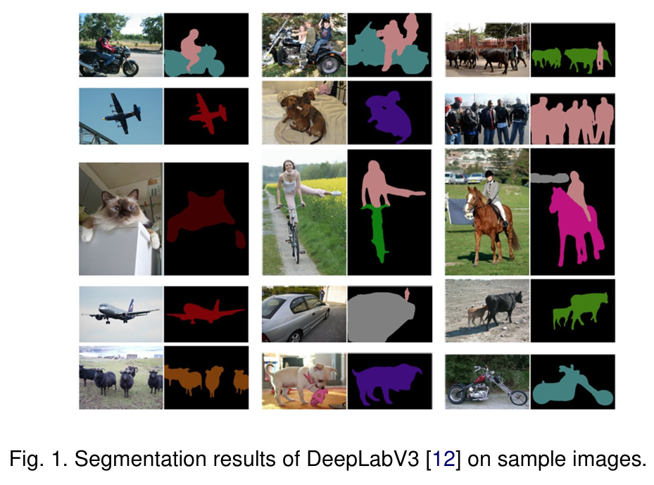
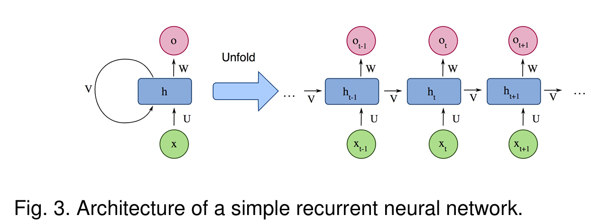
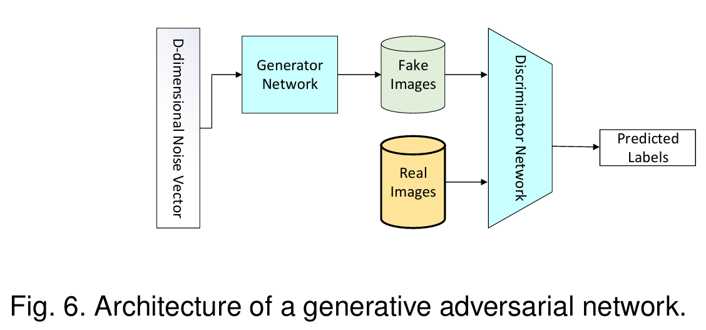
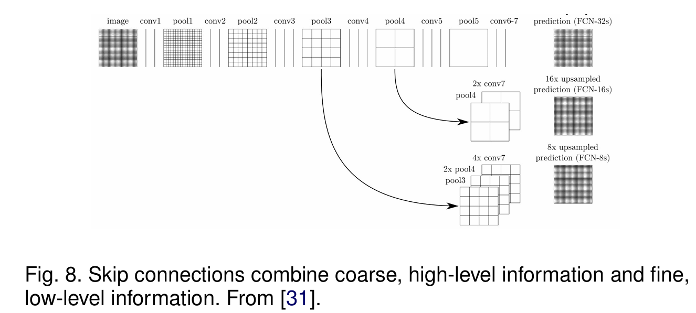
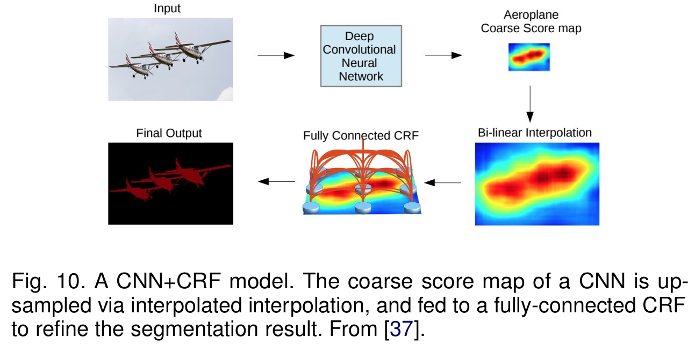
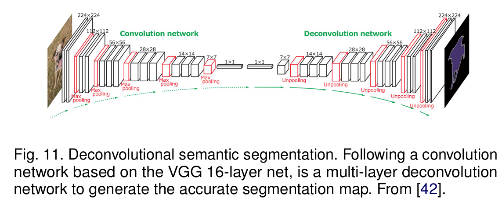
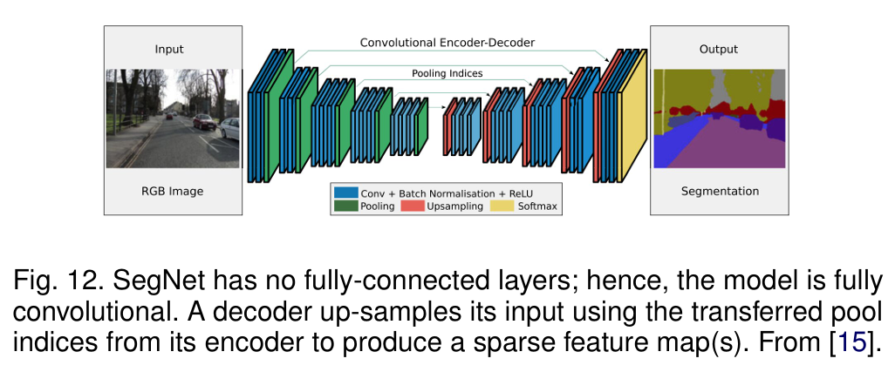
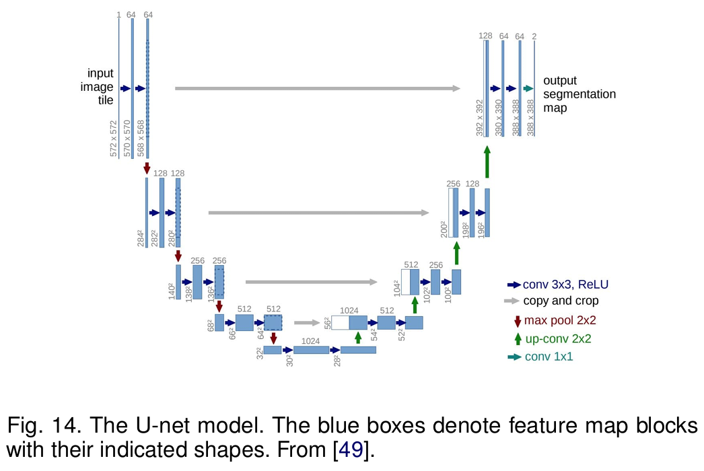

# Image Segmentation Using Deep Learning: A Survey

论文原文：[2001.05566v1](https://arxiv.org/pdf/2001.05566v1)

参考资料：[[图像分割综述\] Image Segmentation Using Deep Learning: A Survey-CSDN博客](https://blog.csdn.net/john_bh/article/details/107044528)

# **Abstract**

图像分割是图像处理和计算机视觉领域的关键研究主题，在场景理解、医学图像分析、机器人感知、视频监控、增强现实和图像压缩等众多领域有着广泛应用。尽管文献中已开发出各种图像分割算法，但近年来，随着深度学习模型在许多视觉应用中取得成功，大量工作致力于开发基于深度学习模型的图像分割方法。本综述全面回顾了语义和实例级别分割领域的开创性工作，包括全卷积像素标注网络、编码器-解码器架构、多尺度和基于金字塔的方法、循环网络、视觉注意力模型以及对抗性生成模型。我们研究了这些深度学习模型的相似性、优势和挑战，考察了最广泛使用的数据集，报告了性能，并讨论了该领域未来有前景的研究方向。

# **1 INTRODUCTION**
图像分割是许多视觉理解系统中的重要组成部分，它涉及将图像（或视频帧）分割成多个区域或目标。分割在广泛的应用中扮演着核心角色，例如医学图像分析（肿瘤边界提取和组织体积测量）、自动驾驶（可导航表面和行人检测）、视频监控和增强现实等。文献中已经开发了许多图像分割算法，从早期的阈值分割、基于直方图的聚类、区域生长、k-means聚类、分水岭，到更高级的主动轮廓、图割、条件随机场和马尔可夫随机场，以及基于稀疏性的方法。然而，在过去的几年里，深度学习（DL）模型带来了新一代的图像分割模型，其性能显著提升，在流行的基准测试中经常 achieving the highest accuracy rates，从而改变了该领域的范式。例如，**图1**展示了流行的深度学习模型DeepLabv3的图像分割输出。

图像分割可以被表述为像素分类问题，具有语义标签（语义分割）或划分单个对象（实例分割）。语义分割对所有图像像素进行像素级标记，使用一组对象类别（例如，人、汽车，树，天空），因此它通常比图像分类（预测整个图像的单个标签）更具挑战性。实例分割通过检测和描绘图像中的每个感兴趣对象（例如，划分单个行人）进一步扩展了语义分割的范围。
本综述涵盖了图像分割领域的最新文献，并讨论了截至2019年提出的100多种基于深度学习的分割方法。我们对这些方法的不同方面进行了全面回顾和深入分析，包括训练数据、网络架构选择、损失函数、训练策略及其主要贡献。我们提供了所审查方法在流行基准测试上的性能比较摘要，并讨论了基于深度学习的图像分割模型面临的几个挑战和潜在的未来方向。
我们将基于深度学习的工作分为以下几类，基于它们的主要技术贡献：

1) 全卷积网络
2) 结合图模型的卷积模型
3) 基于编码器-解码器模型
4) 多尺度和金字塔网络模型
5) 基于R-CNN的模型（用于实例分割）
6) 空洞卷积模型和DeepLab系列
7) 循环神经网络模型
8) 基于注意力模型
9) 生成模型和对抗训练
10) 结合主动轮廓模型
11) 其他模型
本综述论文的一些主要贡献概括如下：
- 本综述涵盖了当前关于分割问题的文献，并概述了截至2019年提出的100多种分割算法，将其分为10个类别。
- 我们对深度学习分割算法的不同方面进行了全面回顾和深入分析，包括训练数据、网络架构选择、损失函数、训练策略及其主要贡献。
- 我们提供了约20个流行图像分割数据集的概述，分为2D、2.5D (RGB-D) 和3D图像。
- 我们提供了所审查方法在流行基准测试上进行分割的特性和性能的比较摘要。
- 我们提供了基于深度学习的图像分割的几个挑战和潜在的未来方向。

本综述的其余部分安排如下： **第二节** 概述了作为许多现代分割算法主干的一些流行深度神经网络架构。**第三节** 全面概述了截至2020年最显著的100多种最新深度学习分割模型。我们还在本节讨论了它们的优势和对先前工作的贡献。**第四节** 回顾了一些最流行的图像分割数据集及其特性。**第五节** 回顾了评估基于深度学习分割模型的流行指标，并报告了这些模型的定量结果和实验性能。**第六节** 讨论了基于深度学习分割方法的主要挑战和未来方向。最后，**第七节** 提出我们的结论。

# **2 OVERVIEW OF DEEP NEURAL NETWORKS**
本节概述了一些计算机视觉领域使用最广泛的深度学习架构，包括卷积神经网络（CNNs）、循环神经网络（RNNs）和长短期记忆（LSTM）、编码器-解码器以及生成对抗网络（GANs）。随着深度学习近年来日益普及，还提出了其他几种深度神经网络架构，如Transformer、Capsule Networks、Gated Recurrent Units、Spatial Transformer Networks等，这些内容不会在本节中涵盖。
值得一提的是，在某些情况下，深度学习模型可以在新的应用/数据集上从头开始训练（假设有足够的标记训练数据），但在许多情况下，由于没有足够的标记数据从头开始训练模型，可以使用迁移学习来解决这个问题。在迁移学习中，在一个任务上训练的模型被重新用于另一个（相关）任务，通常通过对新任务进行一些适应性调整。例如，可以想象将ImageNet上训练的图像分类模型适应于不同的任务，如纹理分类或人脸识别。在图像分割案例中，许多人使用在ImageNet（比大多数图像分割数据集更大的数据集）上训练的模型作为网络的编码器部分，并从这些初始权重重新训练他们的模型。这里的假设是，这些预训练模型应该能够捕获图像中进行分割所需的语义信息，从而使它们能够用更少的标记样本训练模型。

## **2.1 Convolutional Neural Networks (CNNs)**
CNNs 是深度学习领域最成功和广泛使用的架构之一，尤其适用于计算机视觉任务。CNNs 最初由福岛在1980年关于“Neocognitron”的开创性论文中提出，该模型基于Hubel和Wiesel提出的视觉皮层层级感受野模型。随后，Waibel等人于1989年引入了权重在时间感受野之间共享并进行反向传播训练的CNNs用于音素识别。LeCun等人于1998年开发了用于文档识别的CNN架构（图2）。
CNN 主要由三类层组成：
i) **卷积层 (Convolutional layers)**：通过卷积核（或滤波器）进行卷积运算来提取特征。
ii) **非线性层 (Nonlinear layers)**：在特征图上应用激活函数（通常是逐元素操作），使网络能够建模非线性函数。
iii) **池化层 (Pooling layers)**：用某个邻域的统计信息（均值、最大值等）替换特征图的一个小邻域，以降低空间分辨率。
层中的单元局部连接；也就是说，每个单元从前一层的小邻域（称为感受野）接收加权输入。通过堆叠层形成多分辨率金字塔，更高级别的层从日益扩大的感受野中学习特征。CNN 的主要计算优势在于，层中的所有感受野共享权重，从而使参数数量比全连接神经网络显著减少。一些最著名的CNN架构包括AlexNet [19]、VGGNet [20]、ResNet [21]、GoogLeNet [22]、MobileNet [23] 和 DenseNet [24]。

图2. 卷积神经网络架构. [13] 提供

## **2.2 Recurrent Neural Networks (RNNs) and the LSTM**

RNNs 广泛用于处理序列数据，如语音、文本、视频和时间序列，其中任何给定时间/位置的数据都取决于先前遇到的数据。在每个时间步，$t$，模型从当前时间 $X_t$ 和前一个时间步 $h_{t-1}$ 收集输入，并输出目标值和新的隐藏状态（图3）。

$$
h_t = f(W_{hh} h_{t-1} + W_{xh} X_t + b_h)
$$

$$
Y_t = W_{hy} h_t + b_y
$$

其中 $W$ 和 $b$ 是权重矩阵和偏置向量，$f$ 是激活函数。

    图3. 简单循环神经网络架构

RNNs 通常在处理长序列时会出现问题，因为它们在许多实际应用中无法捕获长期依赖关系（尽管理论上没有这方面的限制），并且经常遭遇梯度消失或梯度爆炸问题。然而，一种称为长短期记忆（LSTM）的RNN类型被设计用于避免这些问题。LSTM架构（图4）包含三个门（输入门、输出门、遗忘门），它们调节信息从记忆单元流入和流出，记忆单元可以存储任意时间间隔的值。
$$
\begin{aligned}
f_t &= \sigma(W_f \cdot [h_{t-1}, X_t] + b_f) \\
i_t &= \sigma(W_i \cdot [h_{t-1}, X_t] + b_i) \\
\tilde{C}_t &= \tanh(W_C \cdot [h_{t-1}, X_t] + b_C) \\
C_t &= f_t \odot C_{t-1} + i_t \odot \tilde{C}_t \\
o_t &= \sigma(W_o \cdot [h_{t-1}, X_t] + b_o) \\
h_t &= o_t \odot \tanh(C_t)
\end{aligned}
$$

其中 $\sigma$ 是 Sigmoid 激活函数，$\odot$ 是元素级乘法。

    图4. 标准LSTM模块架构. 图片由 Karpathy 提供.

## **2.3 Encoder-Decoder and Auto-Encoder Models**
编码器-解码器模型是一类通过两阶段网络学习将数据点从输入域映射到输出域的模型：编码器，由编码函数 $z=f(x)$ 表示，将输入压缩成潜在空间表示；解码器，$y=g(z)$，旨在从潜在空间表示预测输出。这里的潜在表示本质上是指一种特征（向量）表示，它能够捕获输入的底层语义信息，这些信息对于预测输出很有用。这些模型在图像到图像转换问题以及自然语言处理中的序列到序列模型中非常受欢迎。**图5**展示了一个简单编码器-解码器模型的框图。这些模型通常通过最小化重建损失 $L(y, \hat{y})$ 来训练，该损失测量真实输出 $y$ 与后续重建 $\hat{y}$ 之间的差异。这里的输出可以是图像的增强版本（例如在图像去模糊或超分辨率中），也可以是分割图。自编码器是编码器-解码器模型的一个特例，其中输入和输出是相同的。
$$
L(y, \hat{y}) = \|y - \hat{y}\|^2
$$
这里 $y$ 是真实输出，$\hat{y}$ 是模型预测的输出。

    图5. 简单编码器-解码器模型架构.

## **2.4 Generative Adversarial Networks (GANs)**
GANs 是一类较新的深度学习模型 [16]。它们由两个网络组成——一个生成器和一个判别器（图6）。传统GAN中的生成器网络 $G = z \rightarrow y$ 学习从噪声 $z$ （具有先验分布）到目标分布 $y$ 的映射，该映射类似于“真实”样本。判别器网络 $D$ 试图区分生成的样本（“假”）和“真实”样本。GAN 的损失函数可以写作：
$$
L_{GAN} = E_{x \sim p_{data}(x)}[\log D(x)] + E_{z \sim p_z(z)}[\log(1-D(G(z)))]
$$
我们可以将GAN视为 $G$ 和 $D$ 之间的最小-最大博弈，其中 $D$ 试图最小化其在区分假样本和真实样本时的分类错误，从而最大化损失函数；而 $G$ 试图最大化判别器网络的错误，从而最小化损失函数。训练模型后，训练好的生成器模型将是 $G^* = argmin_G \max_D L_{GAN}$。实际上，这个函数可能无法为有效训练 $G$ 提供足够的梯度，特别是在初始阶段（当 $D$ 可以很容易地区分假样本和真实样本时）。一种可能的解决方案是，不最小化 $E_{z \sim p_z(z)}[\log(1-D(G(z)))]$，而是训练它最大化 $E_{z \sim p_z(z)}[\log(D(G(z)))]$。
$$
\begin{aligned}
\min_G \max_D V(D, G) &= E_{x \sim p_{data}(x)}[\log D(x)] \\
&+ E_{z \sim p_z(z)}[\log(1-D(G(z)))]
\end{aligned}
$$
这个公式是GANs的经典目标函数，其中 $p_{data}(x)$ 是真实数据分布，$p_z(z)$ 是输入噪声分布，$D(x)$ 是判别器对真实数据样本的输出，$D(G(z))$ 是判别器对生成器生成样本的输出。

    图6. 生成对抗网络架构.

自从 GANs 发明以来，研究人员一直致力于改进/修改 GANs。例如，Radford 等人 [27] 提出了一种卷积 GAN 模型，当用于图像生成时，它比全连接网络效果更好。Mirza [28] 提出了一种条件 GAN 模型，可以生成以类别标签为条件的图像，从而可以生成具有特定标签的样本。Arjovsky 等人 [29] 提出了一种基于 Wasserstein 距离（又称土方移动距离）的新型损失函数，以更好地估计真实样本和生成样本分布不重叠的情况下的距离（因此 Kullback-Leibler 散度不是一个好的距离度量）。有关更多工作，我们推荐读者参考 [30]。

# **3 DL-BASED IMAGE SEGMENTATION MODELS**
本节详细回顾了截至2019年提出的100多种基于深度学习的分割方法，并将其分为10个类别（基于其模型架构）。值得一提的是，许多这些工作都有一些共同点，例如包含编码器和解码器部分、跳跃连接、多尺度分析，以及最近使用的空洞卷积。因此，很难提及每项工作的独特贡献，但更容易根据其对先前工作的底层架构贡献进行分组。除了这些模型的架构分类外，还可以根据分割目标将它们分为：语义分割、实例分割、全景分割和深度分割类别。但由于这些任务在工作量方面存在巨大差异，我们决定采用架构分组。

## **3.1 Fully Convolutional Networks**
Long et al. [31] 提出了最早用于语义图像分割的深度学习工作之一，使用了全卷积网络（FCN）。FCN（图7）只包含卷积层，这使其能够接受任意大小的图像并生成相同大小的分割图。作者修改了现有的CNN架构，如VGG16和GoogLeNet，通过将所有全连接层替换为全卷积层来处理非固定大小的输入和输出。因此，模型输出的是空间分割图而不是分类分数。

    图7. 一种全卷积图像分割网络。FCN 学习进行密集的像素级预测. [31] 提供.

通过使用跳跃连接，将模型最后一层的特征图上采样并与更早层的特征图融合（图8），模型结合了语义信息（来自深层、粗糙层）和外观信息（来自浅层、精细层），以生成准确和详细的分割。该模型在PASCAL VOC、NYUDv2和SIFT Flow上进行了测试，并取得了最先进的分割性能。

    图8. 跳跃连接结合了粗略的高级信息和精细的低级信息. [31] 提供.

这项工作被认为是图像分割领域的一个里程碑，它证明了深度网络可以以端到端的方式在可变大小的图像上进行语义分割训练。然而，尽管其流行和有效，传统的FCN模型存在一些局限性——它在实时推理方面不够快，它没有有效地考虑全局上下文信息，并且不易转移到3D图像。一些研究努力试图克服FCN的一些局限性。
例如，Liu et al. [32] 提出了一种名为 ParseNet 的模型，旨在解决 FCN 忽略全局上下文信息的问题。ParseNet 通过使用层的平均特征来增强每个位置的特征，从而为 FCN 添加全局上下文。一个层的特征图在整个图像上进行池化，生成一个上下文向量。这个上下文向量被归一化并反池化，以生成与初始特征图相同大小的新特征图。然后，这些特征图被串联起来。简而言之，ParseNet 是一个 FCN，其中所描述的模块替换了卷积层（图9）。

    图9. ParseNet，展示了使用额外的全局上下文生成比FCN (c) 更平滑的分割 (d). [32] 提供.

FCNs 已被应用于各种分割问题，例如脑肿瘤分割 [33]、实例感知语义分割 [34]、皮肤病变分割 [35] 和虹膜分割 [36]。

## **3.2 Convolutional Models With Graphical Models**
如前所述，FCN 忽略了潜在有用的场景级别语义上下文。为了整合更多上下文，一些方法将概率图模型（如条件随机场 (CRF) 和马尔可夫随机场 (MRF)）整合到深度学习架构中。
Chen et al. [37] 提出了一种基于CNNs和全连接CRFs（图10）组合的语义分割算法。他们发现深度CNNs最终层的响应对于精确目标分割来说定位不够充分（这是由于使CNNs擅长分类等高级任务的不变性特性所致）。为了克服深度CNNs的这种差的定位特性，他们将最终CNN层的响应与全连接CRF相结合。他们表明，他们的模型能够以比以前方法更高的准确率定位分割边界。

    图10. CNN+CRF 模型。CNN的粗糙分数图通过插值上采样，并输入到全连接CRF中以细化分割结果. [37] 提供.

Schwing 和 Urtasun [38] 提出了一种用于图像分割的全连接深度结构网络。他们提出了一种方法，联合训练 CNN 和全连接 CRF 用于语义图像分割，并在具有挑战性的 PASCAL VOC 2012 数据集上取得了令人鼓舞的结果。在 [39] 中，Zheng 等人提出了一种类似的语义分割方法，将 CRF 与 CNN 结合。
在另一项相关工作中，Lin 等人 [40] 提出了一种基于上下文深度 CRF 的高效语义分割算法。他们探索了“块-块”上下文（图像区域之间）和“块-背景”上下文，通过使用上下文信息来改善语义分割。
Liu 等人 [41] 提出了一种语义分割算法，将丰富的图信息（包括高阶关系和标签上下文混合）融入到MRF中。与以前使用迭代算法优化MRF的作品不同，他们提出了一种CNN模型，即解析网络（Parsing Network），它可以在一次前向传播中实现确定性端到端计算。

## **3.3 Encoder-Decoder Based Models**
另一类流行的深度模型家族用于图像分割，基于卷积编码器-解码器架构。大多数基于深度学习的分割工作都使用某种编码器-解码器模型。我们将这些工作分为两类：用于通用分割的编码器-解码器模型，以及用于医学图像分割的编码器-解码器模型（以便更好地区分应用）。
### **3.3.1 Encoder-Decoder Models for General Segmentation**
Noh et al. [42] 发表了一篇早期关于基于反卷积（又称转置卷积）的语义分割论文。他们的模型（图11）由两部分组成：编码器使用从VGG 16层网络中采用的卷积层，以及一个反卷积网络，该网络以特征向量作为输入并生成像素级类别概率图。反卷积网络由反卷积层和反池化层组成，这些层识别像素级类别标签并预测分割掩码。

    图11. 反卷积语义分割。基于VGG-16层网络的卷积网络之后是一个多层反卷积网络，用于生成准确的分割图. [42] 提供.

该网络在PASCAL VOC 2012数据集上取得了令人满意的性能，并在当时未训练外部数据的方法中获得了最佳准确率（72.5%）。

在另一项名为 SegNet 的有前景的工作中，Badrinarayanan 等人 [15] 提出了一种用于图像分割的卷积编码器-解码器架构（图12）。与反卷积网络类似，SegNet 的核心可训练分割引擎由一个编码器网络组成，该网络在拓扑结构上与 VGG16 网络中的13个卷积层相同，以及一个相应的解码器网络，其后是像素级分类层。SegNet 的主要创新之处在于解码器对其较低分辨率输入特征图的上采样方式；具体来说，它使用与其对应的编码器在最大池化步骤中计算的池化索引执行非线性上采样。这消除了学习上采样的需要。然后，（稀疏的）上采样图与可训练滤波器进行卷积，以生成密集的特征图。SegNet 在可训练参数数量方面也显著小于其他竞争架构。同一作者还提出了 SegNet 的贝叶斯版本，以模拟场景分割的卷积编码器-解码器网络固有的不确定性 [43]。

    图12. SegNet 没有全连接层；因此，该模型是全卷积的。解码器使用从其编码器传输的池索引对其输入进行上采样以生成稀疏特征图. [15] 提供.

这一类别中的另一个流行模型是最近开发的高分辨率网络（HRNet）[44]（图13)。与DeConvNet、SegNet、U-Net和V-Net中复原高分辨率表示不同，HRNet通过并行连接高分辨率到低分辨率卷积流，并反复交换不同分辨率之间的信息，从而在编码过程中保持高分辨率表示。许多最近关于语义分割的工作都使用HRNet作为主干网络，通过利用自注意力及其扩展等上下文模型。
$$
\text{HRNetV2-W48:}
$$

$$
\begin{aligned}
& \text{Stage 1: High-resolution convolutions} \\
& \text{Stage 2: Two-resolution blocks} \\
& \text{Stage 3: Three-resolution blocks} \\
& \text{Stage 4: Four-resolution blocks}
\end{aligned}
$$

其中每个阶段都包含并行的多分辨率卷积流和跨分辨率的信息交换。

    图13. HRNet 架构示意图。它由并行的高分辨率到低分辨率卷积流组成，并伴随跨多分辨率流的重复信息交换。包含四个阶段。第一阶段由高分辨率卷积组成。第二（第三、第四）阶段重复两分辨率（三分辨率、四分辨率）块. [44] 提供.

其他一些工作也采用转置卷积或编码器-解码器进行图像分割，例如堆叠反卷积网络（SDN）[45]、Linknet [46]、W-Net [47] 和用于RGB-D分割的局部敏感反卷积网络 [48]。基于编码器-解码器模型的局限性之一是由于编码过程中高分辨率表示的丢失而导致图像精细信息的丢失。然而，这个问题在一些最近的架构（如HR-Net）中得到了解决。

### **3.3.2 Encoder-Decoder Models for Medical and Biomedical Image Segmentation**
最初为医学/生物医学图像分割开发的模型有几种，它们受到FCNs和编码器-解码器模型的启发。U-Net [49] 和 V-Net [50] 是两个著名的此类架构，现在也已在医疗领域之外使用。
Ronneberger 等人 [49] 提出了 U-Net 用于分割生物显微图像。他们的网络和训练策略依赖于数据增强，以从极少数带注释的图像中有效学习。U-Net 架构（图14）包含两部分：用于捕获上下文的收缩路径，以及实现精确本地化的对称扩展路径。下采样或收缩部分具有 FCN 类似的架构，通过 $3 \times 3$ 卷积提取特征。上采样或扩展部分使用上卷积（或反卷积），在增加特征图维度的同时减少特征图的数量。网络下采样部分的特征图被复制到上采样部分，以避免丢失模式信息。最后，$1 \times 1$ 卷积处理特征图以生成分割图，对输入图像的每个像素进行分类。U-Net 在30张透射光显微图像上进行了训练，并以很大的优势赢得了2015年 ISBI 细胞追踪挑战赛。
$$
\begin{aligned}
& \text{Contracting Path (Encoder):} \\
& \quad \text{Repeat } N \text{ times:} \\
& \quad \quad \text{Conv } 3 \times 3 \text{ (ReLU)} \\
& \quad \quad \text{Conv } 3 \times 3 \text{ (ReLU)} \\
& \quad \quad \text{Max Pooling } 2 \times 2 \text{ (stride 2)} \\
& \text{Expanding Path (Decoder):} \\
& \quad \text{Repeat } N \text{ times:} \\
& \quad \quad \text{Up-convolution } 2 \times 2 \text{ (stride 2)} \\
& \quad \quad \text{Concatenate with cropped feature map from contracting path} \\
& \quad \quad \text{Conv } 3 \times 3 \text{ (ReLU)} \\
& \quad \quad \text{Conv } 3 \times 3 \text{ (ReLU)} \\
& \text{Output Layer:} \\
& \quad \text{Conv } 1 \times 1 \text{ (Sigmoid/Softmax)}
\end{aligned}
$$
其中 N 是下采样/上采样块的数量，每个卷积层后面通常跟ReLU激活。

    图14. U-net 模型。蓝色框表示具有所示形状的特征图块. [49] 提供.

U-Net 的各种扩展已经针对不同类型的图像进行了开发。例如，Cicek [51] 提出了用于3D图像的U-Net架构。Zhou 等人 [52] 开发了一种嵌套的U-Net架构。U-Net 也已应用于各种其他问题。例如，Zhang 等人 [53] 开发了一种基于U-Net的道路分割/提取算法。

V-Net 也是一个著名的、基于 FCN 的模型，由 Milletari 等人 [50] 提出，用于3D医学图像分割。为了模型训练，他们引入了一个基于 Dice 系数的新目标函数，使模型能够处理前景和背景体素数量严重不平衡的情况。该网络在MRI前列腺体积上进行端到端训练，并学习一次性预测整个体积的分割。其他一些关于医学图像分割的相关工作包括用于胸部 CT 图像肺叶快速自动分割的渐进式密集 V-net（PDV-Net）[54]，以及用于病变分割的3D-CNN编码器 [54]。

## **3.4 Multi-Scale and Pyramid Network Based Models**
多尺度分析作为图像处理中一个相当古老的思想，已应用于各种神经网络架构。其中最著名的模型之一是 Lin 等人 [55] 提出的特征金字塔网络（FPN），该模型主要用于目标检测，但后来也应用于分割。深层 CNN 固有的多尺度金字塔结构被用于构建特征金字塔，且额外开销很小。为了合并低分辨率和高分辨率特征，FPN 由一个自下而上的路径、一个自上而下的路径和横向连接组成。连接后的特征图然后通过一个 $3 \times 3$ 卷积进行处理，以生成每个阶段的输出。最后，自上而下路径的每个阶段生成一个预测来检测目标。对于图像分割，作者使用两个多层感知器（MLPs）来生成掩码。

Zhao et al. [56] 开发了金字塔场景解析网络（PSPN），这是一个多尺度网络，旨在更好地学习场景的全局上下文表示（图15）。使用一个残差网络（ResNet）作为特征提取器，通过一个空洞网络从输入图像中提取不同的模式。这些特征图然后输入到金字塔池化模块中，以区分不同尺度的模式。它们在四个不同的尺度上进行池化，每个尺度对应一个金字塔级别，并通过一个 $1 \times 1$ 卷积层处理以降低维度。金字塔级别的输出被上采样并与初始特征图串联，以捕获局部和全局上下文信息。最后，使用一个卷积层生成像素级预测。

    图15. PSPN 架构。CNN 生成特征图，金字塔池化模块聚合不同的子区域表示。通过上采样和级联形成最终特征表示，从而通过卷积获得最终的像素级预测. [56] 提供.

Ghiasi 和 Fowlkes [57] 开发了一种基于拉普拉斯金字塔的多分辨率重建架构，该架构利用来自更高分辨率特征图的跳跃连接和乘法门控，以逐步精细化从较低分辨率图重建的分割边界。他们表明，虽然卷积特征图的表观空间分辨率较低，但高维特征表示包含显著的亚像素定位信息。

还有其他模型使用多尺度分析进行分割，例如 DM-Net（动态多尺度滤波器网络）[58]、上下文对比网络和门控多尺度聚合（CCN）[59]、自适应金字塔上下文网络（APC-Net）[60]、多尺度上下文交织（MSCI)[61] 和显著目标分割 [62]。

## **3.5 R-CNN Based Models (for Instance Segmentation)**
区域卷积网络（R-CNN）及其扩展（Fast R-CNN、Faster R-CNN、Masked-RCNN）已在目标检测应用中取得成功。特别是，为目标检测开发的 Faster R-CNN [63] 架构（图16）使用区域提议网络（RPN）来提议边界框候选。RPN 提取感兴趣区域（RoI），并且 RoIPool 层从这些提议中计算特征，以便推断边界框坐标和目标类别。R-CNN 的一些扩展已被大量用于解决实例分割问题；即同时执行目标检测和语义分割的任务。

    图16. Faster R-CNN 架构. [63] 提供.

在该模型的一个扩展中，He 等人 [64] 提出了 Mask R-CNN 用于对象实例分割，该模型在许多 COCO 挑战赛中超越了所有以前的基准。该模型在高效检测图像中对象的同时，为每个实例生成高质量的分割掩码。Mask R-CNN 本质上是一个具有3个输出分支的 Faster R-CNN（图17）——第一个计算边界框坐标，第二个计算关联类别，第三个计算二值掩码以分割对象。Mask R-CNN 的损失函数结合了边界框坐标、预测类别和分割掩码的损失，并联合训练所有这些部分。**图18** 展示了一些样本图像上的 Mask R-CNN 结果。
$$
\begin{aligned}
L = L_{cls} + L_{box} + L_{mask}
\end{aligned}
$$
其中 $L_{cls}$ 是分类损失，$L_{box}$ 是边界框回归损失，$L_{mask}$ 是掩码预测损失。这三个损失被联合优化。

**图17. Mask R-CNN 实例分割架构. [64] 提供.**

**图18. Mask R-CNN 在COCO测试集样本图像上的结果. [64] 提供.**
刘等人 [65] 提出的路径聚合网络（PANet）基于 Mask R-CNN and FPN 模型（图19）。该网络的特征提取器使用 FPN 架构，并新增了一个增强的自下而上路径，改善了底层特征的传播。该第三路径的每个阶段将前一阶段的特征图作为输入，并使用一个 $3 \times 3$ 卷积层对其进行处理。输出与自上而下路径的同一阶段特征图通过横向连接相加，这些特征图馈送给下一阶段。与 Mask R-CNN 类似，自适应特征池化层的输出馈送给三个分支。前两个使用全连接层生成边界框坐标和相关对象类别的预测。第三个使用 FCN 处理 RoI 以预测对象掩码。

**图19. 路径聚合网络。(a) FPN 主干。(b) 自下而上的路径增强。(c) 自适应特征池化。(d) 框分支。(e) 全连接融合. [65] 提供.**
戴等人 [66] 开发了一种多任务网络，用于实例感知语义分割，该网络由三个网络组成，分别用于区分实例、估计掩码和分类对象。这些网络形成一个级联结构，旨在共享它们的卷积特征。
Hu 等人 [67] 提出了一种新的半监督训练范式，以及一种新颖的权重转移函数，使得在大量类别上训练实例分割模型成为可能，所有这些类别都有框注释，但只有一小部分有掩码注释。
Chen 等人 [68] 通过基于 Faster R-CNN 的语义和方向特征细化对象检测，开发了实例分割模型 MaskLab（图20）。该模型产生三个输出：框检测、语义分割和方向预测。在 Faster-RCNN 对象检测器之上，预测的框提供了对象实例的精确定位。在每个感兴趣区域内，MaskLab 通过结合语义和方向预测来执行前景/背景分割。

**图20. MaskLab 模型。MaskLab 生成三个输出 —— 细化的框预测（来自 Faster R-CNN）、用于像素级分类的语义分割 logits，以及用于预测每个像素指向其实例中心方向的方向预测 logits. [68] 提供.**
另一个有趣的模型是 Chen 等人 [69] 提出的 Tensormask，它基于密集滑动窗口实例分割。他们将密集实例分割视为对4D张量的预测任务，并提出了一个通用框架，允许对4D张量进行新颖的操作。他们证明了张量视图比基线产生了很大的增益，并且产生了与 Mask R-CNN 相当的结果。TensorMask 在密集对象分割方面取得了令人鼓舞的结果。
许多其他实例分割模型都是基于R-CNN开发的，例如为掩码提议开发的模型，包括R-FCN [70]、DeepMask [71]、PolarMask [72]、边界感知实例分割 [73] 和CenterMask [74]。值得注意的是，还有一个有前景的研究方向试图通过学习自底向上分割的分组线索来解决实例分割问题，例如Deep Watershed Transform [75]、实时实例分割 [76] 和通过深度度量学习的语义实例分割 [77]。

## **3.6 Dilated Convolutional Models and DeepLab Family**
空洞卷积（又称“atrous”卷积）为卷积层引入了另一个参数——膨胀率。信号 $x(i)$ 的空洞卷积定义为 $y_i = \sum_{k=1}^K x[i+rk]w[k]$，其中 $r$ 是定义内核 $w$ 权重之间间距的膨胀率。例如，一个膨胀率为2的 $3 \times 3$ 核，其感受野与 $5 \times 5$ 核相同，但仅使用9个参数，从而在不增加计算成本的情况下扩大了感受野。空洞卷积在实时分割领域非常流行，许多最新出版物都报告了该技术的使用。其中一些最重要的包括 DeepLab 家族 [78]、多尺度上下文聚合 [79]、密集上采样卷积和混合空洞卷积（DUC-HDC）[80]、密集连接空洞空间金字塔池化（DenseASPP）[81] 和高效神经网络（ENet）[82]。
$$y_i = \sum_{k=1}^K x[i+rk]w[k]$$
其中 $y_i$ 是输出，$x[i]$ 是输入信号，$w[k]$ 是卷积核权重，$r$ 是膨胀率，$K$ 是卷积核大小。

**图21. 空洞卷积。不同膨胀率的 $3 \times 3$ 卷积核.**
DeepLabv1 [37] 和 DeepLabv2 [78] 是由 Chen 等人开发的最流行的图像分割方法之一。后者有三个主要特点。首先是使用空洞卷积来解决网络中（由最大池化和步幅导致）分辨率降低的问题。其次是 Atrous Spatial Pyramid Pooling (ASPP)，它使用多个采样率的滤波器探测输入的卷积特征层，从而捕获对象以及多个尺度的图像上下文，以稳健地分割多尺度对象。第三是通过结合深度 CNN 和概率图模型的方法改进对象边界的定位。使用 ResNet-101 作为骨干网的最佳 DeepLab 模型在2012年 PASCAL VOC 挑战赛中达到了79.7% 的mIoU分数，在 PASCAL-Context 挑战赛中达到了45.7% 的 mIoU 分数，在 Cityscapes 挑战赛中达到了70.4% 的 mIoU 分数。**图22** 展示了 DeepLab 模型，该模型与 [37] 相似，主要区别在于使用了空洞卷积和 ASPP。

**图22. DeepLab 模型。VGG-16 或 ResNet-101 等 CNN 模型以全卷积方式使用空洞卷积。双线性插值阶段将特征图放大到原始图像分辨率。最后，全连接 CRF 细化分割结果，以更好地捕获对象边界. [78] 提供.**
随后，Chen 等人 [12] 提出了 DeepLabv3，它结合了级联和并行的空洞卷积模块。并行卷积模块被分组到 ASPP 中。ASPP 中添加了 $1 \times 1$ 卷积和批归一化。所有输出都被连接起来，并由另一个 $1 \times 1$ 卷积处理，以生成每个像素带有 logits 的最终输出。
2018年，Chen 等人 [83] 发布了 Deeplabv3+，它使用了一种编码器-解码器架构（图23），包括空洞可分离卷积，由深度卷积（输入的每个通道的空间卷积）和逐点卷积（以深度卷积为输入的 $1 \times 1$ 卷积）组成。他们使用 DeepLabv3 框架作为编码器。最相关的模型具有一个修改后的 Xception 主干，层数更多，使用空洞深度可分离卷积代替最大池化和批归一化。在 COCO 和 JFT 数据集上预训练的最佳 DeepLabv3+ 在2012年 PASCAL VOC 挑战赛中获得了89.0% 的 mIoU 分数。

**图23. DeepLabv3+ 模型. [83] 提供.**

## **3.7 Recurrent Neural Network Based Models**
虽然 CNNs 自然适合计算机视觉问题，但它们并非唯一可能性。RNNs 在建模像素之间的短期/长期依赖关系方面很有用，可以（潜在地）改善分割图的估计。使用 RNNs，像素可以被链接在一起并顺序处理，以建模全局上下文并改善语义分割。然而，一个挑战是图像固有的2D结构。
Visin 等人 [84] 提出了一种基于 RNN 的语义分割模型，名为 ReSeg。该模型主要基于另一项用于图像分类的工作 ReNet [85]。每个 ReNet 层由四个 RNN 组成，它们在图像上水平和垂直地双向扫描，编码图像块/激活，并提供相关的全局信息。为了使用 ReSeg 模型进行图像分割（图24），ReNet 层堆叠在预训练的 VGG-16 卷积层之上，VGG-16 卷积层提取通用的局部特征。然后，ReNet 层之后是上采样层，以在最终预测中恢复原始图像分辨率。由于 GRU 在内存使用和计算能力之间取得了良好的平衡，因此使用了门控循环单元（GRUs）。

**图24. ReSeg 模型。未显示预训练的VGG-16特征提取器网络. [84] 提供.**
在另一项工作中，Byeon 等人 [86] 开发了一种使用长短期记忆（LSTM）网络的场景图像像素级分割和分类方法。他们研究了用于自然场景图像的二维（2D）LSTM网络，同时考虑了标签复杂的空间依赖性。在这项工作中，分类、分割和上下文整合都由2D LSTM网络执行，允许在单个模型中学习纹理和空间模型参数。
Liang 等人 [87] 提出了一种基于图长短期记忆（Graph LSTM）网络的语义分割模型，该网络是 LSTM 从序列数据或多维数据到一般图结构数据的推广。他们没有像现有多维 LSTM 结构（例如，行、网格和对角线 LSTM）那样将图像均匀地划分为像素或块，而是将每个任意形状的超像素视为一个语义一致的节点，并自适应地构建图像的无向图，其中超像素的空间关系被自然地用作边。**图25** 展示了传统像素级 RNN 模型和图-LSTM 模型的视觉比较。为了将 Graph LSTM 模型应用于语义分割（图26），在超像素图上构建的 LSTM 层附加到卷积层上，以通过全局结构上下文增强视觉特征。后续 Graph LSTM 层的节点更新序列由基于初始置信度图的置信度驱动方案确定，然后 Graph LSTM 层可以顺序更新所有超像素节点的隐藏状态。

**图25. 图-LSTM 模型与传统像素级 RNN 模型的比较. [87] 提供.**

**图26. 图-LSTM 模型的语义分割. [87] 提供.**
Xiang 和 Fox [88] 提出了数据关联循环神经网络（DA-RNNs），用于联合3D场景映射和语义标注。DA-RNNs 使用一种新的循环神经网络架构，用于RGB-D视频的语义标注。网络的输出与Kinect-Fusion等映射技术相结合，以便将语义信息注入到重建的3D场景中。
Hu 等人 [89] 开发了一种基于自然语言表达的语义分割算法，该算法结合了 CNN 用于编码图像和 LSTM 用于编码其自然语言描述。这与基于预定义语义类别集的传统语义分割不同，例如，短语“坐在右侧长凳上的两个人”仅需要分割右侧长凳上的两个人，而不是站在或坐在另一条长凳上的任何人。为了为语言表达生成像素级分割，他们提出了一种端到端可训练的循环卷积模型，该模型联合学习处理视觉和语言信息（图27）。在所考虑的模型中，循环 LSTM 网络用于将指代表达编码为向量表示，FCN 用于从图像中提取空间特征图并输出目标对象的空间响应图。该模型的一个示例分割结果（对于查询“穿蓝色外套的人”）如**图28** 所示。
$$v_{expr} = \text{LSTM}(\text{word}_1, \dots, \text{word}_N)$$
$$M = \text{FCN}(\text{Image})$$
其中 $v_{expr}$ 是由 LSTM 编码的语言表达向量，$M$ 是 FCN 生成的空间特征图。

**图27. 用于从自然语言表达式中分割的 CNN+LSTM 架构. [89] 提供.**

**图28. 为查询“穿蓝色外套的人”生成的分割掩码. [89] 提供.**
基于 RNN 的模型的一个局限性是，由于这些模型的顺序性，它们会比其 CNN 对应物更慢，因为这种顺序计算不易并行化。

## **3.8 Attention-Based Models**
注意力机制多年来一直在计算机视觉领域被持续探索，因此将此类机制应用于语义分割也就不足为奇了。
Chen 等人 [90] 提出了一种注意力机制，该机制学习在每个像素位置上对多尺度特征进行软加权。他们调整了一个强大的语义分割模型，并将其与多尺度图像和注意力模型联合训练（图29）。注意力机制优于平均池化和最大池化，并且它使模型能够评估不同位置和尺度特征的重要性。

**图29. 基于注意力的语义分割模型。注意力模型学习为不同尺度的对象分配不同的权重；例如，模型为小人（绿色虚线圆）的特征从尺度1.0分配大权重，为大孩子（洋红色虚线圆）的特征从尺度0.5分配大权重. [90] 提供.**
与训练卷积分类器学习标记对象的代表性语义特征的其他工作不同，Huang 等人 [91] 提出了一种使用逆向注意力机制的语义分割方法。他们的逆向注意力网络（RAN）架构（图30）训练模型也能捕获相反的概念（即与目标类别不相关的特征）。RAN 是一个三分支网络，同时执行直接和逆向注意力学习过程。

**图30. 用于分割的逆向注意力网络. [91] 提供.**
Li 等人 [92] 开发了一种用于语义分割的金字塔注意力网络。该模型利用了全局上下文信息在语义分割中的影响。他们结合了注意力机制和空间金字塔来提取精确的密集特征用于像素标注，而不是复杂的空洞卷积和人工设计的解码器网络。
最近，Fu 等人 [93] 提出了一种用于场景分割的双注意力网络，该网络可以基于自注意力机制捕获丰富的上下文依赖性。具体而言，他们在空洞 FCN 的顶部附加了两种类型的注意力模块，分别模拟空间和通道维度中的语义相互依赖性。位置注意力模块通过所有位置特征的加权和选择性地聚合每个位置的特征。
其他各种工作也探索了用于语义分割的注意力机制，例如OCNet [94] 提出了受自注意力机制启发的对象上下文池化，期望最大化注意力（EMANet）[95]，交叉注意力网络（CCNet）[96]，带循环注意力的端到端实例分割 [97]，用于场景解析的逐点空间注意力网络 [98]，以及判别性特征网络（DFN）[99]，该网络包含两个子网络：一个平滑网络（包含通道注意力块和全局平均池化以选择更具判别性的特征）和一个边界网络（使边界的双边特征可区分）。

## **3.9 Generative Models and Adversarial Training**
自 GANs 问世以来，它们已被应用于计算机视觉领域的广泛任务，并已被采用于图像分割。
Luc 等人 [100] 提出了一种用于语义分割的对抗性训练方法。他们训练了一个卷积语义分割网络（图31），以及一个对抗网络，该网络区分真实分割图和分割网络生成的分割图。他们表明，对抗性训练方法提高了 Stanford Background 和 PASCAL VOC 2012 数据集上的准确性。

**图31. 用于语义分割的 GAN. [100] 提供.**
Souly 等人 [101] 提出使用 GANs 进行半弱监督语义分割。它由一个生成器网络组成，该网络为多类别分类器提供额外的训练样本，在 GAN 框架中充当判别器，该分类器将样本分配给 K 个可能类别中的一个标签 y，或将其标记为假样本（额外类别）。
在另一项工作中，Hung 等人 [102] 开发了一个使用对抗网络进行半监督语义分割的框架。他们设计了一个 FCN 判别器，用于区分预测的概率图与真实分割分布，同时考虑空间分辨率。该模型的损失函数包含三个项：分割真实值的交叉熵损失，判别器网络的对抗损失，以及基于置信度图的半监督损失；即判别器的输出。
Xue 等人 [103] 提出了一种具有多尺度L1损失的对抗网络，用于医学图像分割。他们使用 FCN 作为分割器生成分割标签图，并提出了一种新颖的具有多尺度L1损失函数的对抗性判别网络，以强制判别器和分割器学习捕获像素之间长短程空间关系的全局和局部特征。
其他各种出版物也报道了基于对抗训练的分割模型，例如使用GANs的细胞图像分割 [104]，以及物体不可见部分的分割和生成 [105]。

## **3.10 CNN Models With Active Contour Models**
FCNs 和主动轮廓模型（ACMs）[7] 之间协同作用的探索最近引起了研究兴趣。一种方法是制定受 ACM 原理启发的新损失函数。例如，受 [106] 的全局能量公式启发，Chen 等人 [107] 提出了一种监督损失层，该层在 FCN 训练期间纳入了预测掩模的面积和大小信息，并解决了心脏 MRI 中心室分割的问题。

另一种方法最初试图仅将 ACM 用作 FCN 输出的后处理器，并且一些努力尝试通过预训练 FCN 进行适度的共同学习。一个用于自然图像语义分割任务的 ACM 后处理器示例是 Le 等人 [108] 的工作，其中水平集 ACMs 被实现为 RNNs。Rupprecht 等人 [109] 的 Deep Active Contours 是另一个示例。对于医学图像分割，Hatamizadeh 等人 [110] 提出了一种集成的 Deep Active Lesion Segmentation (DALS) 模型，该模型训练 FCN 骨干网预测新颖的局部参数化水平集能量函数的功能参数。在另一项相关工作中，Marcos 等人 [111] 提出了 Deep Structured Active Contours (DSAC)，它结合了 ACMs 和预训练 FCNs，在一个结构化预测框架中进行建筑物实例分割（尽管需要手动初始化）在航空图像中。对于相同的应用，Cheng 等人 [112] 提出了 Deep Active Ray Network (DarNet)，它与 DSAC 相似，但采用了不同的基于极坐标的明确 ACM 公式，以防止轮廓自相交。Hatamizadeh 等人 [113] 最近引入了一种真正端到端可反向传播训练的、完全集成的 FCN-ACM 组合，名为 Deep Convolutional Active Contours (DCAC)。

## **3.11 Other Models**
除了上述模型，还有其他几种流行的深度学习架构用于分割，例如：Context Encoding Network (EncNet) 使用一个基本的特征提取器，并将特征图输入到一个上下文编码模块中 [114]。RefineNet [115] 是一个多路径细化网络，它明确地利用下采样过程中所有可用的信息，通过长距离残差连接实现高分辨率预测。Seednet [116] 引入了一种自动种子生成技术，利用深度强化学习解决交互式分割问题。“Object-Contextual Representations” (OCR) [44] 在真实标签的监督下学习对象区域，计算对象区域表示，以及每个像素和每个对象区域之间的关系，并用对象上下文表示增强像素表示。其他模型还包括 BoxSup [117]、图卷积网络 [118]、Wide ResNet [119]、Exfuse（增强低层和高层特征融合）[120]、Feedforward-Net [121]、用于测地线视频分割的显著性感知模型 [122]、双图像分割（DIS）[123]、FoveaNet（透视感知场景解析）[124]、Ladder DenseNet [125]、双边分割网络（BiSeNet）[126]、用于场景解析的语义预测指导（SPGNet）[127]、门控形状 CNNs [128]、自适应上下文网络（AC-Net）[129]、动态结构语义传播网络（DSSPN）[130]、符号图推理（SGR）[131]、CascadeNet [132]、尺度自适应卷积（SAC）[133]、统一感知解析（UperNet）[134]、通过再训练和自训练进行分割 [135]、密集连接神经架构搜索 [136]、分层多尺度注意力 [137]。
全景分割 [138] 也是一个日益流行的有趣分割问题，并且在该方向上已经有一些有趣的工作，包括全景特征金字塔网络 [139]、用于全景分割的注意力引导网络 [140]、无缝场景分割 [141]、Panoptic DeepLab [142]、统一全景分割网络 [143]、高效全景分割 [144]。
**图32** 展示了2014年以来流行的基于深度学习的语义分割和实例分割工作的历程。鉴于过去几年开发的大量工作，我们只展示了一些最具代表性的。

**图32. 2014年至2020年基于深度学习的2D图像分割算法时间线。橙色、绿色和黄色块分别指语义分割、实例分割和全景分割算法.**

# **4 IMAGE SEGMENTATION DATASETS**
在本节中，我们将概述一些最广泛使用的图像分割数据集。我们将这些数据集分为3类：2D图像、2.5D RGB-D（彩色+深度）图像和3D图像，并提供每个数据集的特性细节。列出的数据集具有像素级标签，可用于评估模型性能。
值得一提的是，其中一些工作使用数据增强来增加标记样本的数量，特别是那些处理小型数据集（如医疗领域）的工作。数据增强通过对图像（即输入图像和分割图）应用一组转换（在数据空间、特征空间或两者兼有）来增加训练样本的数量。一些典型的转换包括平移、反射、旋转、扭曲、缩放、色彩空间变换、裁剪和投影到主成分。数据增强已被证明可以提高模型的性能，特别是在从有限的数据集（如医学图像分析中的数据集）学习时。它还有助于加快收敛速度，降低过拟合的风险，并增强泛化能力。对于一些小型数据集，数据增强已显示出将模型性能提高20%以上。

## **4.1 2D Datasets**
大多数图像分割研究都集中在2D图像上；因此，有许多2D图像分割数据集可用。以下是一些最流行的：
- **PASCAL 视觉对象识别挑战赛 (VOC) [145]** 是计算机视觉领域最流行的数据集之一，提供标注图像用于5个任务—分类、分割、检测、动作识别和人物姿态。几乎所有文献中报道的流行分割算法都已在该数据集上进行评估。对于分割任务，有21个对象类别标签—车辆（飞机、自行车、船、公交车、汽车、摩托车、火车）、家用物品（瓶子、椅子、餐桌、盆栽植物、沙发、电视/显示器）、动物（鸟、猫、牛、狗、马、羊）和人（如果像素不属于这些类别，则标记为背景）。该数据集分为训练集和验证集，分别包含1,464和1,449张图像。此外，还有一个用于实际挑战的私有测试集。**图33** 展示了一个示例图像及其像素级标签。

**图33. PASCAL VOC 数据集中的一个示例图像. [146] 提供.**

- **PASCAL 上下文 (PASCAL Context) [147]** 是 PASCAL VOC 2010 检测挑战赛的扩展，它包含所有训练图像的像素级标签。它包含400多个类别（包括原始20个类别加上 PASCAL VOC 分割的背景），分为三类（对象、材料和混合）。该数据集中的许多对象类别过于稀疏；因此，通常选择59个常见类别的子集进行使用。

- **微软通用对象上下文 (MS COCO) [148]** 是另一个大型对象检测、分割和图像标注数据集。COCO 包含了复杂日常场景的图像，其中包含常见对象在自然上下文中的情况。该数据集包含91种对象类型的照片，共有250万个标注实例，分布在32.8万张图像中。**图34** 展示了 MS-COCO 标签与先前数据集对于给定样本图像的区别。检测挑战包含80多个类别，提供超过8.2万张图像用于训练，4.05万张图像用于验证，以及超过8万张图像用于测试集。

**图34. COCO 中的样本图像及其分割图，以及与之前数据集的比较. [148] 提供.**

- **Cityscapes [149]** 是一个大型数据库，侧重于城市街道场景的语义理解。它包含来自50个城市的立体视频序列，具有5000帧高质量的像素级标注，以及20000帧弱标注的数据。它包括30个类别的语义和密集像素标注，分为8个类别——平面物体、人类、车辆、建筑物、物体、自然、天空和虚空。**图35** 展示了该数据集的四个样本分割图。

**图35. 城市景观数据集中带有相应分割图的三个样本图像. [149] 提供.**

- **ADE20K / MIT 场景解析 (SceneParse150)** 为场景解析算法提供了标准训练和评估平台。该基准的数据来自 ADE20K 数据集 [132]，其中包含超过2万张以场景为中心的图像，并对对象和对象部件进行了彻底标注。该基准分为2万张图像用于训练，2千张图像用于验证，以及另一批图像用于测试。该数据集中有150个语义类别。

- **SiftFlow [150]** 包含2688张从 LabelMe 数据库子集中标注的图像。$256 \times 256$ 像素的图像基于8种不同的室外场景，其中包括街道、山脉、田野、海滩和建筑物。所有图像都属于33个语义类别中的一个。

- **斯坦福背景 (Stanford background) [151]** 包含来自现有数据集（如 LabelMe、MSRC 和 PASCAL VOC）的室外场景图像。它包含715张至少有一个前景对象的图像。该数据集是像素级标注的，可用于语义场景理解。该数据集的语义和几何标签是使用亚马逊的 Mechanical Turk (AMT) 获得的。

- **伯克利分割数据集 (Berkeley Segmentation Dataset, BSD) [152]** 包含来自30个受试者的1000张 Corel 数据集的12000个手绘分割。它旨在为图像分割和边界检测研究提供经验基础。一半的分割结果是通过向受试者展示彩色图像获得的，另一半是通过向受试者展示灰度图像获得的。

- **Youtube-Objects [153]** 包含从 YouTube 收集的视频，其中包括来自10个 PASCAL VOC 类别的对象（飞机、鸟、船、汽车、猫、牛、狗、马、摩托车和火车）。原始数据集不包含像素级标注（因为它最初是为弱标注的目标检测而开发的）。然而，Jain 等人 [154] 手动标注了126个序列的子集，然后提取了帧子集以进一步生成语义标签。总共有大约10167个标注的 $480 \times 360$ 像素帧可用于该数据集。

- **KITTI [155]** 是最流行的移动机器人和自动驾驶数据集之一。它包含数小时的交通场景视频，使用各种传感器模态（包括高分辨率RGB、灰度立体相机和3D激光扫描仪）进行记录。原始数据集不包含语义分割的真实标签，但研究人员已手动标注了数据集的部分内容用于研究目的。例如，Alvarez 等人 [156] 生成了323张来自道路检测挑战的数据的真实标签，包含3个类别：道路、垂直和天空。

- **其他数据集**：还有其他可用于图像分割目的的数据集，例如语义边界数据集 (Semantic Boundaries Dataset, SBD) [157]、PASCAL Part [158]、SYNTHIA [159] 和 Adobe 的人像分割 (Adobe’s Portrait Segmentation) [160]。

## **4.2 2.5D Datasets**
随着经济实惠的距离扫描仪的普及，RGB-D 图像在研究和工业应用中都变得流行起来。以下是一些最流行的 RGB-D 数据集：
- **NYU-D V2 [161]** 包含来自各种室内场景的视频序列，由 Microsoft Kinect 的 RGB 和深度摄像头记录。它包括1449对来自3个城市的450多个场景的密集标注对齐的 RGB 和深度图像。每个对象都标有一个类别和一个实例编号（例如，cup1、cup2、cup3等）。它还包含407024个未标注的帧。与其他现有数据集相比，该数据集相对较小。**图36** 展示了一个示例图像及其分割图。

**图36. NYU V2 数据集样本。从左至右：RGB 图像、预处理深度图和标签集. [161] 提供.**

- **SUN-3D [162]** 是一个大规模 RGB-D 视频数据集，包含415个序列，捕获自41栋不同建筑中的254个不同空间；其中8个序列已标注，未来将有更多序列被标注。每个标注帧都附带场景中对象的语义分割，以及关于相机姿态的信息。

- **SUN RGB-D [163]** 提供了一个 RGB-D 基准测试，旨在推进所有主要场景理解任务的最新技术。它由四种不同的传感器捕获，包含10000张 RGB-D 图像，规模与 PASCAL VOC 相似。整个数据集都进行了密集标注，包括146617个2D多边形和58657个3D边界框，具有精确的对象方向，以及场景的3D房间类别和布局。

- **UW RGB-D Object Dataset [164]** 包含300个常用家居物品，使用 Kinect 式3D摄像头记录。这些物品被组织成51个类别，使用 WordNet 的上位词-下位词关系进行排列（类似于 ImageNet）。该数据集使用 Kinect 式3D摄像头记录，该摄像头以30 Hz 的频率同步并对齐 $640 \times 480$ 像素的 RGB 和深度图像。该数据集还包括8个带注释的自然场景视频序列，包含来自数据集的对象（UW RGB-D Scenes Dataset）。

- **ScanNet [165]** 是一个 RGB-D 视频数据集，包含超过1500次扫描中的250万个视图，并标注了3D相机姿态、表面重建和实例级语义分割。为了收集这些数据，设计了一个易于使用且可扩展的 RGB-D 捕获系统，其中包括自动化表面重建，并且语义标注是众包的。使用这些数据有助于在几个3D场景理解任务中实现最先进的性能，包括3D对象分类、语义体素标注和 CAD 模型检索。

## **4.3 3D Datasets**
3D 图像数据集在机器人、医学图像分析、3D 场景分析和建筑应用中很受欢迎。三维图像通常通过网格或其他体素表示（如点云）提供。这里我们介绍一些流行的3D数据集。
- **斯坦福 2D-3D (Stanford 2D-3D)**：该数据集提供多种相互注册的2D、2.5D 和3D 영역的数据，包含实例级语义和几何标注 [166]，并收集于6个室内区域。它包含超过7万张 RGB 图像，以及相应的深度图、表面法线、语义标注、全局 XYZ 图像以及相机信息。

- **ShapeNet Core [168]** 是完整 ShapeNet 数据集 [167] 的一个子集，包含单个干净的3D模型和手动验证的类别和对齐标注。它涵盖了55个常见对象类别，包含约51300个独特的3D模型。

- **悉尼城市物体数据集 (Sydney Urban Objects Dataset) [169]**：该数据集包含各种常见的城市道路物体，收集于悉尼中央商务区。它包括车辆、行人、标志和树木等类别的631个独立扫描物体。

# **5 PERFORMANCE REVIEW**
在本节中，我们首先总结一些用于评估分割模型性能的流行指标，然后提供有前景的基于深度学习的分割模型在流行数据集上的定量性能。

## **5.1 Metrics For Segmentation Models**
理想情况下，一个模型应该在多个方面进行评估，例如定量准确性、速度（推理时间）和存储要求（内存占用）。然而，迄今为止的大多数研究工作都集中在评估模型准确性的指标上。下面我们总结了用于评估分割算法准确性的最流行指标。尽管定量指标用于比较基准上的不同模型，但模型输出的视觉质量对于决定哪个模型最佳也很重要（因为人类是许多为计算机视觉应用开发模型的最终消费者）。
- **像素精度 (Pixel accuracy)** 简单地计算正确分类的像素占总像素数的比例。对于 $K+1$ 类（$K$ 个前景类和背景类），像素精度定义为公式1：
$$PA = \frac{\sum_{i=0}^K p_{ii}}{\sum_{i=0}^K \sum_{j=0}^K p_{ij}} \quad(1)$$
其中 $p_{ij}$ 是将类别 $i$ 的像素预测为类别 $j$ 的像素数量。

- **平均像素精度 (Mean Pixel Accuracy, MPA)** 是 PA 的扩展版本，其中正确像素的比例以每类别的方式计算，然后平均所有类别，如公式2所示：
$$MPA = \frac{1}{K+1} \sum_{i=0}^K \frac{p_{ii}}{\sum_{j=0}^K p_{ij}} \quad(2)$$

- **交并比 (Intersection over Union, IoU)** 或 **Jaccard 指数** 是语义分割中最常用的指标之一。它定义为预测分割图和真实值之间交集区域的面积，除以预测分割图和真实值之间并集区域的面积：
$$IoU = J(A, B) = \frac{|A \cap B|}{|A \cup B|} \quad(3)$$
其中 $A$ 和 $B$ 分别表示真实值和预测分割图。其范围在0到1之间。

- **平均交并比 (Mean-IoU)** 是另一个流行的指标，它定义为所有类别 IoU 的平均值。它被广泛用于报告现代分割算法的性能。

- **精确率 / 召回率 / F1 值 (Precision / Recall / F1 score)** 是许多经典图像分割模型报告准确率的常用指标。精确率和召回率可以针对每个类别定义，也可以在汇总层面定义，如下所示：
$$Precision = \frac{TP}{TP+FP}, Recall = \frac{TP}{TP+FN} \quad(4)$$
其中 TP 指真阳性分数，FP 指假阳性分数，FN 指假阴性分数。通常我们对精确率和召回率的组合版本感兴趣。一个流行的此类指标称为 F1 分数，它定义为精确率和召回率的调和平均值：
$$F1\text{-score} = \frac{2 \cdot \text{Prec} \cdot \text{Rec}}{\text{Prec} + \text{Rec}} \quad(5)$$

- **Dice 系数 (Dice coefficient)** 是另一个流行的图像分割度量指标（在医学图像分析中更常用），它可以定义为预测图和真实图重叠区域面积的两倍，除以两张图像中像素的总数。Dice 系数与 IoU 非常相似：
$$Dice = \frac{2|A \cap B|}{|A| + |B|} \quad(6)$$
当应用于布尔数据（例如，二值分割图），并将前景视为正类时，Dice 系数本质上与 F1 值相同，定义如公式7：
$$Dice = \frac{2TP}{2TP+FP+FN} = F1 \quad(7)$$

## **5.2 Quantitative Performance of DL-Based Models**
在本节中，我们列出了前面讨论的一些算法在流行分割基准上的性能。值得一提的是，尽管大多数模型都在标准数据集上报告其性能并使用标准指标，但其中一些模型未能做到这一点，使得全面的比较变得困难。此外，只有一小部分出版物以可复现的方式提供额外信息，例如执行时间和内存占用，这对于分割模型在工业应用（如无人机、自动驾驶汽车、机器人等）中非常重要，因为这些应用可能在计算能力和存储有限的嵌入式消费设备上运行，需要快速、轻量级的模型。

下表总结了一些著名的基于深度学习的分割模型在不同数据集上的性能。**表1** 重点关注 PASCAL VOC 测试集。显然，自 FCN（第一个基于深度学习的图像分割模型）引入以来，模型的准确性取得了很大进步。**表2** 重点关注 Cityscapes 测试数据集。在该数据集上，最新模型相对于最初的 FCN 模型取得了约23%的相对增益。**表3** 重点关注 MS COCO stuff 测试集。该数据集比 PASCAL VOC 和 Cityscapes 更具挑战性，因为最高的 mIoU 约为40%。**表4** 重点关注 ADE20k 验证集。该数据集也比 PASCAL VOC 和 Cityscapes 数据集更具挑战性。
**表5** 提供了著名实例分割算法在 COCO test-dev 2017 数据集上的性能，包括平均精度和速度。**表6** 提供了著名全景分割算法在 MS-COCO val 数据集上的性能，包括全景质量 [138]。最后，**表7** 总结了几个著名模型在 NYUD-v2 和 SUN-RGBD 数据集上的 RGB-D 分割性能。

为了总结这些表格数据，在过去5-6年里，深度分割模型在性能上取得了显著进展，在不同数据集上的 mIoU 相对提高了25%-42%。然而，一些出版物存在可重复性不足的问题，原因有多种——它们在非标准基准/数据库上报告性能，或者只报告了流行基准测试集中某个任意子集上的性能，或者没有充分描述实验设置，有时只评估了一部分对象类别的模型性能。最重要的是，许多出版物没有提供其模型实现的源代码。
然而，随着深度学习模型的日益普及，趋势是积极的，许多研究团队正在向可复现的框架和开源其实现迈进。

**表1**
PASCAL VOC 测试集上的分割模型精度。
(* 指在另一个数据集（如MS-COCO、ImageNet或JFT-300M）上预训练的模型。)
| 方法                       | 主干网络      | mIoU  |
| -------------------------- | ------------- | ----- |
| FCN [31]                   | VGG-16        | 62.2  |
| CRF-RNN [39]               | -             | 72.0  |
| CRF-RNN* [39]              | -             | 74.7  |
| BoxSup* [117]              | -             | 75.1  |
| Piecewise* [40]            | -             | 78.0  |
| DPN* [41]                  | -             | 77.5  |
| DeepLab-CRF [78]           | ResNet-101    | 79.7  |
| GCN* [118]                 | ResNet-152    | 82.2  |
| RefineNet [115]            | ResNet-152    | 84.2  |
| Wide ResNet [119]          | WideResNet-38 | 84.9  |
| PSPNet [56]                | ResNet-101    | 85.4  |
| DeeplabV3 [12]             | ResNet-101    | 85.7  |
| PSANet [98]                | ResNet-101    | 85.7  |
| EncNet [114]               | ResNet-101    | 85.9  |
| DFN* [99]                  | ResNet-101    | 86.2  |
| Exfuse [120]               | ResNet-101    | 86.2  |
| SDN* [45]                  | DenseNet-161  | 86.6  |
| DIS [123]                  | ResNet-101    | 86.8  |
| DM-Net* [58]               | ResNet-101    | 87.06 |
| APC-Net* [60]              | ResNet-101    | 87.1  |
| EMANet [95]                | ResNet-101    | 87.7  |
| DeeplabV3+ [83]            | Xception-71   | 87.8  |
| Exfuse [120]               | ResNeXt-131   | 87.9  |
| MSCI [61]                  | ResNet-152    | 88.0  |
| EMANet [95]                | ResNet-152    | 88.2  |
| DeeplabV3+* [83]           | Xception-71   | 89.0  |
| EfficientNet+NAS-FPN [135] | -             | 90.5  |

**表2**
Cityscapes 数据集上的分割模型精度。
| 方法                      | 主干网络            | mIoU |
| ------------------------- | ------------------- | ---- |
| FCN-8s [31]               | -                   | 65.3 |
| DPN [41]                  | -                   | 66.8 |
| Dilation10 [79]           | -                   | 67.1 |
| DeeplabV2 [78]            | ResNet-101          | 70.4 |
| RefineNet [115]           | ResNet-101          | 73.6 |
| FoveaNet [124]            | ResNet-101          | 74.1 |
| Ladder DenseNet [125]     | Ladder DenseNet-169 | 73.7 |
| GCN [118]                 | ResNet-101          | 76.9 |
| DUC-HDC [80]              | ResNet-101          | 77.6 |
| Wide ResNet [119]         | WideResNet-38       | 78.4 |
| PSPNet [56]               | ResNet-101          | 85.4 |
| BiSeNet [126]             | ResNet-101          | 78.9 |
| DFN [99]                  | ResNet-101          | 79.3 |
| PSANet [98]               | ResNet-101          | 80.1 |
| DenseASPP [81]            | DenseNet-161        | 80.6 |
| SPGNet [127]              | 2xResNet-50         | 81.1 |
| DANet [93]                | ResNet-101          | 81.5 |
| CCNet [96]                | ResNet-101          | 81.4 |
| DeeplabV3 [12]            | ResNet-101          | 81.3 |
| AC-Net [129]              | ResNet-101          | 82.3 |
| OCR [44]                  | ResNet-101          | 82.4 |
| GS-CNN [128]              | WideResNet          | 82.8 |
| HRNetV2+OCR (w/ASPP) [44] | HRNetV2-W48         | 83.7 |
| Hierarchical MSA [137]    | HRNet-OCR           | 85.1 |

**表3**
MS COCO stuff 数据集上的分割模型精度。
| 方法            | 主干网络            | mIoU |
| --------------- | ------------------- | ---- |
| RefineNet [115] | ResNet-101          | 33.6 |
| CCN [59]        | Ladder DenseNet-101 | 35.7 |
| DANet [93]      | ResNet-50           | 37.9 |
| DSSPN [130]     | ResNet-101          | 37.3 |
| EMA-Net [95]    | ResNet-50           | 37.5 |
| SGR [131]       | ResNet-101          | 39.1 |
| OCR [44]        | ResNet-101          | 39.5 |
| DANet [93]      | ResNet-101          | 39.7 |
| EMA-Net [95]    | ResNet-50           | 39.9 |
| AC-Net [129]    | ResNet-101          | 40.1 |
| OCR [44]        | HRNetV2-W48         | 40.5 |

**表4**
ADE20k 验证集上的分割模型精度。
| 方法             | 主干网络   | mIoU  |
| ---------------- | ---------- | ----- |
| FCN [31]         | -          | 29.39 |
| DilatedNet [79]  | -          | 32.31 |
| CascadeNet [132] | -          | 34.9  |
| RefineNet [115]  | ResNet-152 | 40.7  |
| PSPNet [56]      | ResNet-101 | 43.29 |
| PSPNet [56]      | ResNet-269 | 44.94 |
| EncNet [114]     | ResNet-101 | 44.64 |
| SAC [133]        | ResNet-101 | 44.3  |
| PSANet [98]      | ResNet-101 | 43.7  |
| UperNet [134]    | ResNet-101 | 42.66 |
| DSSPN [130]      | ResNet-101 | 43.68 |
| DM-Net [58]      | ResNet-101 | 45.5  |
| AC-Net [129]     | ResNet-101 | 45.9  |

**表5**
COCO test-dev 2017 数据集上的实例分割模型性能
| 方法             | 主干网络  | FPS  | AP   |
| ---------------- | --------- | ---- | ---- |
| YOLACT-550 [76]  | R-101-FPN | 33.5 | 29.8 |
| YOLACT-700 [76]  | R-101-FPN | 23.8 | 31.2 |
| RetinaMask [170] | R-101-FPN | 10.2 | 34.7 |
| TensorMask [69]  | R-101-FPN | 2.6  | 37.1 |
| SharpMask [171]  | R-101-FPN | 8.0  | 37.4 |
| Mask-RCNN [64]   | R-101-FPN | 10.6 | 37.9 |
| CenterMask [74]  | R-101-FPN | 13.2 | 38.3 |

**表6**
MS-COCO val 数据集上的全景分割模型性能。∗ 表示使用了可变形卷积。
| 方法                   | 主干网络    | PQ   |
| ---------------------- | ----------- | ---- |
| Panoptic FPN [139]     | ResNet-50   | 39.0 |
| Panoptic FPN [139]     | ResNet-101  | 40.3 |
| AU-Net [140]           | ResNet-50   | 39.6 |
| Panoptic-DeepLab [142] | Xception-71 | 39.7 |
| OANet [172]            | ResNet-50   | 39.0 |
| OANet [172]            | ResNet-101  | 40.7 |
| AdaptIS [173]          | ResNet-50   | 35.9 |
| AdaptIS [173]          | ResNet-101  | 37.0 |
| UPSNet* [143]          | ResNet-50   | 42.5 |
| OCFusion* [174]        | ResNet-50   | 41.3 |
| OCFusion* [174]        | ResNet-101  | 43.0 |
| OCFusion* [174]        | ResNeXt-101 | 45.7 |

**表7**
NYUD-v2 和 SUN-RGBD 数据集上分割模型的性能，以 mIoU 和平均准确度 (mAcc) 表示。
| 方法                | NYUD-v2 |       | SUN-RGBD |       |
| ------------------- | ------- | ----- | -------- | ----- |
|                     | m-Acc   | m-IoU | m-Acc    | m-IoU |
| Mutex [175]         | -       | 31.5  | -        | -     |
| MS-CNN [176]        | 45.1    | 34.1  | -        | -     |
| FCN [31]            | 46.1    | 34.0  | -        | -     |
| Joint-Seg [177]     | 52.3    | 39.2  | -        | -     |
| SegNet [15]         | -       | -     | 44.76    | 31.84 |
| Structured Net [40] | 53.6    | 40.6  | 53.4     | 42.3  |
| B-SegNet [43]       | -       | -     | 45.9     | 30.7  |
| 3D-GNN [178]        | 55.7    | 43.1  | 57.0     | 45.9  |
| LSD-Net [48]        | 60.7    | 45.9  | 58.0     | -     |
| RefineNet [115]     | 58.9    | 46.5  | 58.5     | 45.9  |
| D-aware CNN [179]   | 61.1    | 48.4  | 53.5     | 42.0  |
| RDFNet [180]        | 62.8    | 50.1  | 60.1     | 47.7  |
| G-Aware Net [181]   | 68.7    | 59.6  | 74.9     | 54.5  |
| MTI-Net [181]       | 68.7    | 59.6  | 74.9     | 54.5  |

# **6 CHALLENGES AND OPPORTUNITIES**
毫无疑问，图像分割极大地受益于深度学习，但仍面临一些挑战。接下来，我们将介绍一些我们认为有助于进一步推进图像分割算法的有前景的研究方向。

## **6.1 More Challenging Datasets**
虽然已经为语义分割和实例分割创建了几个大规模图像数据集，但仍需要更具挑战性的数据集，以及针对不同类型图像的数据集。对于静态图像，包含大量对象和重叠对象的数据集将非常有价值。这将有助于训练模型更好地处理密集对象场景，以及现实世界场景中常见的对象大量重叠情况。
随着3D图像分割日益普及，特别是在医学图像分析领域，对大规模3D图像数据集的需求也日益强烈。这些数据集的创建比其低维对应物更困难。现有的3D图像分割数据集通常不够大，有些是合成的，因此更大、更具挑战性的3D图像数据集将非常有价值。

## **6.2 Interpretable Deep Models**
尽管基于深度学习的模型在具有挑战性的基准测试中取得了令人鼓舞的性能，但关于这些模型仍存在悬而未决的问题。例如，深度模型到底在学习什么？我们应该如何解释这些模型学习到的特征？能够达到给定数据集特定分割准确度的最小神经网络架构是什么？虽然一些技术可以可视化这些模型学习到的卷积核，但对这些模型底层行为/动力学的具体研究仍有待加强。更好地理解这些模型的理论方面可以促进开发更适合各种分割场景的更好模型。

## **6.3 Weakly-Supervised and Unsupervised Learning**
弱监督学习（也称为小样本学习）[182] 和无监督学习 [183] 正成为非常活跃的研究领域。这些技术有望特别适用于图像分割，因为在许多应用领域，特别是在医学图像分析中，收集分割问题的标注样本存在困难。迁移学习的方法是在大量标注样本（可能来自公共基准）上训练一个通用图像分割模型，然后用来自特定目标应用的少量样本对该模型进行微调。自监督学习是另一个有前景的方向，它在各个领域都吸引了大量关注。借助自监督学习，图像中可以捕捉到许多细节，从而可以用更少的训练样本训练分割模型。基于强化学习的模型也可能是另一个潜在的未来方向，因为它们在图像分割领域鲜有关注。例如，MOREL [184] 引入了一种用于视频中移动对象分割的深度强化学习方法。

## **6.4 Real-time Models for Various Applications**
在许多应用中，准确性是最重要的因素；然而，有些应用中，拥有能够近乎实时运行，或者至少接近于普通相机帧率（至少每秒25帧）的分割模型也至关重要。这对于例如部署在自动驾驶汽车中的计算机视觉系统很有用。目前大多数模型都远未达到这个帧率；例如，FCN-8 处理低分辨率图像大约需要100毫秒。基于空洞卷积的模型在一定程度上提高了分割模型的速度，但仍有很大的改进空间。

## **6.5 Memory Efficient Models**
许多现代分割模型即使在推理阶段也需要大量的内存。迄今为止，许多精力都投入到提高此类模型的精度上，但为了将它们适应特定设备（如手机），网络必须简化。这可以通过使用更简单的模型，或者使用模型压缩技术，甚至训练一个复杂的模型，然后使用知识蒸馏技术将其压缩成一个更小、内存效率更高的网络来模拟复杂的模型。

## **6.6 3D Point-Cloud Segmentation**
大量工作集中在2D图像分割上，但解决3D点云分割的工作要少得多。然而，人们对点云分割的兴趣日益增长，它在3D建模、自动驾驶汽车、机器人技术、建筑建模等方面有着广泛的应用。处理3D无序非结构化数据（如点云）带来了几个挑战。例如，如何将CNN和其他经典深度学习架构应用于点云尚不清楚。基于图的深度模型可能是点云分割的一个潜在探索领域，可以为这些数据的额外工业应用提供可能。

## **6.7 Application Scenarios**
在本节中，我们简要探讨了近期基于深度学习的分割方法的一些应用场景，以及未来面临的一些挑战。最值得注意的是，这些方法已成功应用于遥感领域 [185] 的卫星图像分割，包括城市规划技术 [186] 或精准农业 [187]。通过机载平台 [188] 和无人机 [189] 收集的遥感图像也已使用基于深度学习的技术进行分割，为解决气候变化等重要环境问题提供了机会。分割这类图像的主要挑战与数据维度非常高（通常由具有数百甚至数千个光谱波段的成像光谱仪收集）以及用于评估分割算法结果准确性的有限真实信息有关。另一个非常重要的深度学习分割应用领域是医学成像 [190]。在这里，一个机会是设计标准化的图像数据库，可用于评估快速传播的新疾病和流行病。最后但同样重要的是，我们还应该提及生物学 [191] 和建筑材料评估 [192] 中的深度学习分割技术，它们提供了解决高度相关应用领域的机会，但面临与相关图像数据量巨大和有限参考信息进行验证相关的挑战。

# **7 CONCLUSIONS**
我们综述了100多种基于深度学习模型的最新图像分割算法，这些算法在各种图像分割任务和基准测试中取得了令人印象深刻的性能。我们将这些算法分为十个类别，例如：CNN 和 FCN、RNN、R-CNN、空洞 CNN、基于注意力模型、生成和对抗性模型等。我们总结了这些模型在一些流行基准测试（如 PASCAL VOC、MS COCO、Cityscapes 和 ADE20k 数据集）上的定量性能分析。最后，我们讨论了图像分割领域的一些开放挑战和潜在研究方向，这些方向可以在未来几年内继续探索。

# **ACKNOWLEDGMENTS**
作者衷心感谢 Google Brain 的 Tsung-Yi Lin 以及 Microsoft Research Asia 的 Jingdong Wang 和 Yuhui Yuan 审阅了这项工作，并提供了非常有益的评论和建议。

# **REFERENCES**
参考文献部分遵循标准的学术论文引用格式，包含了所有在文中引用到的论文和数据集的详细信息。由于参考文献内容较多，这里仅列出其在论文中的作用，不做具体展开：
- 提供了论文中每个引用的详细信息。
- 是学术研究可追溯性和可信赖性的基础。
- 包含了图像分割领域重要的会议论文、期刊文章和数据集。

