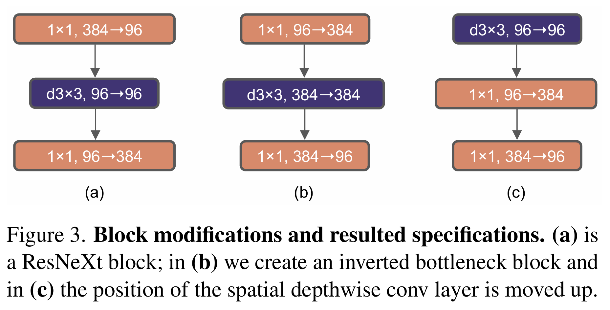
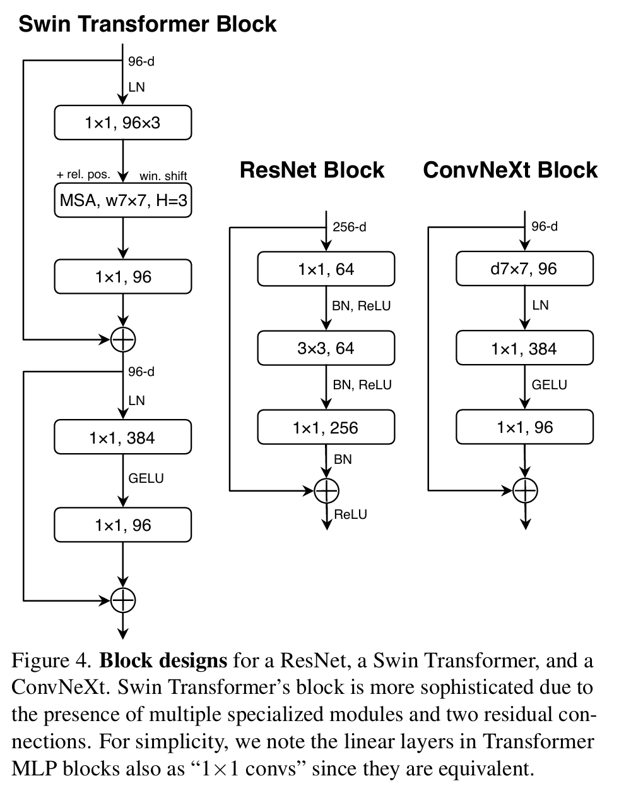

# ConvNeXt 学习笔记

**学习资料:** [(2 条消息) ConvNeXt详解 - 知乎](https://zhuanlan.zhihu.com/p/459163188)

[ConvNeXt补充资料](convnext_supplementary.md)

------

### **ConvNeXt: 一场精心策划的卷积网络复兴运动**

#### **核心论点：挑战时代潮流的“法医式”实验**

2020年代初，计算机视觉领域风云变幻。以 Vision Transformer (ViT) 及 Swin Transformer 为代表的架构，凭借其强大的性能和扩展性，迅速取代卷积网络（ConvNet）成为最先进模型的代名词。一时间，“ConvNet 已死”的论调甚嚣尘上。

然而，Facebook AI Research (FAIR) 的研究者们敏锐地观察到，Swin Transformer 等成功的混合模型，为了在目标检测、语义分割等通用视觉任务上取得成功，不得不重新引入了大量 ConvNet 的经典设计：如**分层金字塔结构**和**局部窗口注意力**（这与卷积的局部性思想异曲同工）。

这引出了一个根本性的问题，也是 ConvNeXt 这篇论文的核心灵魂：**Swin Transformer 的成功，究竟是其核心的“多头自注意力”机制本身碾压了“卷积”？还是因为它所采用的一整套现代化的架构设计（宏观与微观）和先进的训练方法论取得了胜利？**

为了回答这个问题，他们没有提出一个天马行空的新结构，而是开启了一场堪称“法医式”的控制变量实验。他们以最经典的 ConvNet 之一——ResNet-50 为蓝本，开启了一场“现代化”（Modernize）改造之旅，一步步地将 Swin Transformer 的设计思想嫁接到纯粹的卷积网络上，并严谨地记录每一步带来的性能变化。这篇论文，与其说是新模型的发布会，不如说是一份精彩绝伦、无可辩驳的实验报告，旨在为卷积网络正名。

---

### **ConvNeXt 的现代化改造之路：详细步骤与深度解析**

这是整个研究的精华所在。我们将严格遵循论文的路线图，对从 ResNet-50 蜕变为 ConvNeXt-T 的每一步进行深度剖析。

#### **第零步：起点——训练技术的现代化 (Training Techniques)**

*   **背景**: 传统的 ResNet-50 训练流程相对简单，通常只训练 90 个 epoch，使用 SGD 或 Momentum 优化器。而 ViT 和 Swin-T 则受益于一套更复杂、更强大的训练“配方”。
*   **改造**: 将 ResNet-50 的训练流程完全对标 ViT。具体包括：
    1.  **延长训练周期**: 从 90 epochs 大幅增加到 **300 epochs**。
    2.  **更换优化器**: 使用对 Transformer 更友好的 **AdamW 优化器**。
    3.  **引入现代数据增强**: 采用 **Mixup, Cutmix, RandAugment, Random Erasing** 等一系列先进技术。
    4.  **采用现代正则化**: 引入 **Stochastic Depth** 和 **Label Smoothing**。
*   **效果**: 仅此一步，ResNet-50 在 ImageNet-1K 上的 Top-1 准确率就从 **76.1% 飙升至 78.8%**。
*   **深度解析**: 这 **+2.7%** 的巨大提升是一个震撼的开端。它无可辩驳地证明了：**在架构比较中，训练方法是一个极其重要的混淆变量。很大一部分性能差距并非源于模型架构本身，而是源于训练方法论的代差。** 这也给所有工程实践者一个启示：在投入巨大成本设计新模型之前，优化和升级现有的训练流程本身就可能带来惊人的回报。

#### **第一步：宏观架构设计 (Macro Design)**

**a. 改变阶段计算比例 (Changing Stage Compute Ratio)**

*   **背景**: ResNet-50 的四个阶段（stage）的 Block 数量分布为 `(3, 4, 6, 3)`，计算量主要集中在 `res4` 阶段。而 Swin-T 的比例为 `(2, 2, 6, 2)`（近似 1:1:3:1），更侧重于后期阶段。
*   **改造**: 借鉴 Swin-T 的思想，将 ResNet-50 的 Block 比例调整为 `(3, 3, 9, 3)`，这使得模型的 FLOPs 与 Swin-T 对齐，同时将更多的计算资源分配到网络的深层。
*   **效果**: 准确率从 **78.8% 提升至 79.4%**。
*   **深度解析**: 这个改动表明，在网络的深层阶段（此时特征图分辨率较低但通道数更多），进行更复杂的特征变换和融合，可能更有利于学习到对最终分类决策至关重要的高级抽象语义特征。

**b. 将 Stem 替换为 "Patchify"**

*   **背景**: ResNet 的起始层（Stem）是一个 7x7 大卷积核（步长2）后接一个最大池化层，共同完成4倍下采样。ViT/Swin-T 则使用一个不重叠的卷积（例如 4x4，步长4）一次性完成4倍下采样，这个操作在概念上被称为 "Patchify"（图像块化）。
*   **改造**: 将 ResNet 的 Stem 替换为一个更简洁的 **4x4、步长为4的单层卷积**。
*   **效果**: 准确率从 **79.4% 提升至 79.5%**。
*   **深度解析**: 从工程角度看，7x7 卷积加池化是两个串行操作。而单个 4x4、步长4的卷积是一个更简洁、更高效的等价实现。这一步证明了，模型开局的下采样方式可以更激进、更简单，其性能与传统设计并无二致，但结构上却向 ViT 看齐。

#### **第二步：ResNeXt 化——采用深度可分离卷积**

*   **背景**: ResNeXt 证明了分组卷积（Grouped Convolution）是提升效率和性能的有效手段。深度可分离卷积（Depthwise Separable Convolution）是分组卷积的极致形式（分组数=通道数），它将空间维度的滤波和通道维度的混合彻底解耦。
*   **改造**: 将瓶颈块中的 3x3 标准卷积替换为 **3x3 深度可分离卷积**。由于此举会显著降低 FLOPs，为了补偿模型容量，将网络宽度（初始通道数）从 64 增加到 96（对标 Swin-T）。
*   **效果**: 准确率从 **79.5% 显著提升至 80.5%**。
*   **深度解析**: 这是现代化改造中的关键一步。深度可分离卷积由两部分组成：
    1.  **深度卷积 (Depthwise Conv)**: 每个通道使用一个独立的卷积核，只在空间维度上混合信息。
    2.  **逐点卷积 (Pointwise Conv, 1x1 Conv)**: 负责将不同通道的信息进行融合和变换。
    这种**空间与通道信息处理的解耦**，在设计哲学上与 ViT 中的自注意力模块（主要负责空间信息混合）和后续的 MLP 模块（主要负责通道信息混合）高度一致。这强烈暗示了这种解耦式的信息处理范式本身就是一种更优的设计。

#### **第三步：采用倒置瓶颈结构 (Inverted Bottleneck)**

*   **背景**: ResNet 的经典瓶颈块是“两头宽，中间窄”的结构（`1x1降维 -> 3x3卷积 -> 1x1升维`）。而 MobileNetV2 推广了“中间宽，两头窄”的**倒置瓶颈**结构（`1x1升维 -> 深度卷积 -> 1x1降维`），Transformer 的 MLP 块也遵循了类似的扩展-压缩模式。
*   **改造**: 将网络的主体结构从标准瓶颈块改为倒置瓶颈块，扩展比例为4。
*   **效果**: 准确率从 **80.5% 小幅提升至 80.6%**（在更大的 ResNet-200/Swin-B 体系中，这一步带来了 0.7% 的显著提升）。
*   **深度解析**: 倒置瓶颈结构允许网络在更高维度的特征空间上进行核心的变换（如空间卷积），这被认为有助于网络学习到更丰富、更有表现力的特征。同时，输入和输出通过低维的“捷径”（shortcut）连接，保证了梯度的有效流动和信息保真度。

#### **第四步：拥抱大卷积核 (Large Kernel Sizes)**

*   **背景**: 自 VGGNet 以来，堆叠小的 3x3 卷积核成为 ConvNet 设计的金标准，因为这在硬件上非常高效。然而，ViT 的核心优势之一是其全局感受野，Swin-T 也通过至少 7x7 的注意力窗口来获得较大的感受野。
*   **改造**:
    1.  **上移深度卷积层**：首先，将深度卷积层的位置从倒置瓶颈的中间移动到最开始（见论文图3(c)）。这模仿了 Transformer 中 MSA 块在 MLP 块之前的布局。从工程角度看，这让计算相对密集的深度卷积（尤其是使用大核时）在通道数较少时进行，从而优化了整体计算效率。
    2.  **增大核尺寸**: 将上移后的深度卷积核尺寸从 3x3 逐步增加到 5x5, 7x7, 9x9, 11x11。
*   **效果**: 性能在 **7x7** 时达到峰值，准确率从（上一步骤后的）**79.9% 提升至 80.6%**。继续增大核尺寸则收益饱和。
*   **深度解析**: 这一发现直接挑战了“小卷积核堆叠”的传统智慧。它证明了**更大的感受野对于视觉识别任务至关重要**，而 ConvNet 完全可以通过简单地增大卷积核尺寸来有效模拟 ViT 的这一优势，并且 7x7 是一个性价比极高的“甜点”（sweet spot）。

#### **第五步：精雕细琢的微观设计 (Micro Design)**

这是一系列精细但累积效应显著的调整。

*   **用 GELU 替换 ReLU**: GELU 是一个更平滑的非线性激活函数，是 BERT、GPT、ViT 等现代 Transformer 的标配。替换后准确率保持不变（80.6%），但这是对齐现代化设计的重要一步。
*   **更少的激活函数**: 传统 ConvNet 习惯在每个卷积层后都加上激活函数。而 Transformer Block 中激活函数的使用非常克制。改造中，在一个 Block 内，只保留了倒置瓶颈中间最宽的那个 1x1 卷积层后的 GELU 激活，移除了其他所有激活函数。此举将准确率从 **80.6% 提升至 81.3%**，效果惊人，并追平了 Swin-T 的性能。
*   **更少的归一化层**: 类似地，移除了多余的归一化层，只在深度卷积层之前保留一个。此举将准确率进一步提升至 **81.4%**，首次超越 Swin-T。
    *   **深度解析 (激活与归一化)**: 这两步共同说明，**过多的非线性和归一化操作可能会限制信息的有效流动，甚至损害模型的表示能力**。克制地、有策略地在信息流的关键节点上使用它们，是一种更优的设计哲学。
*   **用 Layer Normalization (LN) 替换 Batch Normalization (BN)**:
    *   **背景**: BN 是 ConvNet 的标配，但它依赖于批次（batch）的统计信息，在小批量训练、推理部署和迁移任务中存在诸多问题。LN 在单个样本内部的通道维度上进行归一化，是 Transformer 的标准实践，与具体批次无关。
    *   **改造**: 将网络中所有的 BN 层替换为 LN 层。
    *   **效果**: 准确率从 **81.4% 提升至 81.5%**。
    *   **深度解析**: 这是极其关键的一步。它证明了只要网络架构和训练方法得当，ConvNet 完全可以摆脱对 BN 的依赖。LN 不仅性能更优，而且从根本上避免了 BN 带来的各种工程难题，使得模型训练更稳定、更通用。
*   **独立的下采样层**:
    *   **背景**: ResNet 的空间下采样是在残差块内部通过步长为2的卷积完成的。Swin-T 则在不同 Stage 之间有独立的、专门的下采样层。
    *   **改造**: 在 Stage 之间使用一个独立的 **2x2、步长为2的卷积层**进行下采样，并在其前后添加 LN 层以稳定训练。
    *   **效果**: 准确率从 **81.5% 显著提升至 82.0%**。
    *   **深度解析**: 将**空间降维**与**特征提取**这两个不同的功能彻底分离，使得每个模块的职责更单一、更清晰。这避免了在一个 Block 内同时处理两种复杂任务可能带来的信息混淆和性能瓶颈。

至此，**ConvNeXt-T** 正式诞生。它在同等计算量下，以 **82.0%** 的准确率，无可争议地超越了 Swin-T 的 **81.3%**。

---

### **ConvNeXt 的最终架构与工程价值**

**1. 最终 Block 结构解析**

一个最终的 ConvNeXt Block 的数据流如下：
`输入 x` -> `7x7 深度卷积` -> `LayerNorm` -> `1x1 卷积 (升维4倍)` -> `GELU` -> `1x1 卷积 (降维)` -> `DropPath` -> `+ shortcut(x)` -> `输出`

**2. 与 Swin Transformer Block 的惊人对偶性**

这正是 ConvNeXt 设计最精妙的洞见：
*   **ConvNeXt 的 [7x7 深度卷积]**  <---> **Swin 的 [W-MSA (窗口多头自注意力)]**: 两者都承担了在**局部窗口内进行空间信息混合**的核心任务，都拥有较大的感受野。
*   **ConvNeXt 的 [1x1->GELU->1x1 倒置瓶颈]** <---> **Swin 的 [MLP Block]**: 两者结构几乎完全相同，都负责在**通道维度上进行信息混合和非线性变换**。

**3. 卓越的工程价值与效率**

*   **极致简洁**: ConvNeXt 完全由标准的、通用的卷积模块构成。它摒弃了 Swin Transformer 中如**循环位移（Cyclic Shift）、相对位置偏置（Relative Position Bias）**等复杂且需要专门 CUDA 核函数优化的算子。这使得 ConvNeXt **极易于理解、实现、调试和部署到各种硬件平台**。
*   **推理速度更快**: 如论文表1所示，在同等级别下，ConvNeXt 的推理吞吐量（images/s）普遍高于 Swin Transformer。这得益于其纯卷积的特性，可以完美地利用现代 GPU 对卷积运算数十年来的深度优化。
*   **训练内存更少**: 如论文4.3节所述，训练 ConvNeXt 所需的峰值内存比 Swin Transformer 更低。这在训练动辄百亿参数的大模型时，是一个极其宝贵的工程优势。
*   **全卷积天性**: 作为纯卷积网络，ConvNeXt 可以自然地处理任意分辨率的输入图像。在下游任务（如检测、分割）中进行微调时，无需像 ViT 那样对位置编码进行复杂的插值，使其应用起来更加灵活、方便。

---

### **结论：一场思想的胜利**

ConvNeXt 的研究并非简单地发布了一个性能强大的新模型，而是通过一场精彩绝伦的“思想实验”，为整个计算机视觉领域带来了以下深刻的启示：

1.  **架构设计的普适性力量**: 许多被认为是 Transformer 成功的关键设计（如倒置瓶颈、LN、GELU、更少的激活/归一化、分离的下采样等）是普适且高效的。它们是性能提升的真正秘诀，而非某种特定计算范式（如自注意力）的专利。
2.  **卷积的华丽回归与再思考**: 卷积所固有的强大归纳偏置（如平移等变性、局部性）在视觉任务中依然极其宝贵和高效。ConvNeXt 证明了，只要给经典的卷积网络穿上“现代化的外衣”，它就能爆发出与最先进的 Transformer 相媲美甚至更强的能量。
3.  **对未来的启示**: 这项工作鼓励所有研究者和工程师重新审视和深度挖掘现有技术的潜力，而不是盲目地追逐最新的潮流。它为未来的视觉架构设计提供了一个坚实的、高效的、简洁的纯卷积基线（Baseline），并雄辩地证明了 **ConvNet 依然是“2020年代”值得信赖和深入研究的强大范式**。

总而言之，ConvNeXt 的故事告诉我们：真正的创新，往往不是颠覆性的推倒重来，而是源于对基本原理的深刻理解和对现有技术的精妙重组。

