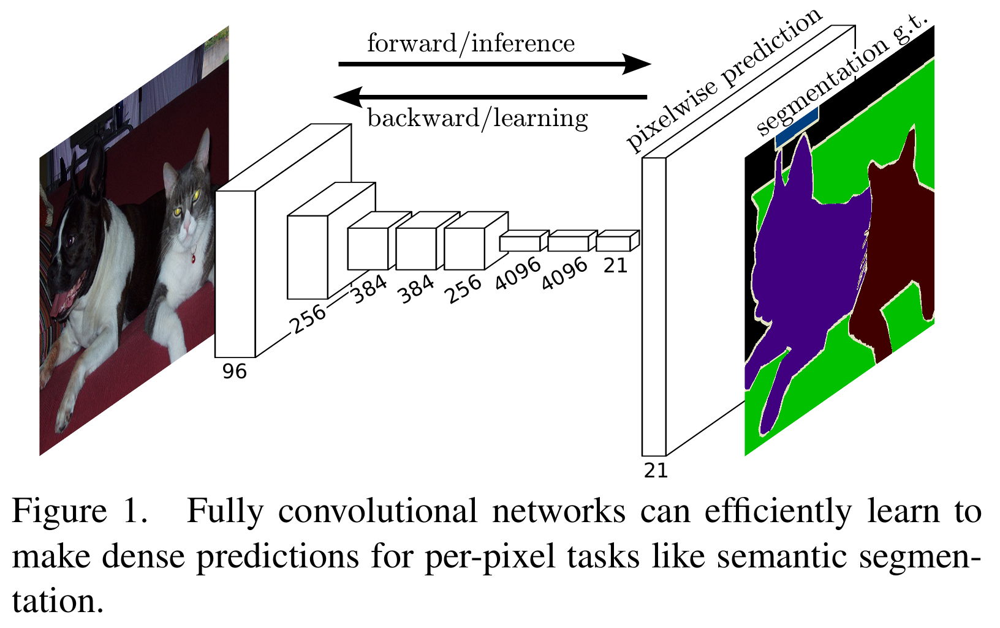
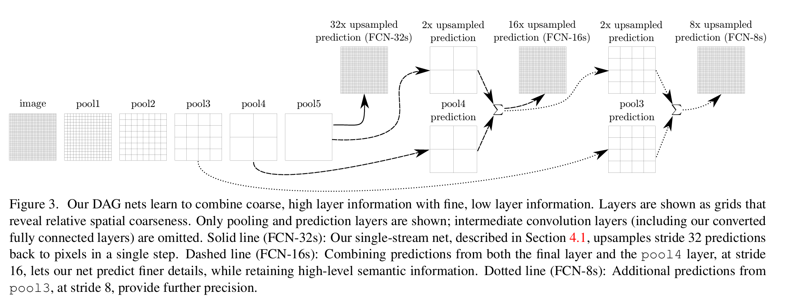

# FCN笔记

**学习资料**:
*   [(1 封私信 / 4 条消息) 深度学习语义分割篇——FCN原理详解篇 - 知乎](https://zhuanlan.zhihu.com/p/629115960)
*   [[1411.4038] Fully Convolutional Networks for Semantic Segmentation](https://arxiv.org/abs/1411.4038)

**相关概念**:

*   转置卷积：[下采样与上采样](../../../../01_Fundamentals(基础知识)/Basic_Concepts (基础概念)/downsampling_and_upsampling(下采样与上采样).md)

---

## 核心思想：全卷积化 (Convolutionalization)

FCN（Fully Convolutional Networks，全卷积网络）是Jonathan Long等人在2015年提出的，是深度学习在图像语义分割领域的开创性工作。其核心思想是将经典的图像分类网络（如AlexNet, VGGNet）**全卷积化**，即用卷积层替换掉网络末端的全连接层（Fully Connected Layer），从而实现从图像像素到像素类别的端到端预测（End-to-end, Pixel-to-pixel）。

### 1. 传统CNN用于分类的问题

在FCN出现之前，主流CNN模型通常在最后使用全连接层，将卷积层提取的特征图（Feature Map）转换成一个固定长度的向量，用于图像分类。这种结构存在两大问题：
*   **输入尺寸固定**：全连接层要求输入特征图的尺寸是固定的，这导致整个网络也必须接收固定大小的输入图像。在实际应用中，需要对不同尺寸的图像进行裁剪或缩放，可能导致信息丢失或形变。
*   **丢失空间信息**：全连接层会“压平”特征图，完全丢弃其空间坐标信息。它只关心特征是否存在，不关心特征在图像中的哪个位置。而语义分割任务恰恰需要为每个像素点进行分类，位置信息至关重要。

### 2. FCN的解决方案

FCN的巧妙之处在于，它将这些全连接层看作是覆盖整个输入区域的特殊卷积层，并用等效的卷积层替换它们。一个连接$h \times w \times d$特征图的全连接层，可以被一个核大小为$h \times w$、输出通道数为$N$（全连接层神经元数量）的卷积层替代。对于分类网络（如VGG）中跟在卷积层和池化层之后的连续全连接层，可以被一系列$1 \times 1$的卷积层替代。这样做带来了革命性的好处：
*   **接受任意尺寸输入**：网络中只包含卷积、池化和上采样层，这些操作不依赖于固定的输入尺寸，因此FCN可以处理任意大小的图像，并输出相应尺寸的分割图（热力图）。
*   **保留空间信息**：输出的结果是一个与输入图像在空间上有对应关系的特征图（Heatmap），图上的每个点的值代表了原始图像对应位置属于某个类别的预测分数，保留了“在哪里”的信息。
*   **计算效率高**：对于整张图像的预测，全卷积网络通过共享重叠区域的计算，远比在每个小块（Patch）上独立运行分类网络要高效得多。

## FCN的网络结构

FCN的结构可以看作由两个主要部分组成：**编码器（Encoder）** 和 **解码器（Decoder）**。

### 1. 编码器（下采样路径）

编码器部分通常直接采用一个在ImageNet上预训练好的图像分类网络，如VGG16或ResNet，并去掉其最后的分类层。这部分的作用是提取图像的层次化特征。随着网络加深，特征图的尺寸会不断变小（下采样），但语义信息会更丰富。
*   **浅层特征**：网络较浅的层（如conv1, conv2）感受野较小，提取的是图像的局部、细节信息，如边缘、颜色、纹理。这些特征分辨率高，但语义信息较弱。
*   **深层特征**：网络较深的层（如conv5, pool5）经过多次卷积和池化，感受野增大，提取的是更全局、更抽象的语义信息。这些特征分辨率低，但语义信息强。

### 2. 解码器（上采样路径）

编码器得到了一个尺寸很小但语义信息丰富的特征图。为了得到与原图一样大小的分割结果，需要将这个小特征图恢复到原始尺寸，这个过程称为**上采样（Upsampling）**。
FCN主要使用**转置卷积（Transposed Convolution）**，在论文中也被称为“反向步幅卷积”（Backwards Strided Convolution）或不准确地称为“反卷积”（Deconvolution），来进行上采样。
转置卷积可以看作是普通卷积的逆操作，它将一个输入值映射到一个输出区域，从而扩大特征图的尺寸。关键在于，**它是一种可以学习参数的上采样方法**，网络可以通过反向传播来学习最优的上采样方式，而不仅仅是使用固定的插值算法（如双线性插值）。

### 3. 跳级结构（Skip Connections/Architecture）

如果仅仅对编码器最深层的特征图（如VGG的pool5输出）进行32倍的上采样来恢复原图尺寸，得到的结果会非常粗糙，只能勾勒出物体的大致轮廓。因为这个特征图虽然包含了丰富的“是什么物体”的语义信息，但由于尺寸太小，已经丢失了大量的“物体在哪里”的空间细节信息。
为了解决这个问题，FCN引入了**跳级结构**，其核心思想是**融合不同深度的特征**，结合深层的语义信息和浅层的外观信息。

*   **深层、粗糙的语义信息**：来自编码器后端，告诉你图像里大概有什么物体。
*   **浅层、精细的外观信息**：来自编码器前端，告诉你物体的精确轮廓和位置。

根据融合的特征层不同，FCN分为了几个经典版本：
*   **FCN-32s**: 不使用跳级结构。直接将最后一层（pool5）的输出上采样32倍得到结果。效果最粗糙。
*   **FCN-16s**: 将pool5的输出上采样2倍，然后与pool4层的输出（经过一个$1 \times 1$卷积得到类别分数）进行**逐元素相加**融合，再对融合后的特征图进行16倍上采样得到结果。
*   **FCN-8s**: 在FCN-16s的基础上更进一步。将pool5和pool4融合后的结果再上采样2倍，然后与pool3层的输出（同样经过$1 \times 1$卷积）相加融合，最后对这个结果进行8倍上采样。这是效果最好也是最常用的版本。
这种结构形成了一个有向无环图（DAG），信息从深层流向浅层，逐步精化预测结果。

### 4. 分割结果的生成过程

分割结果在**上采样（解码器）过程的最终阶段**生成，它依赖于下采样（编码器）提供的特征。具体流程如下：
*   **第一步：下采样提取语义信息**
编码器通过卷积和池化，将输入图像压缩成一个尺寸很小、但语义信息高度浓缩的特征图（例如，VGG的pool5输出）。这个特征图知道了“图像里有什么”，但丢失了精确的“在哪里”的信息。
*   **第二步：生成类别分数图 (Scoring)**
这是解码器开始工作的关键一步。网络使用一个$1 \times 1$的卷积层作用于编码器输出的深度特征图上。这个卷积层的输出通道数被设定为**分割任务的总类别数**（如20个物体+1个背景=21类）。这步操作将几百个特征通道转换成了21个通道的**分数图（Score Map）**，每个通道代表一个类别在该位置的预测分数。
*   **第三步：融合与上采样**
在FCN-16s和FCN-8s中，上一步得到的分数图会与来自编码器浅层（如pool4, pool3）的特征（同样经过$1 \times 1$卷积转换成类别分数图）进行融合（逐元素相加）。这一步结合了深层的语义信息和浅层的空间细节。然后，网络使用**转置卷积**将融合后的分数图逐步放大，恢复到和原始输入图像一样的尺寸。
*   **第四步：逐像素分类 (Argmax)**
这是生成最终可视化分割图的最后一步。此时我们得到了一个与原图尺寸相同、通道数为类别数的分数图（如$H \times W \times 21$）。对于图中的每一个像素位置，模型会沿着通道维度比较其分数，取分数值最大的那个通道作为该像素的预测类别。这个操作称为**Argmax**。将所有像素的预测类别用不同颜色表示，就构成了最终的语义分割图像。

## 损失函数（Loss Function）

FCN的训练是端到端的。对于分割任务，我们需要对每个像素点进行分类。因此，其损失函数是图像中所有像素点分类损失的平均值。通常使用**像素级的交叉熵损失（Per-pixel Cross-Entropy Loss）**。
假设图像总共有$N$个像素点，类别总数为$C$。对于第$i$个像素点：

*   $y_i$是它的真实类别标签（Ground Truth）。
*   $p_i$是模型预测该像素点属于各个类别的概率向量。
那么，整个图像的损失函数$L$可以表示为：
$$
L = \frac{1}{N} \sum_{i=1}^{N} H(y_i, p_i)
$$
其中$H(y_i, p_i)$是单个像素的交叉熵损失，其计算公式为：
$$
H(y_i, p_i) = - sum_{c=1}^{C} y_{ic} log(p_{ic})
$$
*   $y_{ic}$是一个指示函数，如果像素$i$的真实类别是$c$，则$y_{ic}=1$，否则为0。
*   $p_{ic}$是模型预测像素$i$属于类别$c$的概率。
这个公式的含义是：对于每个像素，我们都希望它被预测为真实类别的概率$p_{ic}$尽可能接近1，这样$-log(p_{ic})$就会趋近于0，总损失也就越小。通过在整张图像上最小化这个总损失，模型就能学会如何为每个像素进行正确的分类。在训练时，FCN采用**全图像训练（Full-image Training）**，即每次输入整张图片计算所有像素的损失，这比传统的块状训练（Patchwise Training）在计算上更高效。

## 总结与贡献

FCN模型是语义分割领域的里程碑，它的主要贡献可以概括为：
1.  **提出端到端的全卷积网络结构**：用卷积层替代全连接层，实现了对任意尺寸输入的像素级预测，奠定了现代分割网络的基础。
2.  **引入可学习的上采样层**：使用转置卷积恢复分辨率，并通过反向传播学习最佳的上采样方式。
3.  **开创性的跳级结构**：通过融合多层次特征，巧妙地结合了深层语义信息和浅层空间细节，显著提升了分割精度。
4.  **利用预训练模型进行微调**：证明了在大型分类数据集（如ImageNet）上预训练的模型可以被成功迁移到语义分割任务上，并极大地提升性能。
尽管后来出现了如U-Net、DeepLab等更先进的模型，它们在FCN的基础上进行了各种优化（如U-Net设计了更对称的编解码结构，DeepLab引入了空洞卷积），但FCN的基本思想——**编码-解码结构**和**特征融合**——奠定了现代语义分割网络的基础。

### 我自己的理解：
FCN是一个图像分割的模型，它是在VGGNET的网络基础上修改的，将最后的全连接层用来分类的部分改成了卷积层继续进行卷积操作，并在最后用转置卷积进行上采样。除此之外，在转置卷积的过程中，输入进去的特征图会与原来输入的相同规格的特征图进行跳跃连接，也就是将里面的特征图的值相加，这样能让上卷积操作的内容信息更准确。

