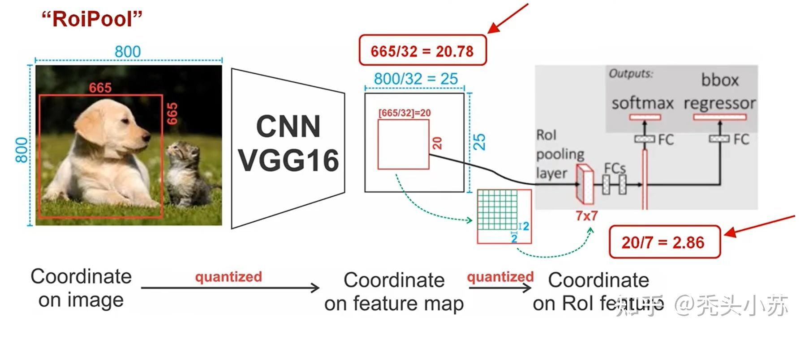
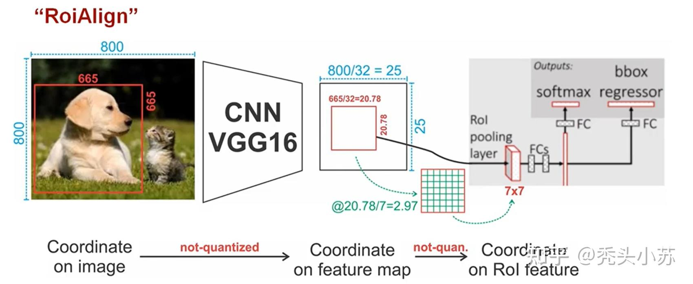

# Mask R-CNN笔记

**学习资料**: [(14 条消息) 深度学习实例分割篇——Mask RCNN原理详解篇 - 知乎](https://zhuanlan.zhihu.com/p/651009999)

------

**Mask R-CNN** 是一个在计算机视觉领域具有里程碑意义的模型，它在 **实例分割 (Instance Segmentation)** 任务中取得了卓越的性能。它是在 Faster R-CNN 的基础上发展而来的，通过在原有的目标检测分支上增加一个并行的**掩码预测分支**，实现了像素级别的对象分割。

### 核心思想

Mask R-CNN 的核心思想可以概括为：**“检测出对象，然后为每个检测到的对象生成一个精确的像素级掩码。”** 也就是说，它不仅能告诉你在图像的哪里有一个对象，还能精确地指出这个对象的每一个像素。

### Mask R-CNN 的结构

Mask R-CNN 的架构可以理解为对 Faster R-CNN 的扩展。我们来逐个剖析其主要组成部分：

1. **骨干网络 (Backbone Network):**
   - 通常是一个经典的卷积神经网络 (CNN)，如 ResNet 或 ResNeXt，用于从输入图像中提取特征图。
   - 这些特征图包含了图像的语义和空间信息，是后续所有任务的基础。
   - 结合 **特征金字塔网络 (FPN - Feature Pyramid Network)** 是一个常见的优化，它可以生成多尺度的特征图，从而更好地处理不同大小的对象。FPN 能够将低层高分辨率的特征（包含细节信息）与高层低分辨率的特征（包含语义信息）融合，提升对小物体的检测能力。
2. **区域提议网络 (RPN - Region Proposal Network):**
   - RPN 是 Faster R-CNN 的核心创新，它取代了传统的耗时区域选择算法（如 Selective Search）。
   - RPN 在骨干网络提取的特征图上滑动一个小型网络，预测一系列可能包含对象的 **区域提议 (Region Proposals)**。
   - 每个区域提议都包含其位置信息（边界框坐标）和对象性得分（即该区域是否包含一个对象）。
   - 这些提议是粗略的，但已经大大缩小了搜索空间。
3. **RoI Align (Region of Interest Align):**
   - 在 Faster R-CNN 中，RoI Pooling 被用于将不同大小的区域提议池化成固定大小的特征图，以便送入后续的全连接层。然而，RoI Pooling 存在量化误差，会丢失一些空间信息，这对像素级的掩码预测是致命的。
   - **RoI Align** 是 Mask R-CNN 的关键改进之一。它通过**双线性插值**来精确地计算特征值，避免了量化误差，从而保留了更准确的空间信息，这对于生成高质量的掩码至关重要。
4. **并行的头部网络 (Parallel Heads):**
   - 这是 Mask R-CNN 最显著的特点。在 RoI Align 之后，每个固定大小的特征图会送入三个并行的分支（头部）：
     - **分类分支 (Classification Head):** 预测区域提议中包含的对象类别（例如：人、汽车、猫等）。
     - **边界框回归分支 (Bounding Box Regression Head):** 对 RPN 预测的粗略边界框进行微调，使其更精确地包围对象。
     - **掩码预测分支 (Mask Prediction Head):** 这是一个新增的分支，用于预测每个区域提议的二值掩码。这个分支通常是一个小型全卷积网络 (FCN)，对每个像素进行分类，判断它是否属于该对象。对于每个 RoI，它会输出一个 K×M×M 的二值掩码，其中 K 是类别数量， M×M 是掩码的尺寸（例如 28x28 像素）。
     - **补充信息：** Mask R-CNN 的掩码预测分支之所以为每个类别都生成一个独立的掩码，是为了**解耦分类和分割任务**。
       - 模型的**分类分支**已经确定了这个 RoI 的类别（比如，判断出这是一个“人”）。
       - **掩码分支**的任务不再是判断这个像素属于哪个类别，而仅仅是判断“这个像素是不是这个人的一部分？”。
       - 因此，当分类分支预测 RoI 为第 `i` 个类别时，只有第 `i` 个 KxMxM 的掩码会参与到损失计算和最终的掩码生成中。这使得每个类别的掩码生成都是一个独立的二分类问题，从而提升了分割的质量，避免了类间竞争。

### 区域提议网络 (RPN) 详解

在目标检测中，我们首先需要知道图像中“可能”存在对象的位置。传统的方法（比如 Selective Search）会生成大量的候选区域，然后逐一判断这些区域里有没有对象。这个过程非常耗时。

**RPN 的核心思想** 就是用一个小的神经网络来**自动、快速地**生成这些“可能包含对象”的区域，我们称之为**区域提议 (Region Proposals)**。这些提议会包含一个大概的位置（边界框）以及这个位置有多大概率是“前景”（即包含对象，而不是背景）。

#### 1. 为什么需要 RPN？

想象一下，一张图片上可能有很多个对象，它们大小不一，形状各异。我们不能简单地在图片上划出所有可能的矩形框来检查。RPN 的作用就是：

- **高效性：** 替代了传统的、计算量大的区域选择算法。
- **端到端学习：** 它可以和整个检测网络一起训练，使得生成的区域提议更适合后续的检测任务。
- **适应性：** 能够处理不同尺度和长宽比的对象。

#### 2. RPN 的工程实现与数据流

我们从输入到输出，一步步来看 RPN 的工作流程：

**输入：特征图 (Feature Map)**

- **来源：** RPN 的输入是来自骨干网络（比如 VGG、ResNet 等）提取出来的**特征图**。
- **理解：** 骨干网络就像一个“图像分析师”，它将原始图像（比如一张 1000x600 像素的图片）进行多层卷积和池化操作，提取出包含图像高级语义信息的“压缩版”表示。这个“压缩版”就是特征图，它的尺寸通常比原图小很多（例如，原图经过 16 倍下采样后，特征图可能变成 62x37 像素），但每个点都包含了原图对应区域的丰富信息。
- **数据流：** `原始图像 -> 骨干网络 -> 特征图 (例如：尺寸 H x W x C，其中 H, W 是特征图的高度和宽度，C 是通道数)`

**核心组件：滑动窗口 (Sliding Window) 和 Anchor Boxes (锚框)**

这是 RPN 最关键的部分。

- **滑动窗口：** RPN 在特征图上使用一个小的**卷积核（例如 3x3 大小）**进行滑动。这个 3x3 的卷积核就像一个“探测器”，它在特征图上一步步移动，每移动到一个位置，就对这个位置以及周围 3x3 区域的特征进行分析。
- **数据流：** `特征图上的每个 (x, y) 位置`
- **Anchor Boxes (锚框)：**
  - **概念：** 在特征图的每一个滑动窗口位置，RPN 不仅仅是看一个点，它会**同时考虑多个预设的、不同尺寸和长宽比的矩形框**。这些预设的矩形框就是 **Anchor Boxes**。
  - **为什么需要 Anchor Boxes？** 因为图像中的对象大小和形状千变万化。一个 3x3 的滑动窗口只能看到局部信息，但它需要预测各种大小的对象。Anchor Boxes 就是为了解决这个问题：在每个位置，我们都假设可能存在不同大小和形状的对象。
  - **具体实现：** 通常，在每个滑动窗口的中心，我们会定义 `k` 个锚框。这 `k` 个锚框通常由**3 种尺度（例如：128x128, 256x256, 512x512 像素，这些是映射回原图的尺寸）**和 **3 种长宽比（例如：1:1, 1:2, 2:1）**组合而成，所以 `k = 3 * 3 = 9` 个锚框。
  - **理解：** 想象你在特征图的每个点上放了 9 个不同大小和形状的“模具”，RPN 会判断这些“模具”里有没有对象。
  - **数据流：** `对于特征图上的每个 (x, y) 位置，生成 k 个 Anchor Boxes`

**输出分支：分类分支 (Classification Branch) 和 回归分支 (Regression Branch)**

在每个滑动窗口位置，RPN 会同时输出两组信息：

1. **分类分支 (Classification Branch)：**
   - **作用：** 判断每个锚框是“前景”（包含对象）还是“背景”（不包含对象）。
   - **实现：** 在 3x3 卷积核的输出之后，连接一个 1x1 的卷积层。这个 1x1 卷积层会输出 `2k` 个值。对于每个锚框，它会输出 2 个值：一个表示是前景的概率，一个表示是背景的概率。
   - **数据流：** `特征图 -> 3x3 卷积 -> 1x1 卷积 -> 2k 个输出值 (前景/背景分数)`
2. **边界框回归分支 (Bounding Box Regression Branch)：**
   - **作用：** 对那些被认为是“前景”的锚框进行微调，使其更精确地匹配对象的真实边界框。
   - **为什么需要微调？** 因为锚框是预设的，它们不可能完美地匹配所有对象的真实边界框。回归分支就是用来修正这些偏差的。
   - **实现：** 同样，在 3x3 卷积核的输出之后，连接另一个 1x1 的卷积层。这个 1x1 卷积层会输出 `4k` 个值。对于每个锚框，它会输出 4 个值：`Δx, Δy, Δw, Δh`，分别表示对锚框中心点 x 坐标、y 坐标、宽度和高度的调整量。
   - **数据流：** `特征图 -> 3x3 卷积 -> 1x1 卷积 -> 4k 个输出值 (边界框偏移量)`

**训练 RPN：**

RPN 的训练是一个二分类问题（前景/背景）和回归问题（边界框微调）的结合。

- **正负样本定义：**
  - **正样本 (Positive Samples)：**
    - **(a)** 与任何真实边界框 (Ground Truth Box) 的 IoU 大于 0.7 的锚框。
    - **(b)** 对于**每一个**真实边界框，与其拥有最高 IoU 的锚框（即使 IoU 低于 0.7）。这样做是为了确保每个真实物体至少有一个锚框作为正样本，防止某些物体因为没有高 IoU 的锚框而被忽略。
  - **负样本 (Negative Samples)：**
    - 与所有真实边界框的 IoU 都小于某个阈值（例如 0.3）的锚框。
  - **忽略样本：** 介于 0.3 和 0.7 之间的锚框在训练时不参与计算损失。
- **损失函数：** RPN 的总损失是分类损失和回归损失的加权和。
  - **分类损失：** 通常使用二值交叉熵损失，用于判断前景/背景。
  - **回归损失：** 通常使用 Smooth L1 损失，用于微调边界框。

**后处理：生成最终的区域提议**

RPN 训练完成后，在推理阶段，它会为每个锚框输出前景/背景分数和边界框偏移量。我们需要进行一些后处理来得到最终的区域提议：

1. **根据前景分数筛选：** 丢弃那些前景分数很低的锚框（例如，低于 0.5 的）。
2. **应用边界框偏移量：** 使用回归分支预测的 `Δx, Δy, Δw, Δh` 来调整剩余锚框的坐标，得到更精确的边界框。
3. **非极大值抑制 (NMS - Non-Maximum Suppression)：**
   - **问题：** 一个对象可能会被多个重叠的锚框同时预测为前景。
   - **作用：** NMS 会去除高度重叠的、分数较低的边界框，只保留分数最高的那个。
   - **实现：**
     - 按照前景分数从高到低排序所有边界框。
     - 选择分数最高的边界框，并将其添加到最终结果列表中。
     - 移除所有与已选择边界框 IoU 大于某个阈值（例如 0.7）的其余边界框。
     - 重复这个过程，直到所有边界框都被处理。
   - **数据流：** `所有调整后的边界框和它们的前景分数 -> NMS -> 最终的区域提议 (例如：2000 个)`

**输出：区域提议 (Region Proposals)**

- **形式：** 一系列边界框（通常是几百到几千个），每个边界框都带有一个“对象性”分数。
- **用途：** 这些区域提议会被送入后续的检测网络（例如 Fast R-CNN 的分类和回归分支），进行更精细的分类和最终的边界框回归。

#### 3. 总结 RPN 的数据流

1. **原始图像** 输入到 **骨干网络**。
2. **骨干网络** 输出 **特征图**。
3. **RPN** 在 **特征图** 上滑动一个 **3x3 卷积核**。
4. 在每个滑动位置，根据预设的 **k 个 Anchor Boxes**，并行输出：
   - `2k` 个值（**前景/背景分数**）
   - `4k` 个值（**边界框偏移量**）
5. 对所有锚框进行：
   - **前景分数筛选**
   - **边界框偏移量应用**
   - **非极大值抑制 (NMS)**
6. 最终输出 **高质量的区域提议**，作为后续检测阶段的输入。

------

### RoI Align (Region of Interest Align) 详解

在 RPN (区域提议网络) 生成了大量的 **区域提议 (Region Proposals)** 后，这些提议都是一些边界框，它们的大小和形状各不相同。然而，我们后续的分类、回归和掩码预测分支（也就是网络的“头部”）通常需要固定大小的输入。这就好比你要把各种尺寸的照片都放进一个固定大小的相框里。

### 1. 为什么需要 RoI Align？—— 从 RoI Pooling 说起

在 Mask R-CNN 出现之前，Faster R-CNN 中使用的是 **RoI Pooling (Region of Interest Pooling)**。我们先来看看 RoI Pooling 是怎么做的，以及它存在的问题。

#### RoI Pooling 的工作方式 (及其问题)

1. **输入：** 一个区域提议（例如，一个边界框 `[x1, y1, x2, y2]`）和原始的特征图。
2. **目标：** 将这个区域提议所对应的特征图区域，转换成一个固定大小的特征图（例如 7x7）。
3. **步骤：**
   - **量化：** RoI Pooling 首先会将区域提议的浮点坐标**量化**到特征图的整数坐标上。比如，一个区域提议在特征图上的左上角坐标是 `(2.3, 4.7)`，RoI Pooling 会直接将其近似为 `(2, 4)`。同样，它的宽度和高度也会被量化。
   - **分块：** 然后，将这个量化后的区域**均匀地划分**成目标尺寸（例如 7x7）的网格。
   - **再次量化：** 每个网格的边界也可能会被量化。例如，如果一个区域的宽度是 10 个像素，要分成 7 份，每份就是 10/7 ≈ 1.42 像素。RoI Pooling 会再次进行向下取整或向上取整，导致每个子区域的尺寸也是整数像素。
   - **最大池化 (Max Pooling)：** 在每个划分出来的子网格中，取其中最大的特征值作为该子网格的代表。

#### RoI Pooling 存在的问题：量化误差

问题就出在**“量化”**上。RoI Pooling 在多个环节都进行了取整操作：

- 将浮点坐标的区域提议映射到特征图的整数坐标。
- 将区域划分成子网格时，子网格的边界也是整数。

这些取整操作会导致信息丢失，我们称之为**量化误差**。

- **举例：** 假设特征图上的一个像素代表原始图像中的 16x16 像素区域（下采样因子为 16）。如果一个对象的真实边界框恰好落在两个特征点之间，RoI Pooling 会强行将其对齐到最近的整数坐标。这种微小的偏差，经过多层网络传递，尤其对于需要像素级精度的任务（比如实例分割中的掩码预测），**就会变得致命**。它会导致预测的掩码与实际对象之间产生“错位”，不够平滑和精确。

### 2. RoI Align 的解决方案：消除量化误差

RoI Align 的核心改进就是为了**消除 RoI Pooling 中的量化误差**，从而保留更准确的空间信息。

#### RoI Align 的工作方式

1. **输入：** 同样是一个区域提议（边界框 `[x1, y1, x2, y2]`）和原始的特征图。
2. **目标：** 同样是将这个区域提议所对应的特征图区域，转换成一个固定大小的特征图（例如 7x7）。
3. **关键改进点：不进行量化！**
   - **不量化坐标：** RoI Align 不会对区域提议的坐标进行任何取整操作，它会**直接使用浮点坐标**。
   - **不量化分块：** 它也会将区域提议均匀地划分成目标尺寸（例如 7x7）的网格，但这些网格的边界也都是浮点坐标。
   - **采样点：** 在每个子网格中，RoI Align 会选择**固定的采样点**（例如，每个子网格的中心点，或者均匀分布的 4 个点），这些采样点的坐标也是浮点数。
   - **双线性插值 (Bilinear Interpolation)：** 这是 RoI Align 的核心！由于采样点的坐标是浮点数，它们不一定正好落在特征图的像素中心上。为了获取这些浮点坐标上的特征值，RoI Align 会使用**双线性插值**的方法。

#### 什么是双线性插值？

- **理解：** 想象一下你在一个地图上寻找某个精确地点的高度。如果这个地点不在任何一个已知海拔点的正上方，你会怎么做？你会参考它周围最近的四个已知海拔点，根据距离的远近来“估算”它的高度。
- **在 RoI Align 中：** 对于每个浮点坐标的采样点，双线性插值会找到它在特征图上最近的 4 个整数像素点。然后，根据这 4 个像素点的值以及采样点到这 4 个像素点的距离，计算出一个加权平均值，作为该采样点的特征值。
- **数据流：** `区域提议的浮点坐标 + 特征图 -> 划分网格 (浮点坐标) -> 选取采样点 (浮点坐标) -> 双线性插值 -> 固定大小的输出特征图`

1. **池化：** 最后，对于每个子网格，可以通过最大池化或平均池化来汇总其采样点的特征值，得到最终固定大小的特征图。

### 3. RoI Align 的优势

- **消除量化误差：** 这是最核心的优势，它避免了 RoI Pooling 因取整而造成的信息损失。
- **更精确的空间对齐：** 由于能够精确地从特征图上采样特征，RoI Align 使得提议区域与特征图上的特征能够**更精确地对齐**。
- **对像素级任务至关重要：** 对于像**实例分割**这样需要预测像素级掩码的任务，精确的空间对齐是至关重要的。RoI Align 保证了掩码预测分支能够接收到与原始图像对象位置精确对应的特征，从而生成高质量、平滑且边界清晰的掩码。
- **提升整体性能：** 尽管只是一个看似微小的改进，但 RoI Align 对 Mask R-CNN 的性能提升起到了关键作用，尤其是在 COCO 等需要高精度定位的基准测试中。

### 总结 RoI Align 的数据流

1. **区域提议 (Region Proposal)** 从 RPN 输出，其坐标是浮点数。
2. 这些浮点坐标的区域提议被直接映射到 **骨干网络输出的特征图** 上。
3. 在每个区域提议内部，会根据目标输出尺寸（例如 7x7）**划分浮点坐标的子网格**。
4. 在每个子网格内部，选取**固定的采样点**（这些点也是浮点坐标）。
5. 对于每个浮点采样点，利用其周围最近的 4 个特征图像素点，通过**双线性插值**计算出该采样点的特征值。
6. 将每个子网格内采样点的特征值进行**池化**（例如最大池化或平均池化），得到该子网格的最终特征。
7. 最终，所有子网格的特征组合成一个**固定大小的输出特征图**（例如 7x7），送入后续的分类、回归和掩码预测分支。

------

### RoI Align 具体例子：从特征图到固定大小输出
想象一下我们有以下情况：
- **原始图像：** 一张大图片，比如 1024×1024 像素。
- **骨干网络下采样：** 假设我们的骨干网络将图像下采样了 **16 倍**。
- **特征图：** 那么，原始图像上的一个像素点，对应到特征图上可能就只有 1/16×1/16 的大小。反过来，特征图上的一个像素点，对应到原始图像上就是 16×16 像素的区域。
- **区域提议 (RoI)：** RPN 经过计算，提出了一个**候选区域**，它在原始图像上的坐标是 (x1=33, y1=65, x2=150, y2=200)。
- **目标输出尺寸：** 我们希望将这个 RoI 对应的特征图区域，池化成一个固定大小的特征图，比如 **2×2 大小** (为了简化，实际中通常是 7×7 或 14×14)。

#### 1. RoI Pooling 的处理方式 (旧方法)
我们先看看 **RoI Pooling** 会怎么处理这个 RoI：

**步骤 1：将 RoI 坐标映射到特征图**
首先，将原图上的 RoI 坐标除以特征图的下采样倍数（16），得到它在特征图上的浮点坐标：
$$
x1_{feat} = 33 / 16 = 2.0625 \\
y1_{feat} = 65 / 16 = 4.0625 \\
x2_{feat} = 150 / 16 = 9.375 \\
y2_{feat} = 200 / 16 = 12.5
$$
现在 RoI 在特征图上的浮点坐标是 $(2.0625, 4.0625, 9.375, 12.5)$。

**步骤 2：RoI Pooling 的第一次量化 (取整)**
**RoI Pooling 会直接对这些浮点坐标进行向下取整，将其强制对齐到特征图的整数网格上。**
$$
x1_{quant} = \lfloor 2.0625 \rfloor = 2 \\
y1_{quant} = \lfloor 4.0625 \rfloor = 4 \\
x2_{quant} = \lfloor 9.375 \rfloor = 9 \\
y2_{quant} = \lfloor 12.5 \rfloor = 12
$$
现在 RoI 在特征图上的量化后坐标是 $(2, 4, 9, 12)$。这个操作引入了第一次的位置偏差。

**步骤 3：将量化后的区域划分为 2×2 的网格，并进行第二次量化**
接下来，需要将这个量化后的区域划分成目标大小，即 2×2 的网格。首先计算该区域的宽度和高度跨度：

- 宽度跨度：$9 - 2 = 7$ 个像素
- 高度跨度：$12 - 4 = 8$ 个像素
  然后将这个跨度除以目标网格数，得到每个子网格（bin）的理论尺寸：
- 子网格宽度：$7 / 2 = 3.5$ 像素
- 子网格高度：$8 / 2 = 4$ 像素

**RoI Pooling 会对 $3.5$ 再次进行量化（向下取整）**，所以每个子网格的实际宽度变成 $3$ 个像素。这导致网格划分不均匀，部分区域（最右侧的 1 个像素列）被舍弃，引入了第二次偏差。

**步骤 4：在每个子网格中进行最大池化**
现在我们有了 4 个尺寸不完全均匀的子网格（例如，左侧的子网格是 3×4，右侧的可能是 3×4 或 4×4，取决于具体实现）。RoI Pooling 会在每个子网格中找到**最大的特征值**，作为该子网格的代表，最终形成一个 2×2 的输出特征图。
**RoI Pooling 的问题：**

从上述过程中可以看到，**两次粗暴的量化**（坐标取整和子网格划分取整）导致了原始 RoI 边界和特征图上的像素点无法完美对齐。我们不仅丢失了 $0.0625, 0.0625, 0.375, 0.5$ 的精确坐标信息，还在划分时舍弃了部分特征区域。这些看起来很小的偏差，累积起来就会导致最终的掩码预测不准确，出现“错位”或锯齿状边缘。

#### 2. RoI Align 的处理方式 (新方法)
现在我们来看 **RoI Align** 如何优雅地处理同样的 RoI $(2.0625, 4.0625, 9.375, 12.5)$：

**步骤 1：不进行量化！直接使用浮点坐标**
RoI Align **不会**对 RoI 在特征图上的浮点坐标 $(2.0625, 4.0625, 9.375, 12.5)$ 进行任何取整操作，完整地保留了其精确位置。

**步骤 2：将区域划分为 2×2 的网格，网格边界也是浮点坐标**
首先计算 RoI 的精确浮点宽度和高度：

- 宽度：$9.375 - 2.0625 = 7.3125$
- 高度：$12.5 - 4.0625 = 8.4375$
然后将它精确地分成 2×2 的网格，每个子网格的尺寸也是浮点数：
- 子网格宽度：$7.3125 / 2 = 3.65625$
- 子网格高度：$8.4375 / 2 = 4.21875$
**注意：** 这里的宽度和高度都是浮点数，**不会取整**。这意味着每个子网格的边界也都是浮点坐标，完美覆盖整个 RoI 区域。

**步骤 3：在每个子网格中选择采样点 (也是浮点坐标)**
为了获取每个子网格的特征值，RoI Align 会在每个子网格中定义**固定的采样点**（sampling points）。例如，在每个子网格中均匀选取 4 个采样点。这些采样点的坐标也是根据浮点边界计算出来的，因此它们也是**浮点坐标**。
例如，对于第一个子网格（左上角），它的 x 轴范围是从 $2.0625$ 到 $2.0625 + 3.65625 = 5.71875$。在这个子网格内，某个采样点的坐标可能是 $(3.5, 6.1)$。

**步骤 4：使用双线性插值获取采样点的特征值**
这是最关键的一步！由于采样点 $(3.5, 6.1)$ 是浮点坐标，它不会正好落在特征图的整数像素中心上。
**双线性插值**会找到它周围最近的 4 个整数像素点（例如，$(3,6), (4,6), (3,7), (4,7)$）。然后，它会根据这 4 个点的特征值，以及采样点 $(3.5, 6.1)$ 到这 4 个点的相对距离，进行**加权平均**，从而“精确估算”出 $(3.5, 6.1)$ 这个浮点坐标点的特征值。

**步骤 5：对每个子网格进行池化**
最后，将每个子网格内所有采样点通过双线性插值得到的特征值，进行**最大池化**或**平均池化**，得到该子网格的最终输出特征。

**整个流程图是这样的：**

1. **一个 RoI (浮点坐标)**
2. **均匀划分成目标尺寸的网格 (浮点边界的子网格)**
3. **在每个子网格内，选择多个固定的浮点采样点**
4. **对每个采样点，使用双线性插值从原始特征图中精确获取特征值**
5. **对每个子网格内所有采样点获取到的特征值，进行池化 (Max/Avg Pooling)**
6. **得到一个固定大小的输出特征图（例如 2×2，其中每个单元都是一个池化后的特征值）**

------

### 训练与损失函数

Mask R-CNN 的训练是一个多任务学习的过程，其总损失函数是三个分支损失的组合：
$$
L=L_{cls}+L_{box}+L_{mask}
$$

- $L_{cls}$: 分类损失，通常使用交叉熵损失。
- $L_{box}$ 边界框回归损失，通常使用 Smooth L1 损失。
- $L_{mask}$: 掩码损失，对于每个类别的掩码，使用**二值交叉熵损失 (Binary Cross-Entropy Loss)**。这是因为 Mask R-CNN 采用的是逐像素的二分类，每个像素独立判断是否属于该对象，而不是多分类（如语义分割）。

### 优势与影响

- **高精度实例分割:** Mask R-CNN 能够生成高质量的像素级对象掩码，在 COCO 等多个基准测试中取得了领先的成绩。
- **端到端训练:** 整个模型可以进行端到端训练，简化了训练流程。
- **通用性强:** 由于其模块化的设计，Mask R-CNN 可以轻松地与不同的骨干网络、FPN 等组件结合，并兼容多种最新的改进（如 Cascade R-CNN、可变形卷积等）。
- **在业界广泛应用:** Mask R-CNN 已成为许多实际应用中的首选模型，例如自动驾驶、医学图像分析、机器人抓取等，因为它提供了比仅仅是边界框更精细的对象理解。

### 总结

Mask R-CNN 通过在 Faster R-CNN 的基础上巧妙地添加一个并行掩码预测分支，并引入了 RoI Align 来解决空间对齐问题，成功地将目标检测和实例分割任务集成在一个统一的框架中。它的卓越性能和通用性使其成为实例分割领域的一个标杆性工作。

------

### 附录：疑问内容

为什么不直接用一个“网络”来完成这个转换，而要用一个“算法”？

答案的核心在于：**RoI Align 和一个小型网络（如卷积层）要解决的问题，在本质上是完全不同的。**

1.  **RoI Align 的任务：空间归一化 (Spatial Normalization)**
    - **目标：** RoI Align 的唯一目标是解决一个**几何问题**。它的输入是已经由骨干网络（如 ResNet）计算好的、非常丰富的**特征图**，以及一个在此特征图上的**任意大小的矩形区域 (RoI)**。它的任务是，不论这个矩形区域有多大或多小，都能从中采样并生成一个**固定尺寸**（例如 7x7）的特征网格。
    - **本质：** 它是一个**采样器 (Sampler)** 或**插值器 (Interpolator)**。它不对特征本身进行学习或转换，它只是在问：“如果我要把这个任意大小的区域‘拉伸’或‘压缩’成一个标准的 7x7 网格，那么这个新网格上每个点的值应该从旧特征图的哪个位置、以何种方式采样得到？” 它不改变特征的语义，只改变特征的排列和尺寸。
    - **类比：** 想象一下在 Photoshop 里，你已经有了一张高分辨率的图片（特征图），现在你想把图中的某个任意矩形选区，无损地缩放到一个 100x100 像素的窗口里。你使用的“缩放”工具（例如双线性或双三次插值算法）就是 RoI Align 的角色。这个工具本身没有学习任何关于图片内容的东西，它只是一个通用的、精确的几何变换工具。

2.  **小型网络（卷积层）的任务：特征转换 (Feature Transformation)**
    - **目标：** 一个网络（比如几个卷积层）的目标是进行**特征学习**。它的输入是特征，输出是**新的、更有意义的、更抽象的**特征。
    - **本质：** 它是一个**特征提取器 (Feature Extractor)**。它通过可学习的权重（卷积核），在输入的特征图上寻找特定的模式（如边缘、角点、纹理，或是更高级的眼睛、鼻子等部件），然后将这些识别出的模式组合成新的特征表示。
    - **类比：** 还是在 Photoshop 里，一个卷积网络更像是“滤镜”（比如锐化、模糊、边缘检测）。它会改变图片（特征图）的内容和外观，提取或增强某些信息。

#### 为什么不能用网络替代 RoI Align？

如果我们试图用一个网络来替代 RoI Align，我们会面临一个棘手的问题：这个网络的输入尺寸是**可变的**！

- 目标检测模型的一个核心挑战就是如何处理不同大小的输入区域。一个标准的卷积网络通常需要固定尺寸的输入。
- 如果我们设计一个“万能网络”，它能接收任意大小的区域作为输入，并输出一个固定大小的特征图，那么这个网络本身的设计会变得极其复杂。实际上，像**空间金字塔池化 (Spatial Pyramid Pooling, SPP)** 这样的结构就是为了解决这个问题而生的，但它本质上也是一种精心设计的池化策略，而不是一个端到端的特征学习网络。

#### 正确的流程应该是这样的：

1.  **全局特征提取（由骨干网络完成）：** 首先，用一个强大的骨干网络（如 ResNet）对**整张图片**进行一次性的、深入的特征提取。这是最耗费计算量的部分，但我们只需要做一次。现在我们有了一张包含所有信息的、高质量的“特征地图”。
2.  **提议感兴趣的区域（由RPN完成）：** RPN 在这张“特征地图”上快速地找出可能包含物体的区域 (RoIs)。
3.  **对齐和归一化（由RoI Align完成）：** 对于每一个被提议的、**大小不一**的 RoI，我们使用 RoI Align 这个**几何工具**，从“特征地图”中精确地“裁剪”出对应区域的特征，并将其缩放成一个**标准尺寸**（如 7x7）。
4.  **最终的分类和分割（由头部网络完成）：** 现在，所有的 RoI 特征都变成了标准尺寸，我们可以把它们送入后续的、结构固定的头部网络（通常是全连接层或小的全卷积网络）中，进行最终的精细分类、边界框回归和掩码预测。

**总结一下：**

您的想法很敏锐，但 RoI Align 并非“古老”或“手动”的妥协，而是一个**功能专一、不可或缺的模块化工具**。它的存在，就是为了将**可变尺寸的几何问题**优雅地解决掉，从而让后续的**固定尺寸的特征学习网络**可以专注地进行分类和分割。

简单来说：**先用 RoI Align 把不同大小的“布料”裁剪成标准尺寸，再用同一个“缝纫机”（头部网络）去加工它们。**
