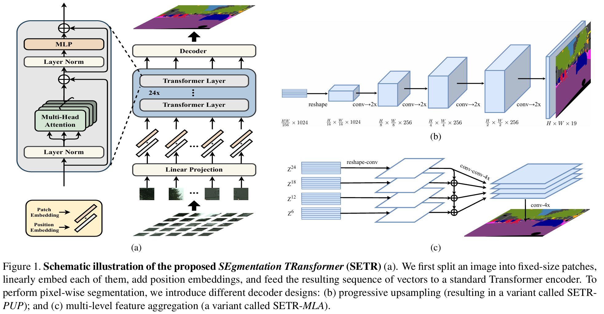

#  SETR论文笔记

论文原文：[2012.15840](https://arxiv.org/pdf/2012.15840)

------

**论文标题：** Rethinking Semantic Segmentation from a Sequence-to-Sequence Perspective with Transformers
**作者：** Sixiao Zheng, Jiachen Lu, Hengshuang Zhao, Xiatian Zhu, Zekun Luo, Yabiao Wang, Yanwei Fu, Jianfeng Feng, Tao Xiang, Philip H.S. Torr, Li Zhang
**机构：** 复旦大学，牛津大学，萨里大学，腾讯优图实验室，Facebook AI
**机构链接：** https://fudan-zvg.github.io/SETR

### 摘要（Abstract）

本文提出了一种将语义分割视为序列到序列预测任务的替代方案。传统语义分割方法多采用基于全卷积网络（FCN）的编码器-解码器架构，通过渐进式地降低空间分辨率并学习具有更大感受野的抽象/语义视觉概念。为了解决上下文建模的关键问题，现有方法通常通过空洞卷积或引入注意力模块来增加感受野。然而，编码器-解码器FCN架构并未改变。

本文提出了一种纯Transformer模型（不含卷积和分辨率缩减）来编码图像序列，形成名为**SEgmentation TRansformer (SETR)**的模型。SETR的编码器在每一层都建模全局上下文，并与一个简单的解码器结合，形成强大的分割模型。实验证明，SETR在ADE20K (50.28% mIoU)、Pascal Context (55.83% mIoU) 上取得了最先进的性能，并在Cityscapes上取得了有竞争力的结果。SETR在提交当天在ADE20K测试服务器排行榜上名列第一。

### 1. 引言（Introduction）

语义分割领域自FCN[36]问世以来，一直由基于FCN的模型主导。标准的FCN分割模型包含一个编码器-解码器架构：编码器负责特征表示学习，解码器则对编码器生成的特征表示进行像素级分类。其中，特征表示学习（即编码器）被认为是模型最重要的组成部分。

**传统CNN编码器的局限性：**
* 编码器通常由堆叠的卷积层组成，为了计算成本考虑，特征图的分辨率会逐步降低，从而学习更抽象的语义概念，同时感受野逐渐增大。
* 这种设计因其**平移等变性**和**局部性**而受欢迎。平移等变性使得模型在未见图像数据上具有更好的泛化能力，局部性则通过参数共享控制模型复杂度。
* 但是，这种设计也带来了一个根本性的限制：由于感受野的限制，学习长距离依赖信息变得具有挑战性，而这对于非受限场景图像的语义分割至关重要。

**解决传统CNN局限性的尝试：**
* **操作卷积：** 1) 增大核尺寸[40]；2) 空洞卷积[8, 22]；3) 图像/特征金字塔[60]。
* **集成注意力模块：** 旨在建模特征图中所有像素的全局交互[48]。通常将注意力层置于FCN架构的顶部[25, 29]。
* 尽管存在上述尝试，标准的编码器-解码器FCN模型架构仍未改变。
* 最近有尝试完全去除卷积并部署纯注意力模型[47]。然而，即使没有卷积，它们也没有改变FCN模型结构的本质：编码器下采样输入空间分辨率以获得用于区分语义类别的低分辨率特征映射，解码器将特征表示上采样到全分辨率分割图。

**本文的贡献和新视角：**

* 本文旨在重新思考语义分割模型设计，并提出了一个替代方案。我们提出用**纯Transformer模型**[45]取代基于堆叠卷积层且空间分辨率逐渐降低的编码器，从而得到新的分割模型：**SEgmentation TRansformer (SETR)**。
* 这种纯Transformer编码器将输入图像视为**图像块序列**，并通过学习的**图像块嵌入**进行表示。它利用**全局自注意力**建模来学习判别性特征表示。
* **具体步骤：** 1) 将图像分解为固定大小的图像块网格，形成图像块序列。2) 对每个图像块的展平像素向量应用线性嵌入层，得到特征嵌入向量序列作为Transformer的输入。3) 解码器利用编码器Transformer学习到的特征恢复原始图像分辨率。
* **核心思想：** **编码器Transformer在每一层都没有空间分辨率的下采样，而是进行全局上下文建模**。这为语义分割问题提供了一个全新的视角。
* 灵感来源于Transformer在自然语言处理(NLP)领域的巨大成功[15, 45]，以及纯视觉Transformer (ViT)[17]在图像分类任务中的有效性。这直接证明了传统的堆叠卷积层(CNN)设计可以被挑战，并且图像特征不一定需要通过降低空间分辨率，从局部到全局逐步学习。
* 将纯Transformer从图像分类扩展到具有空间位置敏感性的语义分割任务并非易事。我们通过实验证明，SETR不仅提供了一种新的模型设计视角，而且在多个基准测试上取得了最先进的性能。

**本文的主要贡献：**
1. **重新定义语义分割问题：** 将图像语义分割重新表述为**序列到序列学习**问题，为现有主流的编码器-解码器FCN模型设计提供了替代方案。
2. **实现方式：** 利用Transformer框架，通过对图像进行序列化来实现完全注意力的特征表示编码器。
3. **解码器设计：** 为了广泛检验自注意力特征表示，我们进一步引入了**三种不同复杂度的解码器设计**。
* 实验证明，SETR模型与有无注意力模块的FCN相比，能学习到更优越的特征表示，在ADE20K (50.28%)、Pascal Context (55.83%) 上取得了新的最先进性能，并在Cityscapes上取得了有竞争力的结果。特别地，我们的模型在竞争激烈的ADE20K测试服务器排行榜上排名第一。

### 2. 相关工作（Related Work）

本节回顾了语义分割和Transformer的相关工作，并指出了本文与现有工作的区别。

#### 2.1 语义分割（Semantic segmentation）

* **FCN的里程碑意义：** 移除全连接层，实现像素级预测[36]。
* **早期优化：** CRF/MRF[6, 35, 62] 用于细化粗糙预测。
* **多层次特征融合：** 为解决语义与位置之间的内在矛盾[36]，编码器和解码器需要聚合粗糙和精细层，从而产生了多种编码器-解码器结构变体[2, 38, 42]。
* **扩大感受野/上下文建模：**
    * **空洞卷积：** DeepLab[7]和Dilation[53]引入空洞卷积。
    * **并行池化/卷积：** PSPNet[60] 使用PPM模块获取不同区域的上下文信息；DeepLabV2[9] 采用ASPP模块（具有不同空洞率的金字塔空洞卷积）。
    * **分解大核：** [40] 用于捕获上下文。
    * **注意力机制：**
        * PSANet[61] 提出了点空间注意力模块，动态捕获长距离上下文。
        * DANet[18] 嵌入了空间注意力和通道注意力。
        * CCNet[26] 专注于降低全空间注意力带来的计算开销。
        * DGMN[57] 构建动态图消息传递网络进行场景建模，显著降低计算复杂度。
* **局限性：** 尽管有这些进展，所有这些方法仍然基于FCN，其特征编码和提取部分依赖经典的ConvNets（如VGG[43]和ResNet[20]）。本文从一个不同的角度重新思考语义分割任务。

#### 2.2 Transformer

* **Transformer在NLP的革命性影响：** [14, 15, 45, 51]
* **Transformer在图像识别领域的探索：**
    * Non-local network[48] 将Transformer风格的注意力附加到卷积骨干网络。
    * AANet[3] 混合卷积和自注意力进行骨干网络训练。
    * LRNet[24] 和 standalone networks[41] 探索局部自注意力以避免全局自注意力带来的高计算量。
    * SAN[59] 探索两种自注意力模块。
    * Axial-Attention[47] 将全局空间注意力分解为两个独立的轴向注意力，大幅减少计算量。
* **CNN-Transformer混合模型：**
    * DETR[5] 及其改进版detr变形[2] 在检测头内部使用Transformer进行目标检测。
    * STTR[32] 和 LSTR[34] 分别采用Transformer进行视差估计和车道形状预测。
    * **ViT[17]：** 最近，ViT是第一项表明纯Transformer图像分类模型可以达到SOTA的工作。它直接启发了本文在语义分割模型中探索纯Transformer编码器设计。

**本文与相关工作[47]的区别：**

* **模型设计：** [47] 尽管也移除了卷积，但其模型仍遵循传统的FCN设计，即特征图的空间分辨率逐渐降低。相比之下，**本文的序列到序列预测模型在整个编码过程中保持相同的空间分辨率**，这代表着模型设计上的一个显著进步。
* **自注意力机制：** 为了最大化在现代硬件加速器上的可扩展性并便于使用，我们坚持使用**标准自注意力设计**。[47] 采用专门设计的轴向注意力[21]，该注意力在标准计算设施上的可扩展性较差。此外，我们的模型在分割精度上也表现更优（见第4节）。

### 3. 方法（Method）

本节详细介绍SETR模型的设计，包括其独特的编码器和三种不同的解码器。

#### 3.1 基于FCN的语义分割（FCN-based semantic segmentation）

为了与我们新的模型设计进行对比，我们首先回顾传统的FCN[36]在图像语义分割中的应用。

* FCN编码器由一系列顺序连接的卷积层组成。
* **输入：** 第一层接收图像作为输入，尺寸为$H \times W \times 3$，其中$H \times W$指定图像的像素大小。
* **后续层输入：** 第$i$层的输入是尺寸为$h \times w \times d$的三维张量，其中$h$和$w$是特征图的空间维度，$d$是特征/通道维度。
* **感受野问题：** 张量在更高层的位置是基于所有与其连接的更低层张量位置计算的，通过逐层卷积定义其感受野。由于卷积运算的局部性，感受野沿着层的深度线性增加，这取决于核大小（通常是$3 \times 3$）。结果是，只有具有大感受野的更高层才能在FCN架构中建模长距离依赖。然而，研究表明[20]，一旦达到特定深度，增加更多层的好处会迅速减弱。因此，**有限的感受野是FCN架构的内在局限性**。
* **FCN与注意力机制的结合：** 最近一些最先进的方法[25, 56, 57]表明，将FCN与注意力机制结合是学习长距离上下文信息更有效的策略。这些方法将注意力学习限制在输入尺寸较小的高层，因为注意力机制相对于像素数量具有二次复杂度。这意味着对低层特征张量的依赖学习不足，导致次优的表示学习。为了克服这一限制，我们提出了一个纯自注意力编码器，命名为**SEgmentation TRansformers (SETR)**。

#### 3.2 分割Transformer（SETR）（Segmentation transformers (SETR)）

SETR遵循NLP中1D序列转换的相同输入-输出结构。因此，2D图像和1D序列之间存在不匹配。

##### 3.2.1 图像到序列（Image to sequence）

**Transformer的输入格式：**

* 如图1(a)所示，Transformer接受1D特征嵌入序列$Z \in \mathbb{R}^{L \times C}$作为输入，其中$L$是序列长度，$C$是隐藏通道大小。
* 因此，需要进行图像序列化，将输入图像$x \in \mathbb{R}^{H \times W \times 3}$转换为$Z$。

**挑战与解决方案：**

* **像素级序列化不可行：** 将图像像素值展平为1D向量（尺寸为$3HW$）是一种直接的序列化方式。对于典型尺寸为$480(H) \times 480(W) \times 3$的图像，生成的向量长度将为691,200。考虑到Transformer模型的二次复杂度，如此高维的向量在空间和时间上都无法处理。因此，将每个单独像素作为Transformer的输入是不可行的。
* **受FCN编码器的启发：** 通常，为语义分割设计的典型编码器会将2D图像$x \in \mathbb{R}^{H \times W \times 3}$下采样为特征图$x_f \in \mathbb{R}^{\frac{H}{16} \times \frac{W}{16} \times C}$。
* **SETR的序列长度：** 我们决定将Transformer的输入序列长度$L$设置为$\frac{H}{16} \times \frac{W}{16} = \frac{HW}{256}$。这样，Transformer的输出序列可以简单地重塑为目标特征图$x_f$。
* **图像块化与嵌入：**
    * 为了获得长度为$\frac{HW}{256}$的输入序列，我们将图像$x \in \mathbb{R}^{H \times W \times 3}$**均匀地划分成 $\frac{H}{16} \times \frac{W}{16}$ 的图像块网格**，然后将这个网格展平为一个序列。
    * 进一步，通过使用线性投影函数$f: p \to e \in \mathbb{R}^C$，将每个向量化的图像块$p$映射到潜在的$C$维嵌入空间。
    * **位置嵌入：** 为了编码图像块的空间信息，我们为每个位置$i$学习一个特定的嵌入$p_i$，并将其添加到$e_i$中，形成最终的序列输入$E = \{e_1+p_1, e_2+p_2, \cdots, e_L+p_L\}$。这样，即使Transformer的自注意力机制是无序的，空间信息也能得以保留。

##### 3.2.2 Transformer

给定1D嵌入序列$E$作为输入，SETR采用纯Transformer编码器来学习特征表示。

* **全局感受野：** 这意味着每个Transformer层都具有**全局感受野**，从而一劳永逸地解决了现有FCN编码器感受野有限的问题。
* **Transformer编码器结构：** 由$L_e$层多头自注意力（MSA）和多层感知机（MLP）块组成[46]（图1(a)）。
* **自注意力（SA）计算：** 在每一层$l$，自注意力的输入是三元组 (query, key, value)，它们由输入$Z^{l-1} \in \mathbb{R}^{L \times C}$计算得到：
    $$
    \text{query} = Z^{l-1}W^Q \\
    \text{key} = Z^{l-1}W^K \\
    \text{value} = Z^{l-1}W^V
    $$
    其中，$W^Q/W^K/W^V \in \mathbb{R}^{C \times d}$是三个线性投影层的可学习参数，$d$是(query, key, value)的维度。自注意力（SA）公式如下：
    $$
    \text{SA}(Z^{l-1}) = Z^{l-1} + \text{softmax}\left(\frac{(Z^{l-1}W^Q)(Z^{l-1}W^K)^T}{\sqrt{d}}\right)(Z^{l-1}W^V)
    $$
* **多头自注意力（MSA）计算：** MSA是SA的扩展，包含$m$个独立的SA操作并将它们的拼接输出进行投影：
    $$
    \text{MSA}(Z^{l-1}) = [\text{SA}_1(Z^{l-1});\text{SA}_2(Z^{l-1});\cdots;\text{SA}_m(Z^{l-1})]W^O
    $$
    其中，$W^O \in \mathbb{R}^{md \times C}$，$d$通常设置为$C/m$。
* **Transformer层输出：** MSA的输出通过MLP块进行转换，并带有残差连接作为层输出：
    $$
    Z^l = \text{MSA}(Z^{l-1}) + \text{MLP}(\text{MSA}(Z^{l-1})) \in \mathbb{R}^{L \times C}
    $$
    注意，在MSA和MLP块之前都应用了层归一化（为简洁省略）。我们将$\{Z^1, Z^2, \cdots, Z^{L_e}\}$表示为Transformer层的特征。

#### 3.3 解码器设计（Decoder designs）

为了评估SETR编码器特征表示$Z$的有效性，我们引入了三种不同的解码器设计以执行像素级分割。解码器的目标是在原始2D图像空间($H \times W$)中生成分割结果，因此我们需要将编码器特征$Z$（在解码器中使用）从$HW/256 \times C$的2D形状重塑为标准的$H/16 \times W/16 \times C$的3D特征图。

**三种解码器：**

1.  **朴素上采样（Naive）：** (SETR-Naive)
    *   这个朴素解码器首先将Transformer特征$Z^{L_e}$投影到类别数量的维度（例如，Cityscapes实验中为19）。
    *   为此，我们采用一个简单的2层网络，架构为：$1 \times 1$卷积 + 同步批量归一化（带ReLU）+ $1 \times 1$卷积。
    *   之后，我们简单地将输出双线性上采样到全图像分辨率，然后通过一个带像素级交叉熵损失的分类层。

2.  **渐进式上采样（PUP）（Progressive UPsampling）：** (SETR-PUP)
    *   与一步上采样可能引入噪声预测不同，我们考虑了一种**渐进式上采样策略**，交替使用卷积层和上采样操作。
    *   为了最大限度地减少不利影响，我们将上采样限制为2倍。因此，从尺寸为$H/16 \times W/16$的$Z^{L_e}$达到全分辨率总共需要4次操作。
    *   图1(b)中给出了此过程的更多细节。

3.  **多级特征聚合（MLA）（Multi-Level feature Aggregation）：** (SETR-MLA)
    *   第三种设计通过**多级特征聚合**（图1(c)）来实现，类似于特征金字塔网络（FPN）[27, 33]的思想。
    *   然而，我们的解码器从根本上不同，因为SETR每一层的特征表示$Z^l$共享相同的分辨率，没有金字塔形状。
    *   **具体实现：**
        *   我们从Transformer的$M$个均匀分布的层中（层索引为$m \in \{L_e/M, 2L_e/M, \cdots, ML_e/M\}$）获取特征表示$\{Z^m\}$作为输入到解码器。
        *   然后部署$M$个流，每个流关注一个特定的选定层。
        *   在每个流中，我们首先将编码器的特征$Z^l$从$HW/256 \times C$的2D形状重塑为$H/16 \times W/16 \times C$的3D特征图。
        *   应用一个3层网络（核大小为$1 \times 1, 3 \times 3, 3 \times 3$），其中特征通道在第一层和第三层分别减半，并在第三层之后通过双线性操作将空间分辨率上采样4倍。
        *   为了增强不同流之间的交互，我们在第一层之后通过元素级相加引入了**自上而下的聚合设计**。在元素级相加后的特征上应用额外的$3 \times 3$卷积。
        *   在第三层之后，我们通过**通道级拼接**从所有流中获得融合特征，然后将其双线性上采样4倍到全分辨率。

### 4. 实验（Experiments）

本节详细介绍了SETR模型的实验设置、评估指标、消融研究以及与最先进方法的比较结果。

#### 4.1 实验设置（Experimental setup）

我们在三个广泛使用的语义分割基准数据集上进行实验：

*   **Cityscapes** [13]: 包含城市场景图像中19个对象类别的密集标注。2975训练图像，500验证图像，1525测试图像。图像分辨率为$2048 \times 1024$。另有19,998张粗略标注图像。
*   **ADE20K** [63]: 具有150个细粒度语义概念的挑战性场景解析基准。20210训练图像，2000验证图像，3352测试图像。
*   **PASCAL Context** [37]: 提供整个场景的像素级语义标签（“物体”和“背景”类别）。4998训练图像，5105验证图像。根据先前工作，我们评估最常见的59个类别和背景类（总共60个类别）。

**实现细节：**
*   遵循[39]的默认设置（例如，数据增强和训练计划）：
    *   **数据增强：** 随机缩放（比例0.5到2之间），随机裁剪（Cityscapes为768，ADE20K和Pascal Context为512和480），随机水平翻转。
    *   **批量大小和迭代次数：**
        *   ADE20K和Pascal Context：批量大小16，总迭代次数160,000和80,000。
        *   Cityscapes：批量大小8，训练计划见表2、6和7。
    *   **优化器：** 采用多项式学习率衰减策略[60]，使用SGD优化器。动量设为0.9，权重衰减设为0。
    *   **初始学习率：** ADE20K和Pascal Context为0.001，Cityscapes为0.01。
*   **辅助损失（Auxiliary loss）：**
    *   与[60]类似，辅助分割损失有助于模型训练。
    *   每个辅助损失头采用2层网络。
    *   在不同的Transformer层添加辅助损失：
        *   SETR-Naive: ($Z^{10}, Z^{15}, Z^{20}$)
        *   SETR-PUP: ($Z^{10}, Z^{15}, Z^{20}, Z^{24}$)
        *   SETR-MLA: ($Z^{6}, Z^{12}, Z^{18}, Z^{24}$)
    *   辅助损失和主损失头同时应用。
*   **多尺度测试：**
    *   使用[39]的默认设置。输入图像首先缩放到统一大小。然后对图像进行多尺度缩放和随机水平翻转（缩放因子为0.5, 0.75, 1.0, 1.25, 1.5, 1.75）。
    *   采用滑动窗口进行测试（例如，Pascal Context为$480 \times 480$）。如果短边小于滑动窗口大小，则按短边缩放图像以匹配滑动窗口大小，同时保持纵横比。
    *   解码器和辅助损失头中使用同步BN。
    *   为训练简单起见，不使用OHEM[55]等常用技巧。
*   **基线（Baselines）：**
    *   使用空洞FCN[36]和Semantic FPN[27]作为基线，结果取自[39]。
    *   我们的模型和基线在相同设置下进行训练和测试，以进行公平比较。还与其他最先进模型进行比较。
    *   空洞FCN的输出步长为8，由于GPU内存限制，我们所有模型的输出步长都为16。
*   **SETR变体（SETR variants）：**
    *   **SETR-Naive, SETR-PUP, SETR-MLA**：基于三种不同的解码器设计。
    *   **编码器变体：** “T-Base”和“T-Large”，分别有12和24层（见表1）。除非另有说明，SETR-Naive、SETR-PUP和SETR-MLA都使用“T-Large”作为编码器。SETR-Naive-Base表示使用“T-Base”编码器的SETR-Naive模型。
    *   **混合基线（Hybrid）：** 我们还设置了一个混合基线Hybrid，它使用基于ResNet-50的FCN编码器，并将其输出特征馈送到SETR。为了应对GPU内存限制和公平比较，Hybrid只考虑“T-Base”，并设置FCN的输出步长为1/16。Hybrid是ResNet-50和SETR-Naive-Base的组合。
*   **预训练（Pre-training）：**
    *   使用ViT[17]或DeiT[44]提供的预训练权重来初始化我们模型中所有的Transformer层和输入线性投影层。
    *   SETR-Naive-DeiT表示使用DeiT[44]预训练的SETR-Naive-Base模型。
    *   所有未预训练的层都随机初始化。
    *   Hybrid的FCN编码器使用在ImageNet-1k上预训练的初始权重。
    *   Transformer部分使用ViT[17]、DeiT[44]预训练的权重或随机初始化。
    *   所有实验都使用$16 \times 16$的图像块大小。
    *   对预训练的位置嵌入进行2D插值，根据它们在原始图像中的位置进行不同输入大小的微调。
*   **评估指标：**
    *   遵循标准评估协议[13]，报告所有类别的平均交并比（mIoU）。
    *   ADE20K额外报告像素精度。

#### 4.2 消融研究（Ablation studies）

表2和表3展示了关于以下方面的消融研究：
(a) SETR不同变体在各种训练计划下的表现。
(b) 与FCN[39]和Semantic FPN[39]的比较。
(c) 在不同数据上进行预训练的影响。
(d) 与Hybrid的比较。
(e) 与FCN在不同预训练下的比较。

除非另有说明，表2和表3中的所有实验都在Cityscapes train fine集上进行，批量大小为8，并使用Cityscapes验证集上的单尺度测试协议评估mIoU(%)。ADE20K上的实验也遵循单尺度测试协议。

**从表2中得出以下观察结果：**
*   **i) 解码器设计：** **渐进式上采样（SETR-PUP）在Cityscapes上取得了所有变体中的最佳性能**。SETR-MLA表现稍差，一个可能的原因是不同Transformer层的特征输出不具备像特征金字塔网络(FPN)那样的分辨率金字塔优势（见图5）。然而，在ADE20K验证集上（表3和表4），SETR-MLA略优于SETR-PUP，且远优于一次性将Transformer输出特征上采样16倍的SETR-Naive变体。
*   **ii) 编码器大小：** 使用“T-Large”的变体（例如SETR-MLA和SETR-Naive）优于其“T-Base”对应模型（即SETR-MLA-Base和SETR-Naive-Base），这符合预期。
*   **iii) 与Hybrid的比较：** 尽管SETR-PUP-Base(76.71)在初始迭代次数下表现不如Hybrid-Base(76.76)，但在更多迭代次数（80k）下训练时，它表现出色（78.02）。这表明在语义分割中可以替代FCN编码器设计，并进一步证实了我们模型的有效性。
*   **iv) 预训练的重要性：** **预训练对我们的模型至关重要**。随机初始化的SETR-PUP在Cityscapes上仅获得42.27%的mIoU。使用DeiT[44]在ImageNet-1K上预训练的模型在Cityscapes上表现最佳，略优于ViT[17]在ImageNet-21K上预训练的对应模型。
*   **v) 预训练策略的对比：** 为了研究预训练的强大作用并进一步验证我们方法的有效性，我们在表3中进行了预训练策略的消融研究。为了与FCN基线进行公平比较，我们首先在ImageNet-21k数据集上预训练一个ResNet-101用于分类任务，然后将预训练的权重用于ADE20K或Cityscapes上的语义分割任务。表3显示，在ImageNet-21k预训练下，FCN基线比在ImageNet-1k预训练的变体有了明显的改进。然而，**我们的方法以较大优势超越了FCN对应的模型**，验证了我们方法的优势主要来自于所提出的序列到序列建模策略，而不是更大的预训练数据。

#### 4.3 与最先进方法的比较（Comparison to state-of-the-art）

##### 4.3.1 ADE20K上的结果（Results on ADE20K）

表4显示了我们在更具挑战性的ADE20K数据集上的结果。

*   我们的SETR-MLA在单尺度（SS）推理下取得了48.64%的卓越mIoU。
*   当采用多尺度（MS）推理时，我们的方法达到了50.28%的mIoU，创造了新的最先进水平。
*   图2展示了我们的模型和空洞FCN在ADE20K上的定性结果。
*   当在训练集+验证集上训练一个模型，默认迭代次数为160,000次时，我们的方法在竞争激烈的ADE20K测试服务器排行榜上排名第一。

##### 4.3.2 Pascal Context上的结果（Results on Pascal Context）

表5比较了Pascal Context上的分割结果。

*   带ResNet-101骨干的空洞FCN取得了45.74%的mIoU。
*   使用相同的训练计划，我们提出的SETR显著优于此基线，mIoU分别达到54.40%（SETR-PUP）和54.87%（SETR-MLA）。
*   当采用多尺度（MS）推理时，SETR-MLA进一步将性能提高到55.83%，以明显优势超越了最接近的竞争对手APCNet。
*   图3展示了SETR和空洞FCN的一些定性结果。
*   图6中学习到的注意力图的进一步可视化表明，SETR可以关注语义上有意义的前景区域，展示了其学习对分割有用的判别性特征表示的能力。

##### 4.3.3 Cityscapes上的结果（Results on Cityscapes）

表6和表7分别显示了Cityscapes验证集和测试集上的比较结果。

*   我们的模型SETR-PUP优于FCN基线，以及FCN加注意力的方法，如非局部网络[48]和CCNet[25]；其性能与迄今为止报道的最佳结果持平。
*   在这个数据集上，我们可以与密切相关的Axial-DeepLab[12, 47]进行比较，后者旨在利用纯注意力模型，但仍遵循FCN的基本结构。值得注意的是，Axial-DeepLab与我们一样设置了相同的输出步长16。然而，其完整的输入分辨率($1024 \times 2048$)远大于我们的裁剪尺寸$768 \times 768$，并且它运行的epoch更多（60k次迭代，批量大小32），而我们设置为（80k次迭代，批量大小8）。
*   尽管如此，当采用多尺度推理时，我们的模型在Cityscapes验证集上仍优于Axial-DeepLab。
*   仅使用fine集，我们的模型（训练100k次迭代）在测试集上以明显优势优于Axial-DeepLab-XL。
*   图4展示了我们的模型和空洞FCN在Cityscapes上的定性结果。

###  5. 结论（Conclusion）

在这项工作中，我们通过引入**序列到序列预测框架**，为语义分割提供了一种替代视角。

*   与现有的基于FCN的方法在组件级别（component level）通过空洞卷积和注意力模块来扩大感受野不同，**我们在架构级别（architectural level）迈出了革命性的一步，完全消除了对FCN的依赖，并优雅地解决了感受野有限的挑战**。
*   我们利用Transformer实现了所提出的思想，Transformer能够在特征学习的每个阶段建模全局上下文。
*   结合一系列不同复杂度的解码器设计，我们建立了强大的分割模型，这些模型没有使用近期方法中部署的任何花哨的技巧。
*   大量实验表明，我们的模型在ADE20K、Pascal Context上取得了新的最先进性能，并在Cityscapes上取得了有竞争力的结果。令人鼓舞的是，我们的方法在提交当天在竞争激烈的ADE20K测试服务器排行榜上排名第一。

### 附录（Appendix）

####  A. 可视化（Visualizations）

*   **位置嵌入（Position embedding）：** 图7显示了学习到的位置嵌入的可视化。它表明模型能够将图像内的距离编码为位置嵌入的相似性。
*   **特征图（Features）：** 图9展示了SETR-PUP的特征可视化。编码器部分收集了24个Transformer层的输出特征（$Z_1$ - $Z_{24}$）。同时，解码器头中每次双线性插值后的5个特征（$U_1$ - $U_5$）也被访问。
*   **注意力图（Attention maps）：** 图10展示了Transformer每一层的注意力图。在T-large模型中，有16个头和24层。类似于[1]
