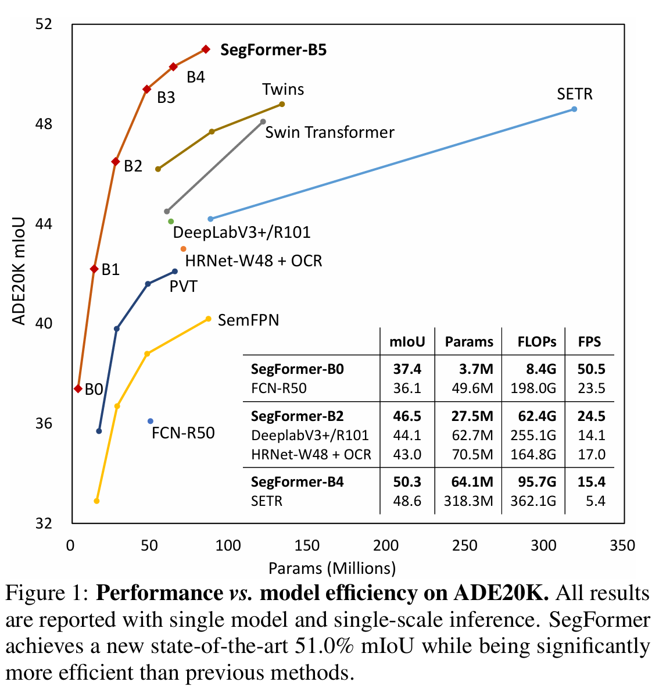
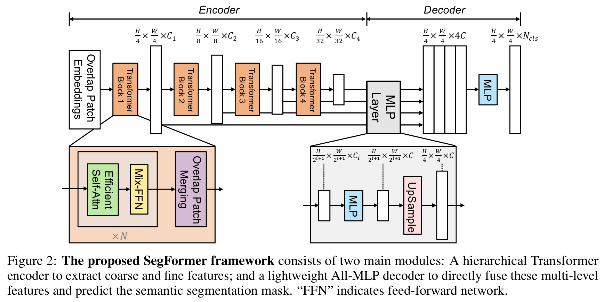
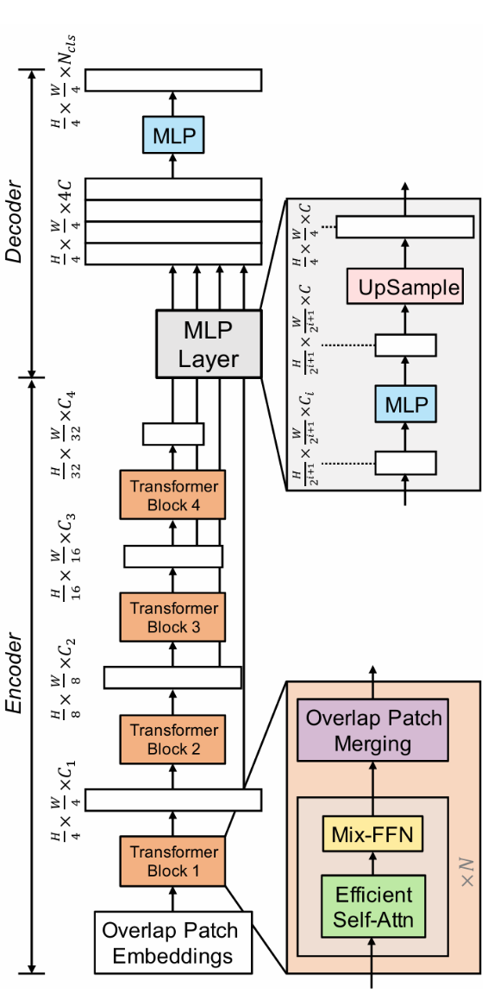
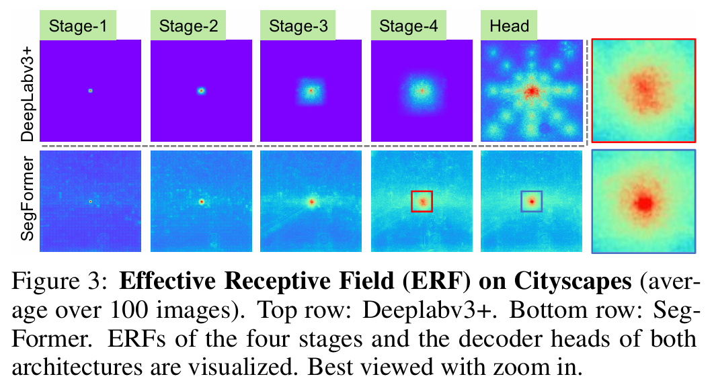
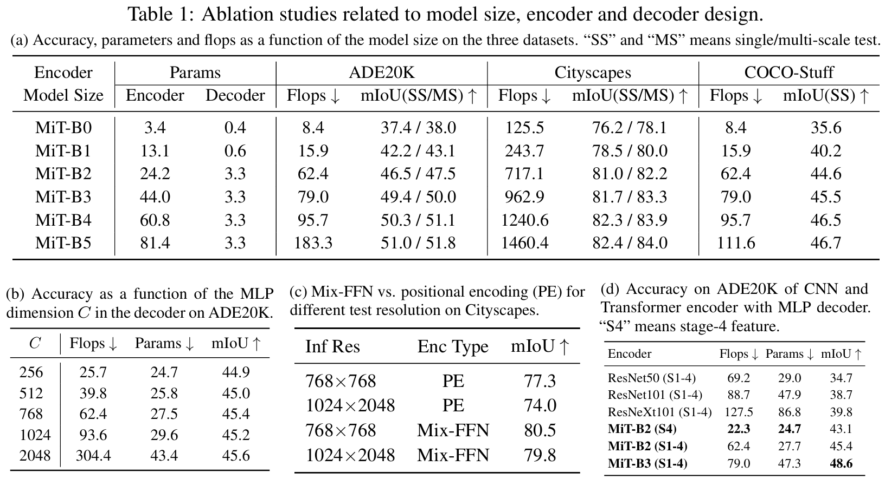
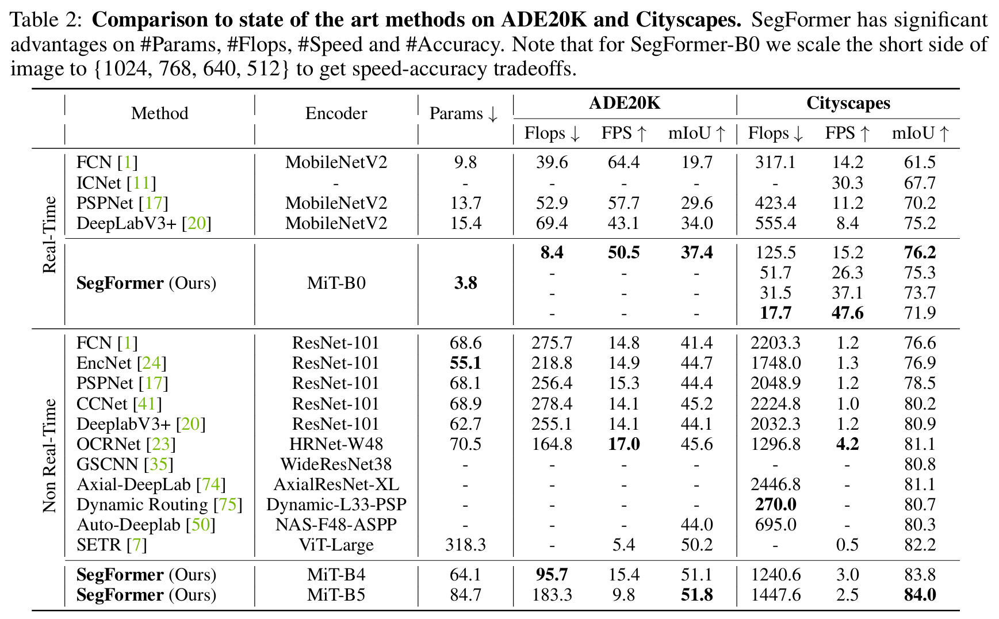
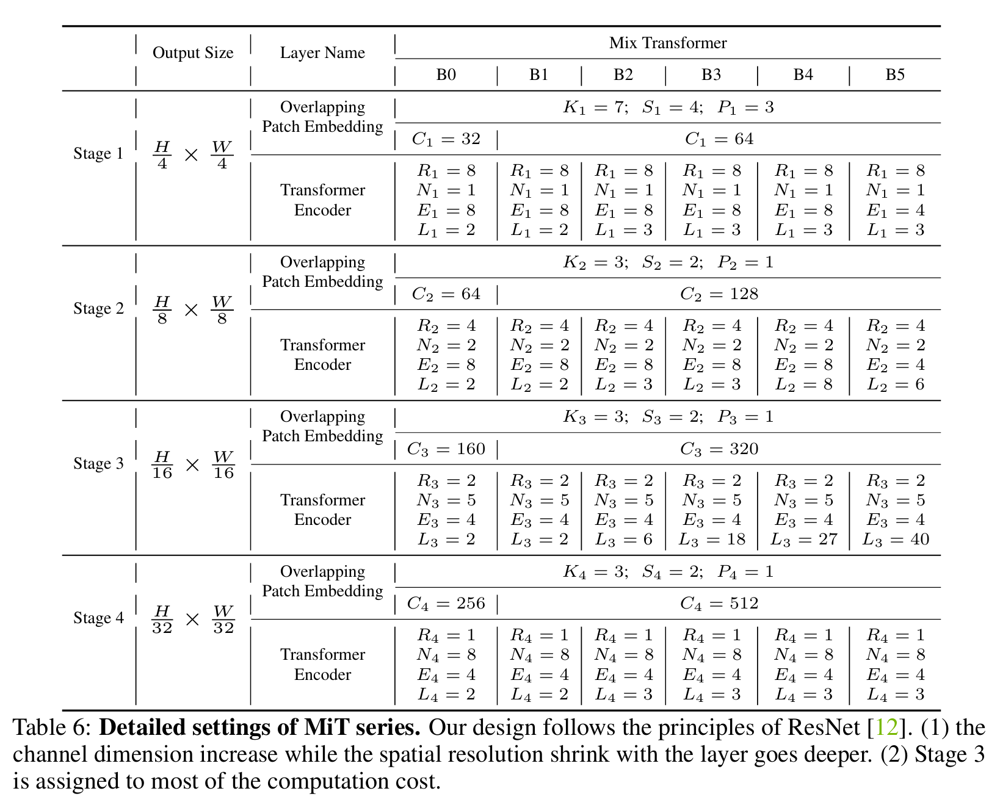
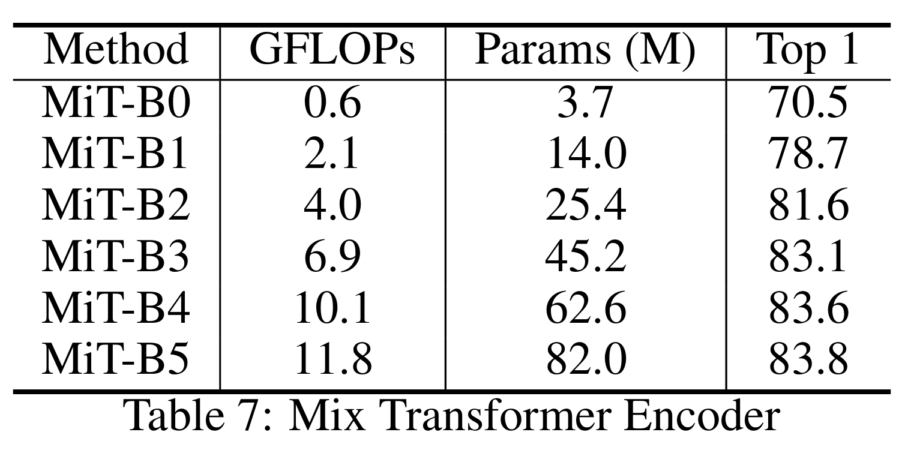

#  SegFormer论文笔记

论文原文：[[2105.15203\] SegFormer: Simple and Efficient Design for Semantic Segmentation with Transformers](https://arxiv.org/abs/2105.15203)

------

## 摘要

SegFormer 是一种用于语义分割的简单、高效且功能强大的框架，它将 Transformer 与轻量级多层感知器 (MLP) 解码器相结合。SegFormer 具有两个突出特点：
1. SegFormer 包含一个新颖的分层结构 Transformer 编码器，该编码器输出多尺度特征。它不需要位置编码，因此避免了当测试分辨率与训练分辨率不同时，位置编码插值会导致性能下降的问题。
2. SegFormer 避免了复杂的解码器。所提出的 MLP 解码器聚合了来自不同层的特征信息，从而结合了局部注意力和全局注意力以生成强大的表示。
本文表明，这种简单而轻量级的设计是 Transformer 上高效分割的关键。通过将方法扩展到 SegFormer-B0 到 SegFormer-B5 系列模型，在ADE20K 数据集上，SegFormer-B4 以 64M 参数实现了 50.3% mIoU，比之前最好的方法小 5 倍，且性能提升 2.2%。最佳模型 SegFormer-B5 在 Cityscapes 验证集上达到了 84.0% mIoU，并在 Cityscapes-C 上展现出优异的零样本鲁棒性。

## 1. 引言

语义分割是计算机视觉中的一项基础任务，为许多下游应用提供了支持。它与图像分类相关，因为它生成的是像素级别的类别预测，而不是图像级别的预测。这一关系在开创性工作 [1] 中被指出并系统地研究，作者在该工作中使用了全卷积网络 (FCNs) 用于语义分割任务。此后，FCN 启发了许多后续工作，并成为密集预测领域的主导设计选择。

由于分类和语义分割之间存在密切关系，许多最先进的语义分割框架都是 ImageNet 上流行图像分类架构的变体。因此，设计骨干网络架构一直是语义分割领域活跃的研究方向。确实，从早期使用 VGGs [1,2] 的方法，到最新使用更深、更强大骨干网络 [3] 的方法，骨干网络的发展极大地推动了语义分割的性能边界。除了骨干网络架构，另一个研究方向是将语义分割定义为结构化预测问题，并专注于设计模块和算子，以有效捕获上下文信息。该领域的一个代表性例子是空洞卷积 [4, 5]，它通过“膨胀”卷积核增加感受野。

鉴于 Transformer 在自然语言处理 (NLP) 领域的巨大成功，近期视觉任务中引入 Transformer 的兴趣激增。Dosovitskiy 等人 [6] 提出了 Vision Transformer (ViT) 用于图像分类。遵循 NLP 中的 Transformer 设计，作者将图像分割成多个线性嵌入的 patch 并将其输入到带有位置嵌入 (PE) 的标准 Transformer 中，在 ImageNet 上取得了令人印象深刻的性能。在语义分割中，Zheng 等人 [7] 提出了 SETR，展示了在语义分割任务中使用 Transformer 的可行性。SETR 采用 ViT 作为骨干网络，并结合了多个 CNN 解码器来放大特征分辨率。尽管性能良好，但 ViT 存在一些局限性：1) ViT 输出的是单尺度低分辨率特征，而不是多尺度特征。2) 对于大图像，其计算成本很高。为了解决这些限制，Wang 等人 [8] 提出了 Pyramid Vision Transformer (PVT)，这是 ViT 的自然扩展，具有用于密集预测的金字塔结构。PVT 在目标检测和语义分割方面比 ResNet 对应模型表现出显著改进。然而，与其他新兴方法（如 Swin Transformer [9] 和 Twins [10]）一样，这些方法主要考虑 Transformer 编码器的设计，而忽略了解码器对进一步改进的贡献。

本文介绍了 SegFormer，一个前沿的 Transformer 框架，用于语义分割，它同时考虑了效率、准确性和鲁棒性。与之前的方法不同，我们的框架重新设计了编码器和解码器。我们方法的主要新颖之处在于：
* 一个新颖的无位置编码、分层 Transformer 编码器。
* 一个轻量级的全 MLP 解码器设计，可以在不使用复杂和计算密集型模块的情况下产生强大的表示。
* 如图 1 所示，SegFormer 在三个公开可用的语义分割数据集上，在效率、准确性和鲁棒性方面都设定了新的 SOTA。

首先，所提出的编码器在对分辨率与训练不同图像进行推理时，避免了位置编码的插值。因此，我们的编码器可以轻松适应任意测试分辨率，而不会影响性能。此外，分层结构使得编码器能够生成高分辨率的细粒度特征和低分辨率的粗粒度特征，这与 ViT 只能生成固定分辨率的单低分辨率特征图形成对比。

其次，我们提出了一种轻量级 MLP 解码器，其核心思想是利用 Transformer 引发的特征，其中较低层的注意力倾向于保持局部性，而最高层的注意力则具有高度非局部性。通过聚合来自不同层的信息，MLP 解码器结合了局部和全局注意力。因此，我们获得了一个简单直接的解码器，它能产生强大的表示。

我们展示了 SegFormer 在模型大小、运行时间和准确性方面的优势，这些优势在三个公开数据集上得到证明：ADE20K、Cityscapes 和 COCO-Stuff。在 Cityscapes 上，我们的轻量级模型 SegFormer-B0，在没有 TensorRT 等加速实现的情况下，以 48 FPS 的速度实现了 71.9% mIoU，与 ICNet [11] 相比，延迟和性能分别相对提高了 60% 和 4.2%。我们最大的模型 SegFormer-B5 实现了 84.0% mIoU，相比 SETR [7] 相对提高了 1.8% mIoU，并且速度快 5 倍。在 ADE20K 上，该模型设定了新的 SOTA 51.8% mIoU，比 SETR 小 4 倍。此外，我们的方法对常见腐蚀和扰动的鲁棒性显著优于现有方法，因此适用于安全关键应用。代码将公开。

## 2. 相关工作

**语义分割。** 语义分割可以看作是图像分类从图像级别到像素级别的扩展。在深度学习时代 [12-16]，FCN [1] 是语义分割的基础工作，它是一个全卷积网络，以端到端的方式执行像素到像素的分类。此后，研究人员专注于从不同方面改进 FCN，例如：扩大感受野 [17-19,5,2,4,20]；细化上下文信息 [21-29]；引入边界信息 [30-37]；设计各种注意力模块 [38-46]；或使用 AutoML 技术 [47-51]。这些方法显著提高了语义分割性能，但代价是引入了许多经验性模块，使得所得到的框架计算量大且复杂。最近的方法已经证明了基于 Transformer 的架构在语义分割中的有效性 [7,46]。然而，这些方法仍然计算量大。

**Transformer 骨干网络。** ViT [6] 是第一个证明纯 Transformer 可以在图像分类中实现 SOTA 性能的工作。ViT 将每张图像视为一系列 token，然后将其输入到多个 Transformer 层进行分类。随后，DeiT [52] 进一步探索了 ViT 的数据高效训练策略和蒸馏方法。最近的方法，如 T2T ViT [53]、CPVT [54]、TNT [55]、CrossViT [56] 和 LocalViT [57] 对 ViT 进行了定制更改，以进一步提高图像分类性能。

除了分类，PVT [8] 是第一个在 Transformer 中引入金字塔结构的工作，展示了纯 Transformer 骨干网络在密集预测任务中与 CNN 对应模型的潜力。此后，Swin [9]、CvT [58]、CoaT [59]、LeViT [60] 和 Twins [10] 等方法增强了特征的局部连续性，并移除了固定大小的位置嵌入，以提高 Transformer 在密集预测任务中的性能。

**特定任务的 Transformer。** DETR [52] 是第一个使用 Transformer 构建端到端目标检测框架而不使用非极大值抑制 (NMS) 的工作。其他工作也已将 Transformer 用于各种任务，如跟踪 [61,62]、超分辨率 [63]、ReID [64]、着色 [65]、检索 [66] 和多模态学习 [67,68]。 对于语义分割，SETR [7] 采用 ViT [6] 作为骨干网络提取特征，取得了令人印象深刻的性能。然而，这些基于 Transformer 的方法效率很低，因此难以部署在实时应用中。

## 3. 方法

本节介绍 SegFormer，我们的高效、鲁棒且强大的分割框架，不包含手工制作和计算密集型模块。如图 2 所示，SegFormer 包含两个主要模块：(1) 一个分层 Transformer 编码器，用于生成高分辨率的粗略特征和低分辨率的精细特征；(2) 一个轻量级的全 MLP 解码器，用于融合这些多级特征以生成最终的语义分割掩码。

给定一个大小为 $H \times W \times 3$ 的图像，我们首先将其分割成大小为 $4 \times 4$ 的 patch。与 ViT 使用 $16 \times 16$ 的 patch 不同，使用更小的 patch 有利于密集预测任务。然后我们使用这些 patch 作为输入到分层 Transformer 编码器，以获得原始图像分辨率的 $\{1/4, 1/8, 1/16, 1/32\}$ 的多级特征。然后我们将这些多级特征传递给全 MLP 解码器，以预测分辨率为 $\frac{H}{4} \times \frac{W}{4} \times N_{cls}$ 的分割掩码 $M$ 其中 $N_{cls}$ 是类别数。本节的其余部分将详细介绍所提出的编码器和解码器设计，并总结我们的方法与 SETR 之间的主要区别。

### 3.1. 分层 Transformer 编码器

我们设计了一系列混合 Transformer 编码器 (MiT)，从 MiT-B0 到 MiT-B5，它们具有相同的架构但尺寸不同。MiT-B0 是我们的轻量级模型，用于快速推理，而 MiT-B5 是最大的模型，用于实现最佳性能。我们对 MiT 的设计部分受 ViT 启发，但为语义分割量身定制和优化。

**分层特征表示。** 与 ViT 只能生成单分辨率特征图不同，该模块的目标是，给定输入图像，生成类似 CNN 的多级特征。这些特征提供高分辨率的粗糙特征和低分辨率的细粒度特征，这通常能提升语义分割的性能。更具体地说，给定一个分辨率为 $H \times W \times 3$ 的输入图像，我们执行 patch 合并以获得具有分辨率 $H/{2^{i+1}} \times W/{2^{i+1}} \times C_i$ 的分层特征图 $F_i$，其中 $i \in \{1,2,3,4\}$，且 $C_{i+1}$ 大于 $C_i$。

**重叠补丁合并。**
给定一个图像块，ViT 中使用的补丁合并过程将一个 $N \times N \times 3$ 补丁统一为一个 $1 \times 1 \times C$ 向量。这可以很容易地扩展为将一个 $2 \times 2 \times C_i$ 的特征路径统一为一个 $1 \times 1 \times C_{i+1}$ 向量，以获得分层特征图。使用此方法，我们可以将我们的分层特征从 $F_1(H/4 \times W/4 \times C_1)$ 缩小到 $F_2(H/8 \times W/8 \times C_2)$，然后对层次结构中的任何其他特征图进行迭代。此过程最初设计用于组合不重叠的图像或特征补丁。因此，它未能保留这些补丁周围的局部连续性。
相反，我们使用重叠补丁合并过程。为此，我们定义 $K, S, P$，其中 $K$ 是补丁大小，$S$ 是两个相邻补丁之间的步幅，$P$ 是填充大小。在我们的实验中，我们设置 $K=7, S=4, P=3$ 和 $K=3, S=2, P=1$ 来执行重叠补丁合并，以生成与非重叠过程相同大小的特征。

**高效自注意力。** 编码器的主要计算瓶颈是自注意力层。在原始多头自注意力过程中，每个头 $Q, K, V$ 都具有相同的维度 $N \times C$，其中 $N = H \times W$ 是序列的长度，自注意力估计如下：
$$
\text{Attention}(Q, K, V) = \text{Softmax}(\frac{QK^T}{\sqrt{d_{head}}})V. \tag{1}
$$
这个过程的计算复杂度是 $O(N^2)$，这对于大图像分辨率来说是 prohibitive 的。相反，我们使用 [8] 中引入的序列缩减过程。此过程使用缩减比 $R$ 来缩减序列的长度，如下所示：
$$
\hat{K}=\text{Reshape}(\frac{N}{R}, C \cdot R)(K) \\
K=\text{Linear}(C \cdot R, C)(\hat{K}), \tag{2}
$$
其中 $K$ 是要被缩减的序列，$\text{Reshape}(\frac{N}{R}, C \cdot R)(K)$ 表示将 $K$ 重塑为形状为 $\frac{N}{R} \times (C \cdot R)$ 的张量，$\text{Linear}(C_{in}, C_{out})(\cdot)$ 表示一个线性层，它接受一个 $C_{in}$ 维张量作为输入，并生成一个 $C_{out}$ 维张量作为输出。因此，新的 $K$ 的维度为 $\frac{N}{R} \times C$。结果，自注意力机制的复杂度从 $O(N^2)$ 降低到 $O(\frac{N^2}{R})$。在我们的实验中，我们将 $R$ 设置为从第一阶段到第四阶段分别为 $[64, 16, 4, 1]$。

**Mix-FFN。** ViT 使用位置编码 (PE) 来引入位置信息。然而，PE 的分辨率是固定的。因此，当测试分辨率与训练分辨率不同时，需要对位置编码进行插值，这通常会导致准确性下降。为了缓解这个问题，CPVT [54] 使用 $3 \times 3$ 卷积和 PE 来实现数据驱动的 PE。我们认为位置编码对于语义分割来说实际上不是必需的。相反，我们引入了 Mix-FFN，它通过在前馈网络 (FFN) 中直接使用 $3 \times 3$ 卷积来考虑零填充的影响以泄露位置信息 [69]。Mix-FFN 可以表述为：
$$
x_{out} = \text{MLP}(\text{GELU}(\text{Conv}_{3\times3}(\text{MLP}(x_{in})))) + x_{in}, \tag{3}
$$
其中 $x_{in}$ 是来自自注意力模块的特征。Mix-FFN 将一个 $3 \times 3$ 卷积和一个 MLP 混合到每个 FFN 中。在我们的实验中，我们将展示一个 $3 \times 3$ 卷积足以为 Transformer 提供位置信息。特别是，我们使用深度可分离卷积来减少参数数量并提高效率。

### 3.2. 轻量级全 MLP 解码器

SegFormer 包含一个仅由 MLP 层组成的轻量级解码器，从而避免了其他方法中通常使用的手工制作和计算密集型组件。实现如此简单解码器的关键在于，我们的分层 Transformer 编码器比传统 CNN 编码器具有更大的有效感受野 (ERF)。

所提出的全 MLP 解码器包含四个主要步骤。首先，来自 MiT 编码器的多级特征 $F_i$ 经过一个 MLP 层以统一通道维度。然后，在第二个步骤中，特征被上采样到 $1/4$ 大小并拼接在一起。第三，采用一个 MLP 层来融合拼接后的特征 $F$。最后，另一个 MLP 层接收融合后的特征以预测分辨率为 $\frac{H}{4} \times \frac{W}{4} \times N_{cls}$ 的分割掩码 $M$，其中 $N_{cls}$ 是类别数。这让我们可以将解码器表述为：
$$
\hat{F}_i = \text{Linear}(C_i, C)(F_i), \forall i \\
\hat{F}_i = \text{Upsample}(\frac{W}{4} \times \frac{W}{4})(\hat{F}_i), \forall i \\
F = \text{Linear}(4C, C)(\text{Concat}(\hat{F}_i)), \forall i \\
M = \text{Linear}(C, N_{cls})(F), \tag{4}
$$
其中 $M$ 指的是预测的掩码，$\text{Linear}(C_{in}, C_{out})(\cdot)$ 指的是一个线性层，其输入和输出向量维度分别为 $C_{in}$ 和 $C_{out}$。

**有效感受野分析。** 对于语义分割，保持大型感受野以包含上下文信息一直是核心问题 [5,19,20]。在这里，我们使用有效感受野 (ERF) [70] 作为工具来可视化和解释为什么我们的 MLP 解码器设计在 Transformer 上如此有效。在图 3 中，我们可视化了 DeepLabv3+ 和 SegFormer 四个编码器阶段和解码器头部的 ERF。我们可以得出以下观察结果：

* 即使在最深的 Stage-4，DeepLabv3+ 的 ERF 也相对较小。
* SegFormer 的编码器自然地在低级阶段生成类似于卷积的局部注意力，同时能够输出在 Stage-4 有效捕获上下文的高度非局部注意力。
* 如图 3 中放大补丁所示，MLP 头（蓝色框）的 ERF 与 Stage-4（红色框）不同，除了非局部注意力外，还具有显著更强的局部注意力。

CNN 中有限的感受野需要借助上下文模块（例如 ASPP [18]）来扩大感受野，但这必然会增加模型复杂度。我们的解码器设计得益于 Transformer 中的非局部注意力，从而在不增加复杂性的情况下获得了更大的感受野。然而，相同的解码器设计在 CNN 骨干网络上效果不佳，因为整体感受野受限于 Stage-4 的有限感受野，我们将在表 1d 中稍后验证这一点。

更重要的是，我们的解码器设计本质上利用了 Transformer 产生的特征，该特征同时生成高度局部和非局部的注意力。通过统一它们，我们的 MLP 解码器通过添加少量参数来呈现互补且强大的表示。这是激励我们设计的另一个关键原因。仅从 Stage-4 获取非局部注意力不足以产生良好的结果，这也将在表 1d 中得到验证。

### 3.3. 与SETR的关系。

SegFormer 与 SETR [7] 相比，包含多个更高效、更强大的设计：
* 我们只使用 ImageNet-1K 进行预训练。SETR 中的 ViT 在更大的 ImageNet-22K 上进行预训练。
* SegFormer 的编码器具有分层架构，比 ViT 更小，并且可以捕获高分辨率的粗略特征和低分辨率的精细特征。相比之下，SETR 的 ViT 编码器只能生成单一的低分辨率特征图。
* 我们在编码器中移除了位置编码，而 SETR 使用固定形状的位置编码，当推理分辨率与训练分辨率不同时，这会降低准确性。
* 我们的 MLP 解码器比 SETR 中的解码器更紧凑，计算量更少。这导致计算开销几乎可以忽略不计。相比之下，SETR 需要带有多个 $3 \times 3$ 卷积的重型解码器。

## 4. 实验

### 4.1. 实验设置

**数据集:**
我们使用了三个公开数据集：Cityscapes [71]、ADE20K [72] 和 COCO-Stuff [73]。ADE20K 是一个场景解析数据集，包含 150 个细粒度语义概念，由 20210 张图像组成。Cityscapes 是一个用于语义分割的驾驶数据集，包含 5000 张精细标注的高分辨率图像，涵盖 19 个类别。COCO-Stuff 涵盖 172 个标签，包含 164k 张图像：118k 用于训练，5k 用于验证，20k 用于测试开发，20k 用于测试挑战。

**实现细节:**
我们使用 mms Segmentation 1 代码库，并在一台配备 8 块 Tesla V100 GPU 的服务器上进行训练。我们在 ImageNet-1K 数据集上预训练编码器，并随机初始化解码器。在训练期间，我们通过随机缩放（比例 0.5-2.0）、随机水平翻转和随机裁剪进行数据增强，裁剪大小分别为 ADE20K 的 $512 \times 512$、Cityscapes 的 $1024 \times 1024$ 和 COCO-Stuff 的 $512 \times 512$。根据 [9] 的设置，我们为最大的模型 B5 在 ADE20K 上设置裁剪大小为 $640 \times 640$。我们使用 AdamW 优化器，在 ADE20K 和 Cityscapes 上训练 160K 次迭代，在 COCO-Stuff 上训练 80K 次迭代。例外的是，对于消融研究，我们训练了 40K 次迭代。我们对 ADE20K 和 COCO-Stuff 使用批大小 16，对 Cityscapes 使用批大小 8。学习率初始化为 0.00006，然后默认使用因子为 1.0 的“poly”LR 调度。为简单起见，我们没有采用 OHEM、辅助损失或类别平衡损失等常用的技巧。在评估期间，我们将图像的短边缩放到训练裁剪大小，并保持 ADE20K 和 COCO-Stuff 的纵横比。对于 Cityscapes，我们使用滑动窗口测试进行推理，裁剪 $1024 \times 1024$ 窗口。我们使用平均交并比 (mIoU) 报告语义分割性能。

### 4.2. 消融研究

**模型大小的影响。** 我们首先分析增加编码器大小对性能和模型效率的影响。图 1 显示了 ADE20K 上性能与模型效率的关系，作为编码器大小的函数，表 1a 总结了三个数据集的结果。这里首先要观察的是解码器与编码器的大小。如图所示，对于轻量级模型，解码器只有 0.4M 参数。对于 MiT-B5 编码器，解码器仅占用模型总参数的 4%。在性能方面，我们可以观察到，总体而言，增加编码器大小可在所有数据集上持续改进。我们的轻量级模型 SegFormer-B0 紧凑高效，同时保持具有竞争力的性能，表明我们的方法非常适用于实时应用。另一方面，我们最大的模型 SegFormer-B5 在所有三个数据集上均取得了 SOTA 结果，显示了我们 Transformer 编码器的潜力。

**Decoder 中 C、MLP 解码器通道维度的影响。** 我们现在分析 MLP 解码器中通道维度 $C$ 的影响，参见第 3.2 节。在表 1b 中，我们展示了性能、FLOPs 和参数作为该维度的函数。我们可以观察到，设置 $C=256$ 可提供极具竞争力的性能和计算成本。性能随着 $C$ 的增加而增加；然而，它会导致更大、效率更低的模型。有趣的是，对于通道维度大于 768，这种性能趋于平稳。鉴于这些结果，我们选择 $C=256$ 作为我们的实时模型 SegFormer-B0、B1，其余模型选择 $C=768$。

**Mix-FFN 与位置编码 (PE)。** 在本实验中，我们分析了在 Transformer 编码器中移除位置编码而改为使用所提出的 Mix-FFN 的影响。为此，我们训练了带有位置编码 (PE) 和所提出的 Mix-FFN 的 Transformer 编码器，并在 Cityscapes 上使用两种不同图像分辨率进行推理：使用滑动窗口的 $768 \times 768$ 和使用整个图像的 $1024 \times 2048$。

表 1c 显示了本实验的结果。如图所示，对于给定的分辨率，我们使用 Mix-FFN 的方法明显优于使用位置编码的方法。此外，我们的方法对测试分辨率的差异不那么敏感：当使用位置编码时，分辨率较低时准确率下降 3.3%。相比之下，当我们使用所提出的 Mix-FFN 时，性能下降仅为 0.7%。从这些结果我们可以得出结论，使用所提出的 Mix-FFN 可以产生比使用位置编码更好的、更鲁棒的编码器。

**有效感受野评估。** 在第 3.2 节中，我们认为我们的 MLP 解码器受益于 Transformer 具有比其他 CNN 模型更大的有效感受野。为了量化这种效应，在本实验中，我们将我们的 MLP 解码器与基于 CNN 的编码器（如 ResNet 或 ResNeXt）一起使用时的性能进行了比较。如表 1d 所示，将我们的 MLP 解码器与基于 CNN 的编码器结合使用，与将其与所提出的 Transformer 编码器结合使用相比，准确率显著降低。直观地说，由于 CNN 的感受野比 Transformer 小（参见第 3.2 节的分析），MLP 解码器不足以进行全局推理。相比之下，将我们的 Transformer 编码器与 MLP 解码器结合使用可获得最佳性能。此外，对于 Transformer 编码器，有必要结合低级局部特征和高级非局部特征，而不仅仅是高级特征。

### 4.3. 与最先进方法的比较

我们现在将我们的结果与 ADE20K [72]、Cityscapes [71] 和 COCO-Stuff [73] 数据集上的现有方法进行比较。

**ADE20K 和 Cityscapes:** 表 2 总结了我们的结果，包括 ADE20K 和 Cityscapes 的参数、FLOPs、延迟和准确性。在表的上半部分，我们报告了实时方法，其中包括 SOTA 方法和我们使用 MiT-B0 轻量级编码器的结果。在下半部分，我们关注性能，并报告了我们的方法和使用更强编码器的相关工作的结果。

如上所示，在 ADE20K 上，SegFormer-B0 以仅 3.8M 参数和 8.4G FLOPs 达到了 37.4% mIoU，在参数、FLOPs 和延迟方面优于所有其他实时同行。例如，与 DeeplabV3+ (MobileNetV2) 相比，SegFormer-B0 快 7.4 FPS，并且保持 3.4% 更高的 mIoU。此外，SegFormer-B5 优于所有其他方法，包括之前最好的 SETR，并建立了 51.8% 的新 SOTA，比 SETR 高 1.6% mIoU，同时效率显著更高。

如表 2 所示，我们的结果在 Cityscapes 上也成立。SegFormer-B0 达到 15.2 FPS 和 76.2% mIoU（输入图像短边为 1024），与 DeeplabV3+ 相比 mIoU 提高了 1.3%，速度快 2 倍。此外，当输入图像短边为 512 时，SegFormer-B0 以 47.6 FPS 运行，达到 71.9% mIoU，比 ICNet 快 17.3 FPS，性能好 4.2%。SegFormer-B5 取得了 84.0% 的最佳 IoU，比所有现有方法至少高 1.8% mIoU，并且比 SETR [7] 快 5 倍，小 4 倍。

在 Cityscapes 测试集上，我们遵循通用设置 [20]，将验证图像合并到训练集中，并报告使用 Imagenet-1K 预训练以及使用 Mapillary Vistas [76] 的结果。如表 3 所示，仅使用 Cityscapes 精细数据和 Imagenet-1K 预训练，我们的方法就达到了 82.2% mIoU，优于所有其他方法，包括使用 ImageNet-22K 预训练和额外 Cityscapes 粗糙数据的 SETR。使用 Mapillary 预训练，我们获得了 83.1% mIoU 的新 SOTA 结果。图 4 显示了 Cityscapes 上的定性结果，其中 SegFormer 提供了比 SETR 更好的细节和比 DeeplabV3+ 更平滑的预测。

**COCO-Stuff。** 最后，我们在完整的 COCO-Stuff 数据集上评估了 SegFormer。为了进行比较，由于现有方法未提供此数据集的结果，我们复现了最具代表性的方法，如 DeeplabV3+、OCRNet 和 SETR。在这种情况下，此数据集上的 FLOPs 与 ADE20K 报告的相同。如表 4 所示，SegFormer-B5 仅用 84.7M 参数就达到了 46.7% mIoU，比 SETR 提高 0.9%，模型大小小 4 倍。总而言之，这些结果证明了 SegFormer 在语义分割方面在准确性、计算成本和模型大小方面的优越性。

### 4.4. 对自然损坏的鲁棒性

模型鲁棒性对于许多安全关键任务（例如自动驾驶 [77]）至关重要。在本实验中，我们评估 SegFormer 对常见损坏和扰动的鲁棒性。为此，我们遵循 [77] 的方法，生成 Cityscapes-C，该数据集通过噪音、模糊、天气和数字类别中的 16 种算法生成的损坏扩展了 Cityscapes 验证集。我们将我们的方法与 DeeplabV3+ 的变体以及 [77] 中报告的其他方法进行比较。本实验的结果总结在表 5 中。

我们的方法显著优于之前的方法，在 Gaussian Noise 上相对改进高达 588%，在雪天天气上相对改进高达 295%。结果表明了 SegFormer 强大的鲁棒性，我们设想它将有益于对鲁棒性要求高的安全关键应用。

## 5. 结论

在本文中，我们提出了 SegFormer，一个简单、简洁但功能强大的语义分割方法，它包含一个无位置编码的分层 Transformer 编码器和一个轻量级全 MLP 解码器。它避免了之前方法中常见的复杂设计，从而实现了高效率和高性能。SegFormer 不仅在常用数据集上取得了新的 SOTA 结果，而且还表现出强大的零样本泛化能力。我们希望我们的方法能成为语义分割的坚实基线，并激发进一步的研究。一个局限性是，虽然我们最小的 3.7M 参数模型比已知的 CNN 模型更小，但尚不清楚它是否能在只有 100k 内存的边缘设备芯片中良好运行。我们将其留待未来的工作。

## 附录

### A. MiT 系列的详细信息

在本节中，我们列出了我们混合 Transformer（MiT）编码器的一些重要超参数。通过改变这些参数，我们可以轻松地将我们的编码器从 B0 扩展到 B5。总结一下，我们 MiT 的超参数如下：

* $K_i$: 第 $i$ 阶段重叠补丁嵌入的补丁大小；
* $S_i$: 第 $i$ 阶段重叠补丁嵌入的步长；
* $P_i$: 第 $i$ 阶段重叠补丁嵌入的填充大小；
* $C_i$: 第 $i$ 阶段输出的通道数；
* $L_i$: 第 $i$ 阶段编码器层的数量；
* $R_i$: 第 $i$ 阶段高效自注意力的缩减比；
* $N_i$: 第 $i$ 阶段高效自注意力的头数；
* $E_i$: 第 $i$ 阶段前馈层 [78] 的扩展比；

表 6 显示了 MiT 系列的详细信息。为了便于高效讨论，我们为 MiT 编码器分配了 B0 到 B5 的代号，其中 B0 是为实时性设计的最小模型，而 B5 是为高性能设计的最大模型。

### B. 更多定性掩码预测结果

在图 5 中，我们展示了更多在 Cityscapes、ADE20K 和 COCO-Stuff 上的定性结果，并与 SETR 和 DeepLabV3+ 进行了比较。

与 SETR 相比，我们的 SegFormer 预测的掩码在物体边界附近具有显著更精细的细节，因为我们的 Transformer 编码器可以捕获比 SETR 更高分辨率的特征，从而保留更多的纹理细节信息。与 DeepLabV3+ 相比，SegFormer 得益于 Transformer 编码器比卷积网络更大的有效感受野，减少了长距离错误。

### C. 更多有效感受野可视化

在图 6 中，我们选择了一些代表性图像和 DeepLabV3+ 和 SegFormer 的有效感受野 (ERF)。除了更大的 ERF，SegFormer 的 ERF 对图像上下文更敏感。我们看到 SegFormer 的 ERF 学习了道路、汽车和建筑物的模式，而 DeepLabV3+ 的 ERF 显示出相对固定的模式。结果还表明，我们的 Transformer 编码器比卷积网络具有更强的特征提取能力。

### D. DeepLabV3+ 和 SegFormer 在 Cityscapes-C 上的更多比较

在本节中，我们详细展示了 SegFormer 和 DeepLabV3+ 之间的零样本鲁棒性比较。根据 [77] 的方法，我们测试了 4 种“噪声”的 3 种强度，以及其余 12 种腐蚀和扰动的 5 种强度。

如图 7 所示，随着严重程度的增加，DeepLabV3+ 表现出显著的性能下降。相比之下，SegFormer 的性能相对稳定。此外，SegFormer 在所有腐蚀/扰动和所有严重程度上都比 DeepLabV3+ 具有显著优势，展示了出色的零样本鲁棒性。
