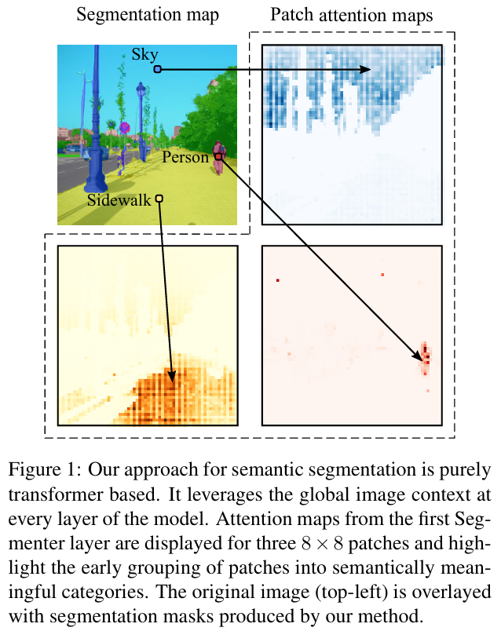
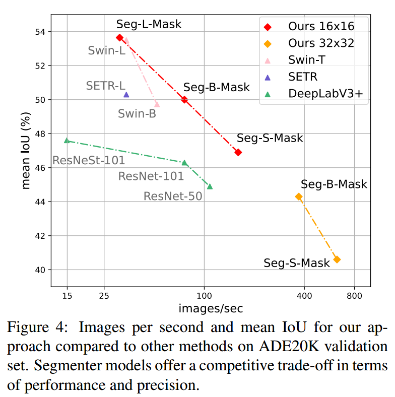

#  Segmenter论文笔记

论文原文：[[2105.05633v3\] Segmenter: Transformer for Semantic Segmentation](https://arxiv.org/abs/2105.05633v3)

------

这篇论文《Segmenter: Transformer for Semantic Segmentation》提出了一种纯基于Transformer的模型，用于语义分割任务。该方法与传统的基于卷积神经网络（CNN）的方法不同，它在网络的每一层，甚至从第一层开始就能捕获全局上下文信息。论文的核心思想是将图像作为一系列图像块（patch）的序列输入到Vision Transformer（ViT）编码器中进行处理，然后通过一个线性解码器或一个Mask Transformer解码器将编码器的输出转换为像素级的类别标签。

### 摘要 (Abstract)

图像分割任务在单个图像块级别上常常存在歧义，因此需要上下文信息来达成标签共识。本文引入了Segmenter，一个用于语义分割的Transformer模型。与基于卷积的方法相比，我们的方法从第一层开始就能在整个网络中建模全局上下文。我们基于最近的Vision Transformer (ViT) 并将其扩展到语义分割。为此，我们依赖于对应于图像块的输出嵌入，并通过点式线性解码器或Mask Transformer解码器从这些嵌入中获取类别标签。我们利用预训练好的图像分类模型，并展示了在语义分割的中等大小数据集上可以对其进行微调。线性解码器已能获得优秀的性能，但通过生成类别掩码的Mask Transformer可以进一步提升性能。我们进行了广泛的消融研究，以展示不同参数的影响，特别是对于大型模型和较小patch尺寸，性能更好。Segmenter在语义分割方面取得了优异的结果。它在ADE20K和Pascal Context数据集上超越了现有技术水平，并在Cityscapes上具有竞争力。

### 1. 引言 (Introduction)

语义分割是计算机视觉领域的一个具有挑战性的问题，在自动驾驶、机器人、增强现实、图像编辑和医学成像等领域有广泛应用。其目标是将每个图像像素分配给与其对应的对象类别标签，并为目标任务提供高级图像表示（例如，检测人物及其衣物的边界以实现虚拟试穿应用）。尽管近年来取得了很大进展，但由于类内变化丰富、上下文变化以及遮挡和低图像分辨率导致的歧义，图像分割仍然是一个具有挑战性的问题。

目前语义分割的主流方法通常依赖于卷积编码器-解码器架构，其中编码器生成低分辨率图像特征，解码器将特征上采样到带有像素级类别分数的分割图。这些方法依赖于可学习的堆叠卷积层，可以捕获语义丰富的信息。然而，卷积核的局部性限制了对图像全局信息的访问，而全局信息对于分割任务尤为重要，因为局部patch的标记往往取决于全局图像上下文。为了解决这个问题，DeepLab方法引入了带有空洞卷积和空间金字塔池化的特征聚合，以扩大卷积网络的感受野并获取多尺度特征。一些分割方法也探索了基于通道或空间注意力以及点式注意力的替代聚合方案，以更好地捕获上下文信息。然而，这些方法仍然依赖于卷积骨干网络，因此偏向于局部交互，这表明卷积架构在分割中存在局限性。

为了克服这些限制，本文将语义分割问题表述为一个序列到序列的问题，并使用Transformer架构来利用模型每个阶段的上下文信息。Transformer通过设计可以捕获场景元素之间的全局交互，并且没有内置的归纳偏置。

然而，建模全局交互的成本是二次的，这使得将此类方法应用于原始图像像素时成本过高。本文遵循Vision Transformers (ViT) 的最新工作，将图像分割成patch，并将线性patch嵌入作为Transformer编码器的输入token。编码器生成的上下文感知token序列随后由Transformer解码器上采样到像素级类别分数。对于解码，本文考虑两种方案：简单的点式线性映射patch嵌入到类别分数，或者基于Transformer的解码方案，其中可学习的类别嵌入与patch token一起处理以生成类别掩码。本文对用于分割的Transformer进行了广泛的研究，包括模型正则化、模型大小、输入patch大小及其在准确性和性能之间的权衡。Segmenter方法取得了优异的结果，同时保持简单、灵活和快速。尤其是使用大模型和小输入patch尺寸时，最佳模型在具有挑战性的ADE20K数据集上达到了53.63%的平均IoU，大幅超越了所有先前的最先进卷积方法5.3%。这种改进部分源于本文方法在模型每个阶段都捕获了全局上下文。

总而言之，本文的贡献在于：
(i) 提出了一种基于Vision Transformer (ViT) 的新型语义分割方法，它不使用卷积，通过设计捕获上下文信息，并优于基于FCN的方法。
(ii) 提出了一系列具有不同分辨率的模型，可以在精度和运行时间之间进行权衡，从最先进的性能到具有快速推理和良好性能的模型。
(iii) 提出了一种基于Transformer的解码器，生成类别掩码，该解码器优于线性基线，并且可以扩展到执行更通用的图像分割任务。
(iv) 证明了本文的方法在ADE20K和Pascal Context数据集上均取得了最先进的成果，并在Cityscapes上具有竞争力。

### 2. 相关工作 (Related work)

**语义分割 (Semantic segmentation)**。基于全卷积网络（FCN）结合编码器-解码器架构的方法已成为语义分割的主流方法。早期方法依赖于一堆连续卷积层组成的结构，后接空间池化来进行密集预测。后续方法在解码过程中上采样高级特征图并将其与低级特征图结合，以同时捕获全局信息并恢复清晰的对象边界。为了扩大卷积层在第一层的感受野，一些方法提出了空洞卷积。为了在更高级层中捕获全局信息，近期工作采用了空间金字塔池化来捕获多尺度上下文信息。DeepLabv3+ 在这些基础上结合了空洞空间金字塔池化，提出了一个简单有效的编码器-解码器FCN架构。近期工作通过在编码器特征图之上使用注意力机制替代粗略池化，以更好地捕获长距离依赖。

虽然最近的分割方法主要关注于改进FCN，但卷积所施加的局部操作限制可能导致全局图像上下文处理效率低下和次优的分割结果。因此，本文提出了一种纯Transformer架构，该架构在编码和解码阶段的每个层都捕获全局上下文。

**视觉Transformer (Transformers for vision)**。Transformer在许多自然语言处理（NLP）任务中达到了最先进水平。此类模型依赖于自注意力机制，并捕获句子中token（单词）之间的长距离依赖。此外，Transformer非常适合并行化，便于在大数据集上进行训练。Transformer在NLP领域的成功启发了计算机视觉领域的几种方法，这些方法将CNN与自注意力形式结合，以解决目标检测、语义分割、全景分割、视频处理和少样本分类等问题。

最近，Vision Transformer (ViT) 引入了一种无卷积的Transformer架构用于图像分类，其中输入图像被处理为patch token序列。虽然ViT需要在非常大的数据集上进行训练，但DeiT提出了一种基于token的蒸馏策略，并使用CNN作为教师模型，在ImageNet-1k数据集上训练出一个具有竞争力的视觉Transformer。同时进行的工作将此扩展到视频分类和语义分割。更具体地说，SETR使用ViT骨干网络和标准CNN解码器。Swin Transformer使用ViT的变体，由局部窗口组成，并在层之间进行移位，并使用Upper-Net作为金字塔FCN解码器。

本文提出Segmenter，一个用于语义图像分割的Transformer编码器-解码器架构。本文的方法依赖于ViT骨干网络，并引入了一个受DETR启发的掩码解码器。本文的架构不使用卷积，通过设计捕获全局图像上下文，并在标准图像分割基准上取得了有竞争力的性能。

### 3. 本文方法：Segmenter (Our approach: Segmenter)

Segmenter基于一个完全基于Transformer的编码器-解码器架构，将一系列patch嵌入映射到像素级类别标注。模型的概览如图2所示。patch序列由3.1节描述的Transformer编码器进行编码，并通过点式线性映射或3.2节描述的Mask Transformer进行解码。我们的模型采用像素级交叉熵损失进行端到端训练。在推理时，通过上采样然后应用argmax来获得每个像素的单一类别。

#### 3.1. 编码器 (Encoder)

图像$x \in R^{H \times W \times C}$被分割成一系列patch $x = [x_1, ..., x_N] \in R^{N \times P^2 \times C}$，其中$(P, P)$ 是patch的大小，$N = HW/P^2$ 是patch的数量，$C$ 是通道数。每个patch被展平为1D向量，然后线性投影到patch嵌入，以生成patch嵌入序列$x^0 = [Ex_1, ..., Ex_N] \in R^{N \times D}$，其中 $E \in R^{D \times (P^2C)}$。为了捕获位置信息，可学习的位置嵌入 $pos = [pos_1, ..., pos_N] \in R^{N \times D}$ 被添加到patch序列中，得到最终的输入token序列 $z^0 = x^0 + pos$。

一个由$L$层组成的Transformer [50] 编码器应用于token序列$z^0$，以生成上下文感知的编码序列$z_L \in R^{N \times D}$。Transformer层由一个多头自注意力（MSA）块，随后是一个带有两个层的点式MLP块组成，在每个块之前应用层归一化（LN），并在每个块之后添加残差连接：

$$
a^{i-1} = MSA(LN(z^{i-1})) + z^{i-1} \tag{1}
$$

$$
z^i = MLP(LN(a^{i-1})) + a^{i-1} \tag{2}
$$

其中$i \in \{1, ..., L\}$。自注意力机制由三个点式线性层组成，将token映射到中间表示：查询 $Q \in R^{N \times d}$，键 $K \in R^{N \times d}$ 和值 $V \in R^{N \times d}$。自注意力计算如下：

$$
MSA(Q, K, V) = softmax\left(\frac{QK^T}{\sqrt{d}}\right)V \tag{3}
$$

Transformer编码器将输入的嵌入式patch序列$z^0 = [z^0_1, ..., z^0_N]$（包含位置编码）映射到$z_L = [z_{L,1}, ..., z_{L,N}]$，这是一个包含丰富语义信息的上下文感知编码序列，供解码器使用。接下来介绍解码器。

#### 3.2. 解码器 (Decoder)

patch编码序列$z_L \in R^{N \times D}$被解码成分割图$s \in R^{H \times W \times K}$，其中$K$是类别数量。解码器学习将来自编码器的patch级编码映射到patch级类别分数。接下来，这些patch级类别分数通过双线性插值上采样到像素级分数。接下来描述线性解码器（作为基线）以及本文的方法——Mask Transformer，如图2所示。

**线性解码器 (Linear)**。一个点式线性层应用于patch编码$z_L \in R^{N \times D}$，以生成patch级类别logits $z_{lin} \in R^{N \times K}$。然后，该序列被重塑为2D特征图$s_{lin} \in R^{H/P \times W/P \times K}$，并通过双线性插值上采样到原始图像大小$s \in R^{H \times W \times K}$。最后，对类别维度应用softmax以获得最终的分割图。

**Mask Transformer (Mask Transformer)**。对于基于Transformer的解码器，本文引入了一组$K$个可学习的类别嵌入 $cls = [cls_1, ..., cls_K] \in R^{K \times D}$，其中$K$ 是类别数量。每个类别嵌入被随机初始化并分配给一个语义类别。它将用于生成类别掩码。类别嵌入$cls$与patch编码$z_L$共同由解码器处理，如图2所示。解码器是一个由$M$层组成的Transformer编码器。本文的Mask Transformer通过计算L2归一化的patch嵌入 $z'_M \in R^{N \times D}$ 和解码器输出的类别嵌入 $c \in R^{K \times D}$ 之间的标量积来生成$K$个掩码。类别掩码集计算如下：
$$
Masks(z'_M, c) = z'_M c^T \tag{4}
$$

其中 $Masks(z'_M, c) \in R^{N \times K}$ 是一个patch序列集。每个掩码序列随后被重塑为2D掩码，形成 $s_{mask} \in R^{H/P \times W/P \times K}$，并双线性上采样到原始图像大小以获得特征图 $s \in R^{H \times W \times K}$。然后，对类别维度应用softmax，接着进行层归一化，以获得像素级类别分数，形成最终的分割图。掩码序列之间是软排他的，即 $\sum_{k=1}^K s_{i,j,k} = 1$ 对于所有 $(i,j) \in H \times W$。

本文的Mask Transformer受到DETR、Max-DeepLab和SOLO-v2的启发，这些方法引入了对象嵌入来生成实例掩码。然而，与本文方法不同的是，MaxDeep-Lab使用基于CNN和Transformer的混合方法，并由于计算限制将像素和类别嵌入分成两个流。通过使用纯Transformer架构并利用patch级编码，本文提出了一种简单的方法，在解码阶段同时处理patch和类别嵌入。这种方法允许生成动态滤波器，随输入而变化。虽然本文的工作解决了语义分割问题，但本文的Mask Transformer也可以通过将类别嵌入替换为对象嵌入来直接适应全景分割。

### 4. 实验结果 (Experimental results)

本节展示了Segmenter在各种数据集上的实验结果，并进行了详细的消融研究，以分析不同参数对模型性能的影响。

#### 4.1. 数据集和指标 (Datasets and metrics)

*   **ADE20K**：包含包含细粒度标签的挑战性场景，是语义分割最具挑战性的数据集之一。训练集包含20,210张图像，有150个语义类别。验证集和测试集分别包含2,000和3,352张图像。
*   **Pascal Context**：训练集包含4,996张图像，有59个语义类别加上一个背景类别。验证集包含5,104张图像。
*   **Cityscapes**：数据集包含来自50个不同城市的5,000张图像，有19个语义类别。训练集有2,975张图像，验证集有500张图像，测试集有1,525张图像。

**指标 (Metrics)**：报告所有类别平均的交并比（mIoU）。

#### 4.2. 实现细节 (Implementation details)

*   **Transformer模型 (Transformer models)**：编码器基于Vision Transformer (ViT)，考虑了“Tiny”、“Small”、“Base”和“Large”模型（见表1）。Transformer编码器中变化的参数是层数和token大小。多头自注意力（MSA）块的head大小固定为64，head数量是token大小除以head大小，MSA之后MLP的隐藏层大小是token大小的四倍。还使用了ViT的变体DeiT。本文考虑了以不同分辨率表示图像的模型，并使用了8x8、16x16和32x32的输入patch大小。
*   **ImageNet预训练 (ImageNet pre-training)**：Segmenter模型在ImageNet上预训练。ViT在ImageNet-21k上预训练，并使用了强数据增强和正则化。DeiT在其变体ImageNet-1k上预训练。本文微调了改进的ViT模型，这些模型在ImageNet-1k上预训练224x224分辨率，并在384分辨率上微调。然后，在语义分割任务中，保持patch大小固定，并在更高分辨率下进行微调。根据[19]，通过双线性插值预训练位置嵌入以匹配微调序列长度。解码器采用截断正态分布随机初始化权重。
*   **数据增强 (Data augmentation)**：训练期间遵循MMSegmentation的标准化流程，包括均值减法、图片随机缩放（0.5到2.0之间）、随机左右翻转。大图片随机裁剪，小图片填充到固定大小。
*   **优化 (Optimization)**：使用像素级交叉熵损失，不进行权重再平衡。使用SGD作为优化器，基学习率$\gamma_0$，权重衰减为0。采用“poly”学习率衰减策略 $\gamma = \gamma_0(1 - \frac{N_{iter}}{N_{total}})^{0.9}$。
*   **推理 (Inference)**：为处理推理时变化的图像大小，使用滑动窗口，分辨率与训练大小匹配。对于多尺度推理，使用不同缩放因子（0.5, 0.75, 1.0, 1.25, 1.5, 1.75）的图像版本并进行左右翻转，然后平均结果。

#### 4.3. 消融研究 (Ablation study)

* **正则化 (Regularization)**：对比了dropout和随机深度（stochastic depth）两种正则化方式。结果显示，随机深度能持续改善Transformer在分割任务上的训练效果，而dropout则会降低性能。这与DeiT在图像分类中观察到的结果一致。因此，后续所有模型均采用0.1的随机深度，不使用dropout。

* **Transformer尺寸 (Transformer size)**：通过改变层数和token大小来研究Transformer尺寸对性能的影响。结果表明，性能随骨干网络容量的增加而线性增长。当token维度加倍或层数加倍时，mIoU均有显著提升。最大的Segmenter模型Seg-L/16在ADE20K验证集上达到了50.71%的mIoU，这表明Transformer模型比FCN更具表达能力。

* **Patch尺寸 (Patch size)**：这是一个关键因素。减小patch尺寸能显著提升性能，例如Seg-B从32x32到16x16，提升了5%。8x8的patch尺寸性能更好，但计算成本更高。图3直观展示了patch尺寸对分割图的影响，小patch尺寸能生成更锐利的边界和更精细的对象分割。表4进一步分析了不同patch尺寸对大小物体的表现，发现小patch尺寸（如8x8）在小型和中型实例上带来显著增益，而Segmenter相比DeepLab在大型实例上表现出更大的优势。

  

* **解码器变体 (Decoder variants)**：比较了线性解码器和Mask Transformer。Mask Transformer始终优于线性基线，尤其是在大型对象上。这得益于其生成动态滤波器的能力。并且，Mask Transformer学习到的类嵌入具有语义意义，相似的类别在嵌入空间中也靠近（见图8）。

* **Transformer vs. FCN (Transformer versus FCN)**：表4和表6对比了Segmenter与DeepLabv3+等FCN模型的性能。Transformer模型在全局场景理解方面表现出优势，尤其是在大型实例上。但在小型和中型实例上的表现与DeepLab相当。

* **性能 (Performance)**：图4展示了Segmenter在mIoU和每秒图像处理数（计算效率）方面的优势。Segmenter在精度和速度之间提供了有竞争力的权衡。Seg/16模型在精度-计算时间方面表现最佳。Seg-B-Mask/16在推理速度与FCN相当的同时，性能优于FCN，并与SETR-MLA相当但速度更快。Seg/32模型虽然分割粒度更粗，但推理速度非常快。

  

*   **数据集大小 (Dataset size)**：研究了训练数据集大小对性能的影响。结果表明，即使在微调阶段，足够大的数据集（例如ADE20K上高于8k张图像）对于Transformer模型取得良好性能仍然至关重要。

#### 4.4. 与现有技术水平的比较 (Comparison with state of the art)

*   **ADE20K**：Segmenter在ADE20K上取得了最先进的性能。预训练的Seg-B†/16与DeepLabv3+ ResNeSt-200相当。加上Mask Transformer的Seg-B†-Mask/16进一步提升了2%，超越了所有FCN方法。最佳模型Seg-L-Mask/16达到了53.63%的mIoU，大幅超越DeepLabv3+ ResNeSt-200以及其他基于Transformer的方法SETR和Swin-L。
*   **Pascal Context**：在Pascal Context上，Segmenter也表现出色。Seg-B†模型已具有竞争力，Seg-L/16更是达到了最先进水平，超越SETR-L。Mask Transformer进一步提升了性能，Seg-L-Mask/16达到了59.04%的mIoU，比OCR HRNetV2-W48和SETR-L MLA分别提升了2.8%和3.2%。
*   **Cityscapes**：在Cityscapes上，Segmenter同样具有竞争力。Seg-L-Mask/16达到了81.3%的mIoU。
*   **定性结果 (Qualitative results)**：图5展示了Seg-L-Mask/16与DeepLabv3+的定性比较。Segmenter在大型实例上提供更一致的标签，并更好地处理部分遮挡，而DeepLabv3+倾向于生成更锐利的对象边界。附录C中提供了更多定性结果，显示Segmenter在某些情况下能产生比DeepLabv3+更连贯的分割图，但在处理相邻人物的边界时DeepLabv3+可能更优。两者在分割小实例时都存在困难。

### 5. 结论 (Conclusion)

本文提出了一种用于语义分割的纯Transformer方法。编码部分建立在最近的Vision Transformer (ViT) 之上，但不同之处在于我们依赖于所有图像块的编码。我们观察到Transformer能够很好地捕获全局上下文。将一个简单的点式线性解码器应用于块编码就已经取得了优异的结果。使用Mask Transformer进行解码进一步提高了性能。我们相信，这种端到端的编码器-解码器Transformer是迈向语义分割、实例分割和全景分割统一方法的第一步。

### 6. 致谢 (Acknowledgements)

致谢部分感谢了提供ViT-Base模型和有益讨论的Andreas Steiner和Gauthier Izacard，并承认了研究工作中获得的资助和支持。

### 附录 (Appendix)

附录部分提供了额外的实验结果和分析。
*   **ImageNet预训练 (ImageNet pre-training)**：研究了ImageNet预训练对Segmenter性能的影响。结果（表9）显示，ImageNet预训练能显著提高Seg-S/16的性能，相比随机初始化模型有巨大的改进（最高32.9%）。
*   **注意力图和类别嵌入 (Attention maps and class embeddings)**：
    *   **注意力图 (Attention maps)**：图6展示了Seg-B/8不同层（1, 4, 8, 11层）的patch注意力图。观察到注意力图的感受野会根据输入图像和实例大小进行调整，在大实例上收集全局信息，在小实例上关注局部信息。这与CNN恒定的感受野不同。此外，信息从低层到高层逐渐聚合。
    *   **感受野大小 (Size of attended area)**：图7展示了每个头和模型深度所关注区域的大小。即使是第一层，有些头也关注远处patch，这明显超出了ResNet/ResNeSt初始层的感受野。
    *   **类别嵌入 (Class embeddings)**：图8展示了使用Mask Transformer学习到的类别嵌入的奇异值分解（SVD）投影。结果显示，这些投影将语义上相关的类别（如交通工具、房屋内物品、室外类别）进行了隐式聚类。
*   **定性结果 (Qualitative results)**：图9、10、11和12提供了额外的定性比较，包括与DeepLabv3+ ResNeSt-101的对比和失败案例。Segmenter通常能产生更连贯的分割图（图9），但在分割外观非常相似的不同区域时，两者都会混淆（图10）。对于相邻人物的边界，DeepLabv3+可能表现更好（图11）。对于小型实例（如灯、人、花、汽车、信号灯），两者都存在分割困难（图12）。

---

### 技术点详细解释 (Detailed Technical Explanation)

#### **1. 纯Transformer架构 (Pure Transformer Architecture)**

核心：抛弃了传统的卷积神经网络，完全采用Transformer模型。
*   **编码器 (Encoder)**：基于Vision Transformer (ViT)。
    
    *   **图像分块 (Image Patching)**：将原始图像 $x \in R^{H \times W \times C}$（高、宽、通道）分割成一系列不重叠的图像块。每个图像块 PxP（例如 16x16 或 8x8）。如果图像是 $H \times W$，patch 大小是 $P \times P$，那么图像会被分成 $N = (H/P) \times (W/P)$ 个patch。
    *   **线性投影 (Linear Projection)**：每个 $P \times P \times C$ 的图像块被展平（flatten）成一个 $P^2 C$ 维的向量。然后，通过一个可学习的线性投影矩阵 $E \in R^{D \times (P^2 C)}$ 将每个展平的patch映射到一个更高维的嵌入空间，得到patch嵌入 $Ex_i \in R^D$。这里的 $D$ 是Transformer的隐藏维度（token size）。
    *   **位置嵌入 (Positional Embeddings)**：由于Transformer的自注意力机制是置换不变的（permutation-invariant），它无法感知输入序列中token的顺序或位置。为了引入位置信息，可学习的1D位置嵌入 $pos_i \in R^D$ 被添加到对应的patch嵌入 $Ex_i$ 上，形成最终的输入token序列 $z^0_i = Ex_i + pos_i$。
    *   **Transformer 块 (Transformer Blocks)**：编码器由多个堆叠的Transformer层组成。每个Transformer层遵循标准Transformer结构：
        
        *   **层归一化 (Layer Normalization, LN)**：在每个块的输入之前应用，有助于稳定训练。
        *   **多头自注意力 (Multi-Headed Self-Attention, MSA)**：这是Transformer的核心。它允许模型同时关注输入序列的不同部分，并捕获不同类型的关系。MSA通过将输入token（$z_i$）分别线性投影到Query (Q)、Key (K) 和 Value (V) 向量来计算注意力。
            
            *   单头注意力（scaled dot-product attention）计算公式：
                $$
                Attention(Q,K,V) = softmax\left(\frac{QK^T}{\sqrt{d_k}}\right)V
                $$
                其中 $d_k$ 是Q和K向量的维度，用于缩放点积以防止梯度过大。
            *   多头注意力则是将输入映射到多个独立的(Q, K, V)空间，并行计算多个注意力头，然后将它们的输出拼接起来，再通过一个线性层投影回原始维度。
            *   Transformer的自注意力机制使得它能够直接建模远程依赖，因为它计算的是所有token对之间的相似性，而不像CNN那样受限于局部感受野。
        *   **前馈网络 (Feed-Forward Network, FFN) / MLP (Multi-Layer Perceptron)**：在MSA之后，每个token独立地通过一个两层的MLP。
        *   **残差连接 (Residual Connections)**：在MSA块和MLP块之后都添加了残差连接，即输入直接加到输出上，有助于解决深度网络中的梯度消失问题。
*   **解码器 (Decoder)**：
    
    *   **线性解码器 (Linear Decoder - Baseline)**：
        *   这是一个简单的解码方式。编码器输出的上下文感知patch编码 $z_L \in R^{N \times D}$（N是patch数量，D是隐藏维度）直接通过一个线性层映射到patch级的类别logit $z_{lin} \in R^{N \times K}$（K是类别数量）。
        *   然后，这个 $N \times K$ 的logit序列被重塑为 $H/P \times W/P \times K$ 的2D特征图。
        *   最后，通过双线性插值（Bilinear Interpolation）上采样到原始图像分辨率 $H \times W \times K$。
        *   对每个像素的K个类别logit应用softmax得到最终的像素级类别概率。
    *   **Mask Transformer 解码器 (Mask Transformer Decoder)**：
        *   **可学习的类别嵌入 (Learnable Class Embeddings)**：引入一组可学习的类别嵌入 $cls = [cls_1, ..., cls_K] \in R^{K \times D}$。每个嵌入代表一个语义类别。这些嵌入是随机初始化的，并在训练过程中与模型其他部分一起学习。
        *   **Transformer 处理 (Transformer Processing)**：编码器输出的patch编码 $z_L$ 和这些类别嵌入 $cls$ 会一起输入到 Mask Transformer 解码器中。这个解码器本身也是一个Transformer，由 $M$ 层组成。重要的是，它能够建模patch编码和类别嵌入之间的相互作用。这意味着不是简单地将patch映射到类别，而是类别“查询”图像特征以生成其对应的掩码。
        *   **掩码生成 (Mask Generation)**：解码器输出经过L2归一化的patch嵌入 $z'_M \in R^{N \times D}$ 和类别嵌入 $c \in R^{K \times D}$。然后，通过计算它们的矩阵乘法 $z'_M c^T$ 来生成掩码。
            $$
            Masks(z'_M, c) = z'_M c^T
            $$
            这个操作的输出是一个 $N \times K$ 的矩阵。其中的每个元素 $(i, j)$ 表示第 $i$ 个patch属于第 $j$ 个类别的“得分”或“激活值”。这是一种动态滤波器机制，类别嵌入 $c$ 就充当了动态的类别特定滤波器。
        *   **重塑与上采样 (Reshaping and Upsampling)**：与线性解码器类似，这个 $N \times K$ 的得分矩阵会被重塑为 $H/P \times W/P \times K$，并通过双线性插值上采样到原始图像分辨率。
        *   **softmax与层归一化 (Softmax and Layer Normalization)**：最后，对类别维度应用softmax，然后进行层归一化，得到最终的像素级类别分数。
        *   **“软排他” (Softly Exclusive)**：这意味着对于每个像素，所有类别概率的总和为1。

#### **2. 全局上下文建模 (Global Context Modeling)**

*   **自注意力机制 (Self-Attention Mechanism)**：这是Transformer区别于CNN的关键。传统CNN的卷积核是局部操作的，只能通过堆叠深层网络来逐渐扩大感受野，但仍然是局部的逐层聚合。而Transformer的自注意力机制在理论上可以一步到位地关注输入序列中的所有其他元素，无论它们在原始图像中相距多远。这意味着模型在计算每个patch的表示时，可以同时考虑到图像中的所有其他patch信息，从而在每一层都捕获全局上下文。这对于语义分割至关重要，因为许多物体的分类和边界确定依赖于其周围甚至整个场景的上下文。

#### **3. 从图像分类到语义分割的ViT适配 (ViT Adaptation from Image Classification to Semantic Segmentation)**

*   **ViT基础 (ViT Foundation)**：ViT最初是为图像分类设计的。它通常在ImageNet等大型数据集上进行预训练，学习通用的图像表示。
*   **微调策略 (Fine-tuning Strategy)**：Segmenter利用了ImageNet上预训练的ViT模型作为编码器骨干。这是迁移学习的常见实践。对于语义分割任务，在特定数据集（如ADE20K）上对整个模型进行微调。
*   **高分辨率输入 (Higher Resolution Inputs)**：语义分割通常需要在较高分辨率下进行推理以保留细节。当输入图像分辨率增加时，patch数量会增加，导致token序列变长。为了适应新的序列长度，Segmenter对预训练的位置嵌入进行双线性插值。这允许模型将从低分辨率图像学到的位置信息迁移到高分辨率图像。
*   **解码器初始化 (Decoder Initialization)**：解码器（线性或Mask Transformer）是新添加的部分，因此其权重是随机初始化的。

#### **4. 消融研究的洞察 (Insights from Ablation Study)**

*   **正则化 (Regularization)**：
    *   **随机深度 (Stochastic Depth)**：在训练过程中随机跳过一些Transformer层。这可以看作是一种模型集成，允许模型在训练时对不同深度的网络进行训练，从而提高泛化能力。实验表明它比Dropout更有效。
    *   **Dropout (Dropout)**：随机将一些神经元的输出置为0，以防止过拟合。但在ViT中，Dropout似乎不如随机深度有效，甚至可能损害性能。论文提到这与DeiT的观察一致。
*   **模型尺寸 (Model Size)**：更大、更深的Transformer模型（更多层，更大隐藏维度）通常意味着更强的表示能力，从而带来更高的分割精度。这表明Transformer在语义分割任务上具有很好的可扩展性。
*   **Patch尺寸 (Patch Size)**：
    *   **精度-速度权衡 (Accuracy-Speed Trade-off)**：小patch尺寸（例如8x8）意味着更多的patch，导致更长的token序列。这增加了Transformer的计算量（自注意力是序列长度的二次方），但能提供更精细的空间信息，从而保留图像细节，生成更锐利的边界，提高分割精度。大patch尺寸则反之，计算更快，但精度可能下降。
    *   **细节捕捉 (Detail Capture)**：论文的定性结果清楚地显示，小patch尺寸对于捕捉小物体和精细的物体边界至关重要。

#### **5. 性能与比较 (Performance and Comparison)**

*   **超越FCN (Outperforming FCNs)**：Segmenter在多个基准数据集上超越了最先进的卷积方法（如DeepLabv3+），尤其是在ADE20K等复杂数据集上表现突出。这强调了Transformer在理解全局场景上下文方面的优势。
*   **Mask Transformer 的优势 (Advantage of Mask Transformer)**：Mask Transformer解码器通过学习动态滤波器（类别嵌入），使得模型能够更灵活地根据输入图像生成类别掩码，从而进一步提升了分割性能，尤其对大物体有更显著的提升。这类似于实例分割中Mask R-CNN的Mask head思想，但这里应用于语义分割的类别掩码。
*   **效率 (Efficiency)**：论文也展示了Segmenter在保持高精度的同时，也具备较好的推理速度，部分配置甚至优于一些FCN模型。

#### **6. 关键技术细节 (Key Technical Details)**

*   **Encoder输入 (Encoder Input)**
    $x \in R^{H \times W \times C}$ (原始图像)
    切分并展平为 $x_{patch} \in R^{N \times (P^2 C)}$
    线性投影 $x^0 = E x_{patch}$, 其中 $E \in R^{D \times (P^2 C)}$
    添加位置编码 $z^0 = x^0 + pos$, 其中 $pos \in R^{N \times D}$
*   **Transformer Encoder层 (Transformer Encoder Layer)**
    $MSA(Q,K,V) = softmax(\frac{QK^T}{\sqrt{d}})V$ (公式3)
    $a^{i-1} = MSA(LN(z^{i-1})) + z^{i-1}$ (公式1)
    $z^i = MLP(LN(a^{i-1})) + a^{i-1}$ (公式2)
    Encoder输出：$z_L \in R^{N \times D}$
*   **Mask Transformer Decoder输入 (Mask Transformer Decoder Input)**
    编码器输出 $z_L \in R^{N \times D}$ (patch embeddings)
    可学习的类别嵌入 $cls \in R^{K \times D}$
    解码器接收 $[z_L; cls]$ 作为输入 (拼接在一起处理)
*   **Mask Transformer Decoder掩码生成 (Mask Transformer Decoder Mask Generation)**
    解码器输出 $z'_M \in R^{N \times D}$ (L2-normalized patch embeddings)
    解码器输出 $c \in R^{K \times D}$ (类别嵌入)
    掩码计算：$Masks(z'_M, c) = z'_M c^T$ (公式4)
    结果 $Masks \in R^{N \times K}$ (patch-wise class scores)
*   **上采样 (Upsampling)**
    $Masks$ 重塑为 $s_{mask} \in R^{H/P \times W/P \times K}$
    双线性插值上采样到 $s \in R^{H \times W \times K}$ (原始分辨率的像素级类别logit)
    最终输出：apply softmax over K.

简而言之，Segmenter通过将图像视为一系列token，利用Transformer强大的全局建模能力，实现了对语义分割任务的新颖、高效且高性能的解决方案。它证明了纯Transformer结构在视觉理解任务中的巨大潜力，并为未来的统一视觉任务模型奠定了基础。
