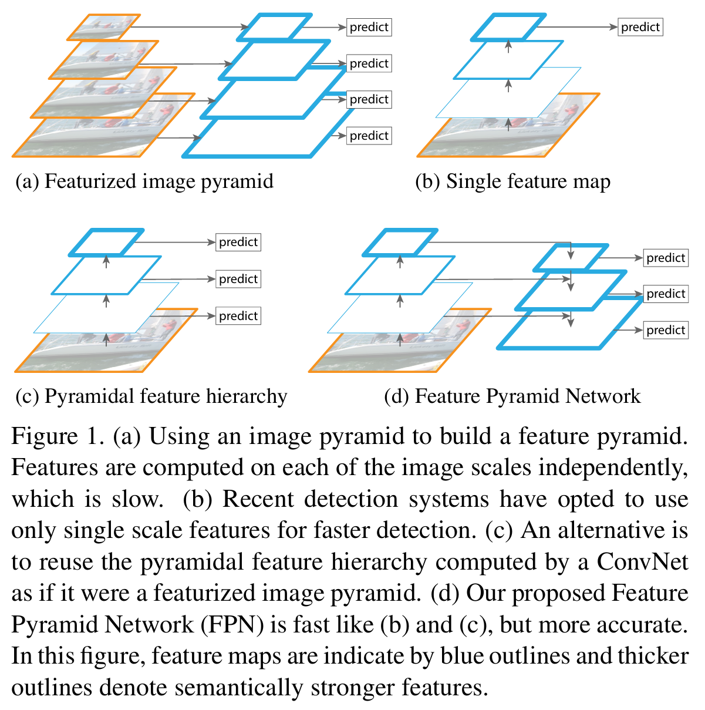
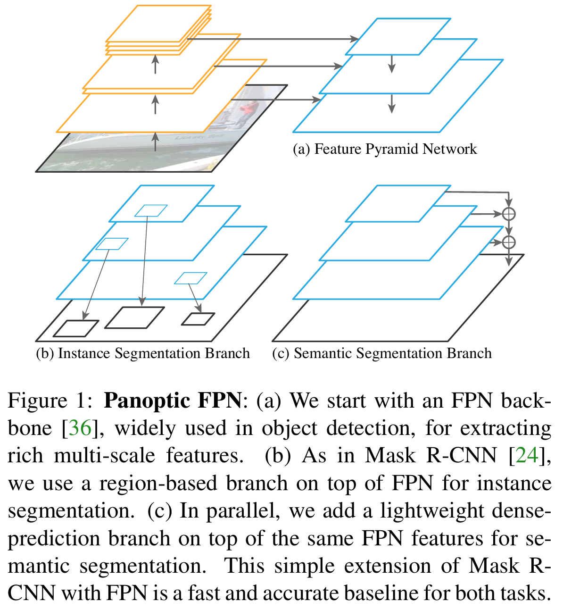

# Panoptic FPN （SFPN）笔记

**学习资料**: [(6 条消息) 何恺明组又出神作！最新论文提出全景分割新方法 - 知乎](https://zhuanlan.zhihu.com/p/54554862)

[(16 条消息) 【论文笔记】FPN —— 特征金字塔 - 知乎](https://zhuanlan.zhihu.com/p/92005927)

[Mask R-CNN笔记](../Mask_R-CNN/mask_r-cnn_notes)

---

## 核心思想：一个网络，两种分割
Panoptic FPN的核心目标是设计一个**单一、统一的网络**来同时解决计算机视觉中两个核心但架构上存在冲突的分割任务：
1.  **实例分割 (Instance Segmentation)**：识别并分割出图像中每一个独立的“事物”（Things），比如每一辆车、每一个人。这本质上是一个“检测后分割”的思路，是**自顶向下（Top-down）**的，先定位对象，再精细化其边界。
2.  **语义分割 (Semantic Segmentation)**：对图像中的每一个像素进行分类，主要针对背景“材质”（Stuff），比如天空、草地、道路。这是一个密集的像素级分类任务，是**自下而上（Bottom-up）**的，直接对所有像素进行预测。

在Panoptic FPN之前，这两个领域的顶尖模型架构迥异：实例分割的王者是基于FPN的**Mask R-CNN**，而语义分割的霸主是基于空洞卷积的**DeepLab系列**。直接将两者暴力合并非常困难。

Panoptic FPN的突破在于，它没有设计一个全新的复杂结构，而是提出了一个极其优雅且高效的方案：在强大的实例分割框架Mask R-CNN的基础上，为其**并行**增加一个轻量级的语义分割分支，并让这两个分支共享同一个强大的特征提取主干——**特征金字塔网络 (FPN)**。

这个为FPN注入强大语义能力的设计，就是我们常说的 **Semantic FPN (SFPN)** 思想最著名和成功的实践。

## 前置知识：详细解释FPN

FPN 并非一个从零开始设计的全新网络架构，而是一个**精巧的特征融合模块**，它建立在现有强大的 **骨干网络（Backbone Network）** 之上，旨在解决计算机视觉任务中**多尺度物体识别**的难题。你之前提到 FPN 是一个特征提取器，这个理解非常准确，它正是通过生成一个高质量的特征金字塔来服务于后续的任务。

### FPN 的核心思想与必要性

传统的卷积神经网络（CNN）在进行前向传播时，虽然深层特征图拥有丰富的**语义信息**（例如，能识别出图片中的“猫”或“狗”），但由于多次下采样（如池化操作），它们的**空间分辨率较低**，导致小物体的信息丢失，定位精度不高。反之，浅层特征图虽然保留了较高的**空间分辨率和细节信息**（如边缘、纹理），但缺乏足够的语义上下文来准确识别复杂的物体。这种深层特征语义强但分辨率低、浅层特征分辨率高但语义弱的矛盾，使得模型在处理大小差异悬殊的物体时力不从心。

FPN 的诞生正是为了弥补这一不足。它旨在构建一个能够同时提供**高层语义信息**和**高分辨率细节信息**的特征金字塔，让不同尺度的物体都能找到最适合它们识别的特征层。

------

### FPN 的结构与工作原理

FPN 的精髓在于其独特的三向结构，它巧妙地融合了骨干网络不同层级的特征：

1. **自底向上路径 (Bottom-up Pathway)：**

   这部分就是你提到的 CNN 前向传播过程。FPN 首先会利用一个强大的骨干网络（例如你疑问中提到的 ResNet 等经典的 CNN 架构，或是更先进的 Swin Transformer），对输入图像进行一系列的卷积和下采样操作。在这个过程中，骨干网络会逐层提取特征，产生一系列不同空间尺寸的特征图。随着层级的加深，特征图的空间分辨率逐渐减小，但其所蕴含的语义信息越来越丰富。例如，一个输入图像经过骨干网络后，会输出 C2,C3,C4,C5 等特征层，其中 C2 分辨率最高，语义信息相对较少，而 C5 分辨辨率最低，但语义信息最强。

2. **自顶向下路径 (Top-down Pathway)：**

   为了将高层丰富的语义信息传递给低分辨率的特征层，FPN 从最高层的特征图（比如 C5）开始，通过**上采样（upsampling）**操作逐步恢复特征图的空间分辨率。每一次上采样都将特征图的尺寸变大，以便与下一层的特征图进行融合。

3. **横向连接 (Lateral Connections)：**

   这也是 FPN 的核心创新点。在自顶向下路径中，经过上采样得到的特征图会与自底向上路径中空间尺寸相同的对应特征图进行融合。这种融合通常采用**逐元素相加（element-wise addition）**的方式。你联想到 FCN 编码器和解码器的跳跃结构，这个直觉非常敏锐，因为两者在形式上确实非常相似，都涉及相同大小特征图的融合。

   - **融合目的：** 横向连接的目的是将高层特征图中强大的语义信息，与低层特征图中保留的丰富细节信息进行有效结合。例如，上采样后的 P5（由 C5 得到）会与 C4 进行融合，生成更具语义和细节的 P4；然后 P4 再上采样与 C3 融合，生成 P3，以此类推。
   - **结果：** 经过横向连接后，FPN 最终会输出一个**特征金字塔**，其中每个层级（例如 P2,P3,P4,P5）都具有强烈的语义信息，同时保留了该层级应有的空间分辨率。这些 P 层的特征图就是 FPN 为后续任务准备的高质量特征表示。

------

### FPN 与 FCN 跳跃连接的异同

你对 FPN 的横向连接和 FCN 的跳跃结构感到“昏”，这是因为它们在操作形式上确实非常相似——都是将来自网络不同部分、**空间尺寸一致的特征图进行融合**，通常是逐元素相加。

然而，它们的核心**目的**和**最终输出**却大相径庭：

- **FCN 的跳跃连接：** 旨在直接**生成像素级别的分割结果**。它将编码器（下采样路径）的特征跳跃连接到解码器（上采样路径），主要是为了**弥补上采样过程中的细节丢失**，从而输出一个精细的、与输入图像尺寸相同的语义分割图。FCN 是一个**端到端的完整网络**，直接完成语义分割任务。
- **FPN 的横向连接：** 旨在**构建一个多尺度的、语义丰富的特征金字塔**。它并不是直接生成最终任务的结果，而是作为一个**通用的特征增强模块**，为下游任务（如目标检测、实例分割）提供高质量的特征表示。FPN 产生的 Pi 层特征图，会作为后续检测头或分割头的输入，让这些头在处理不同尺度的目标时都能获得最合适的特征。

简而言之，虽然操作形式相似，**FCN 是为了直接输出一个精细的分割图，而 FPN 是为了提供一系列“更好用”的特征图供其他任务使用。**

### 总结

FPN 通过巧妙地结合自底向上、自顶向下和横向连接这三条路径，解决了传统 CNN 在多尺度特征提取上的不足。它能够利用强大的骨干网络（如 ResNet）提取的原始特征，并将其转化为一个兼具丰富语义和高分辨率细节的特征金字塔。这个金字塔能够为不同尺度的物体提供尺度不变的强语义特征，从而显著提升了目标检测、实例分割等任务在复杂场景下的性能，使其成为当前计算机视觉领域不可或缺的重要模块。

## 模型架构详解：双分支共享FPN

Panoptic FPN的整体架构可以看作是一个“一干两支”的结构：一个共享的FPN主干，以及分别用于实例分割和语义分割的两个并行分支。

### 1. 共享主干：特征金字塔网络 (FPN)
FPN是整个架构的基石，它的作用是为后续两个分支提供高质量、多尺度的特征图，这是有效处理不同大小物体和区域的关键。

**FPN的结构与工作原理：**
FPN通过巧妙的结构，让网络在每一层都能输出兼具丰富空间细节和强大语义信息的特征。
*   **自下而上路径 (Bottom-up Pathway)**：这是标准的前馈卷积网络（如ResNet）的前向传播过程。网络从输入图像开始，经过多个卷积阶段（Stages），比如ResNet的`conv2_x`到`conv5_x`。这些阶段的输出被称为$C_2, C_3, C_4, C_5$。随着层级加深，特征图的分辨率**逐级减半**（如$1/4 \to 1/8 \to 1/16 \to 1/32$），但感受野增大，提取的语义信息（如“这是一只猫”）也越来越强。
*   **自上而下路径 (Top-down Pathway) 与横向连接 (Lateral Connection)**：这是FPN的精髓所在。它将高层的、抽象的语义信息传递回低层，以弥补低层特征语义不足的缺陷。
    1.  从最顶层的$C_5$开始，通过一个$1 \times 1$的卷积层进行通道降维（通常降至256维），得到语义最强的金字塔层$P_5$。
    2.  将$P_5$进行$2 \times$**上采样**（通常是最近邻插值），使其分辨率与$C_4$对齐。
    3.  同时，将$C_4$也通过一个$1 \times 1$卷积进行通道降维。
    4.  将上采样后的$P_5$与处理后的$C_4$进行**逐元素相加**，这个连接就是“横向连接”。相加的结果再经过一个$3 \times 3$卷积（用于消除上采样带来的混叠效应），最终生成$P_4$。
    5.  重复这个过程，依次生成$P_3$和$P_2$。

这个过程可以用以下公式概括：
$$
P_i = \text{Conv}_{3 \times 3}(\text{Upsample}(P_{i+1}) + \text{Conv}_{1 \times 1}(C_i))
$$
通过这种方式，FPN最终输出一个特征金字塔$\{P_2, P_3, P_4, P_5\}$，其中每一层都融合了高层语义和低层细节，非常适合用于检测和分割不同尺寸的目标。

### 2. 实例分割分支 (Instance Branch)
这部分完全继承自 **Mask R-CNN**，是一个成熟且强大的实例分割框架。它专门负责处理图像中的“事物”类别。
*   **区域提议网络 (Region Proposal Network, RPN)**：RPN在FPN的每一层特征图（$P_2$到$P_6$，其中$P_6$是$P_5$经过下采样得到，用于处理极大物体）上独立运行。它通过在特征图上密集地放置预设的多种尺寸和长宽比的**锚点框(Anchor Boxes)**，来快速地判断哪些区域可能包含物体（前景/背景分类）并初步回归其边界框。
*   **RoIAlign (Region of Interest Align)**：这是Mask R-CNN相较于Faster R-CNN的关键改进，对于生成高质量掩码至关重要。
    *   **背景**：之前的RoIPool操作在将不同大小的RoI池化到固定尺寸时，会进行两次取整量化操作，这会导致RoI的特征与其在原图中的实际位置产生几个像素的偏差（misalignment）。对于分类任务影响不大，但对于像素级的分割任务是致命的。
    *   **RoIAlign的解决方案**：它取消了所有的取整操作，通过**双线性插值**算法来精确计算每个池化输出网格单元（bin）的特征值。这保证了提取出的特征与RoI的原始空间位置是完全对齐的，为后续的像素级掩码预测打下了坚实基础。
*   **预测头 (Prediction Heads)**：对经过RoIAlign池化后的特征图（如$7 \times 7$或$14 \times 14$）并行进行三项预测：
    1.  **分类 (Classification)**：通过全连接层，判断RoI中的物体属于哪个具体类别（如“人”、“车”）。
    2.  **边界框回归 (Box Regression)**：通过全连接层，再次精调RoI的边界框坐标，使其更紧密地包裹物体。
    3.  **掩码预测 (Mask Prediction)**：通过一个迷你的**全卷积网络(FCN)**，对池化后的特征图（通常会放大到如$28 \times 28$）进行操作，为每个类别都输出一个二值的分割掩码，精确地勾勒出RoI内部的物体轮廓。

### 3. 语义分割分支 (Semantic Branch)
这是Panoptic FPN的核心创新，也是**Semantic FPN思想**的具体实现。它的设计哲学是**轻量、高效、且充分利用FPN已有特征**。

**工作流程与设计思想：**

1.  **输入**：该分支接收来自FPN的所有特征层级，即$P_2, P_3, P_4, P_5$。
2.  **特征处理与上采样**：它的目标是将所有FPN层级的特征信息融合到一个共同的高分辨率特征图上（通常是与$P_2$相同的`1/4`原图尺寸）。
    *   从$P_5$（分辨率最低，1/32）开始，依次对$P_4$, $P_3$进行处理。每个层级的处理模块非常简洁，包含一系列标准操作：一个$3 \times 3$卷积（用于特征提炼和通道调整），一个**组归一化 (Group Normalization, GN)**层，一个ReLU激活函数，以及一个$2 \times$双线性上采样。
    *   **为什么用组归一化(GN)？**
        
        > **组归一化 (Group Normalization, GN)** 是一种替代批归一化(BN)的归一化技术。BN的效果依赖于足够大的批次大小（batch size）来获得稳定的统计数据（均值和方差），在小批量（如目标检测中常见）或多任务学习（不同任务的数据分布可能不同）场景下性能会下降。GN将特征的通道维度分成若干组（groups），在组内独立计算均值和方差进行归一化。因为它完全不依赖于批次维度，所以在任何batch size下表现都非常稳定。
    *   通过这种级联的上采样和特征提炼，最终$P_5, P_4, P_3$的特征图都被逐步上采样到了与$P_2$相同的`1/4`分辨率。这个过程可以看作是一个轻量级的解码器。
3.  **特征融合**：将所有处理并上采样到`1/4`分辨率的特征图（来自$P_2, P_3, P_4, P_5$）进行**逐元素相加**。这是一个极其简单但有效的操作。它将来自FPN高层的强语义信息（源自$P_5, P_4$）和低层的丰富空间细节信息（源自$P_2, P_3$）无差别地聚合在一起，形成一个富含多尺度上下文的高分辨率特征图。
4.  **最终预测**：
    *   对融合后的特征图使用一个$1 \times 1$卷积，将其通道数转换为最终的语义类别数（如COCO中的53个“材质”类别）。
    *   这里引入一个特殊的**“其他(other)”类别**。在训练时，所有属于“事物”的像素都被标记为此类别。这是一种巧妙的解耦策略：语义分支只需要专注于“材质”的分类，而把“事物”区域交给更专业的实例分支去处理，避免了两个分支在“事物”区域产生预测冲突。
    *   最后，通过一个$4 \times$双线性上采样，将特征图恢复到原始图像大小，并应用Softmax函数得到每个像素的最终类别概率。

## 工程实现与训练策略

### 1. 联合训练与损失函数
要让两个分支协同工作，关键在于如何设计和平衡它们的损失函数。
*   **总损失函数**：模型的总损失是两个分支损失的加权和。
    $$
    L_{total} = \lambda_i \cdot L_{instance} + \lambda_s \cdot L_{semantic}
    $$
*   **实例损失 ($L_{instance}$)**：即Mask R-CNN的损失，由分类损失$L_c$（交叉熵）、边界框回归损失$L_b$（Smooth L1损失）和掩码损失$L_m$（二值交叉熵）三部分组成。
    $$
    L_{instance} = L_c + L_b + L_m
    $$
*   **语义损失 ($L_{semantic}$)**：标准的像素级多分类交叉熵损失，用于监督语义分割的输出。
    $$
    L_{semantic} = -\frac{1}{N} \sum_{i=1}^{H \times W} \sum_{c=1}^{C} y_{i,c} \log(\hat{y}_{i,c})
    $$
*   **损失加权 ($\lambda_i, \lambda_s$)**：这两个权重超参数至关重要。由于两个任务的损失计算方式和归一化尺度不同（实例损失按RoI数量归一化，语义损失按像素数量归一化），直接相加会导致优化过程被数值更大的损失主导。通过调整$\lambda_i$和$\lambda_s$（通常设为1.0和0.5或1.0），可以在训练中找到一个平衡点，使得两个任务都能得到充分优化。论文的实验甚至惊喜地发现，联合训练不仅没有损害各自的性能，反而带来了相互促进的增益（positive transfer）。

### 2. 推理阶段的后处理
在推理时，模型会同时输出实例分割结果和语义分割结果，这两者可能在同一像素上产生重叠。为了生成最终的全景分割图，需要一个简单的后处理步骤来合并它们：
1.  **实例优先**：如果一个像素同时被实例分支（如预测为“人”）和语义分支（如预测为“道路”）覆盖，则**实例分支的预测拥有最终决定权**。这是符合全景分割定义的，即“事物”的优先级高于“材质”。
2.  **置信度筛选**：如果多个实例预测发生重叠（例如，RPN对同一个人输出了两个略有差异的框），则保留置信度分数最高的那个实例。
3.  **清理**：移除语义分支预测为“其他”的区域（因为这些区域已经被实例分支接管），以及移除面积过小的零碎“材质”区域（这通常是噪声），以得到更干净的最终输出。

### 3. 架构效率分析
Panoptic FPN相较于其他语义分割架构（如DeepLab系列）具有显著的效率优势：
*   **无需空洞卷积（Atrous Convolution）**：
    
    > **空洞卷积**是在卷积核的元素之间插入空洞（0），从而在不增加计算量和参数的情况下，扩大卷积核的感受野。DeepLab等模型用它来在保持较高特征图分辨率的同时捕获长距离上下文信息。但它的缺点是计算和内存开销依然较大，且可能引入“网格效应”。
    > Panoptic FPN通过FPN的自上而下路径来融合上下文，完全避免了空洞卷积，使其骨干网络更灵活、更标准。
*   **轻量级解码器**：FPN的自上而下路径和语义分割分支共同构成了一个非对称的、轻量级的解码器结构。相比之下，U-Net等模型的解码器通常与编码器对称，结构更“重”。
这意味着，在相同的计算预算下，Panoptic FPN可以选择一个更强大的骨干网络（如从ResNet-50升级到ResNet-101），从而获得比“两个独立的ResNet-50网络”组合更高的性能。这充分证明了其架构的先进性和高效性。
