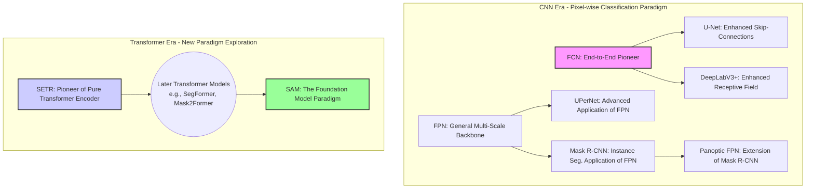

# 图像分割模型对比

[图像分割模型对比表格](图像分割模型对比表格.xlsx)

------

#### **模型关系族谱**

为了更直观地理解这些模型之间的关系，我们可以将它们归入几个主要的“技术流派”：

### **图例中文解释**

上面这张图展示了图像分割模型的演进关系，分为两个主要时代：

1.  **CNN时代 - 像素分类范式 (CNN Era - Pixel-wise Classification Paradigm)**
    *   **FCN (开创者)**: 是一切的起点。
    *   它直接发展出了 **U-Net** (通过强化跳跃连接) 和 **DeepLabV3+** (通过强化感受野)。
    *   **FPN (通用的多尺度骨干网络)** 是一个关键组件，它被用于：
        *   **UPerNet**: 可以看作是FPN的一个高级应用。
        *   **Mask R-CNN**: 是FPN在实例分割领域的应用。
        *   **Panoptic FPN**: 则是Mask R-CNN为了实现全景分割的进一步扩展。

2.  **Transformer时代 - 新范式探索 (Transformer Era - New Paradigm Exploration)**
    *   **SETR (纯Transformer编码器的先驱)**: 开启了使用Transformer进行分割的道路。
    *   它的思想启发了**后续一系列的Transformer模型** (如SegFormer, Mask2Former等)。
    *   这条技术路线的最终演进，催生了 **SAM (基础模型范式)**，它代表了分割领域当前最前沿的、通用的、可提示的分割能力。

**标注颜色说明:**
*   **粉色 (FCN)**: 代表CNN语义分割的开创者。
*   **蓝色 (SETR)**: 代表Transformer分割范式的开创者。
*   **绿色 (SAM)**: 代表基础模型新范式的代表。

### **模型关系深度梳理**

- **FCN (Fully Convolutional Networks)**
  - **定位**: **语义分割的鼻祖**。
  - **描述**: 开创性地提出了端到端的全卷积网络，将分类网络末尾的全连接层替换为卷积层，实现了对任意尺寸图像的像素级密集预测。它奠定了后续所有语义分割模型的基础。

- **U-Net**
  - **与FCN的关系**: **FCN跳跃连接思想的极致发扬**。FCN的跳跃连接较为简单，而U-Net设计了优雅的U形对称结构。通过大量的长跳跃连接，它将编码器中高分辨率的浅层特征与解码器对应层进行拼接（Concatenate），极大地弥补了下采样过程中损失的空间细节，特别适用于需要精确边界的医学图像分割。

- **DeepLabV3+**
  - **与FCN的关系**: **FCN感受野问题的解决方案**。DeepLab系列继承了FCN的纯卷积思想，其核心创新——**空洞卷积（Atrous Convolution）**，旨在解决FCN因连续池化导致分辨率骤降和感受野受限的问题。它允许模型在不牺牲分辨率的情况下指数级扩大感受野，并通过ASPP模块捕捉丰富的多尺度上下文。DeepLabV3+进一步引入编码器-解码器结构，优化了分割边界。

- **FPN (Feature Pyramid Networks)**
  - **定位**: **通用的多尺度特征提取器**。
  - **描述**: FPN本身不是一个完整的分割模型，而是一个即插即用的骨干网络组件。它通过“自顶向下路径”和“横向连接”，将高层强语义特征与底层高分辨率特征进行融合，为后续的检测和分割头提供了强大的、包含丰富尺度信息的特征金字塔。

- **UPerNet (Unified Perceptual Parsing Network)**
  - **与FPN的关系**: **FPN思想的集大成者**。UPerNet将FPN作为其基础架构，并在FPN输出的特征金字塔之上，进一步加入了**金字塔池化模块 (Pyramid Pooling Module, PPM)**（源自PSPNet）。这相当于在FPN的多尺度特征之上，再次进行了一次全局上下文信息的聚合。这种“FPN + PPM”的双重多尺度融合策略，使其成为一个非常强大和通用的分割基线模型。

- **Mask R-CNN**
  - **定位**: **实例分割的里程碑**。
  - **与FPN和FCN的关系**: Mask R-CNN是**FPN的典型应用**。它在目标检测器Faster R-CNN之上，构建于FPN提取的多尺度特征，并增加了一个并行的掩码预测分支。该分支本质上就是一个在每个提议区域（RoI）上运行的**微型FCN**，用于生成像素级的实例掩码。

- **Panoptic FPN**
  - **与Mask R-CNN的关系**: **Mask R-CNN的全景分割扩展**。它在Mask R-CNN（用于分割前景实例"Things"）的基础上，并行增加了一个轻量级的语义分割分支（通常是基于FPN特征的简单FCN结构），专门用于分割背景"Stuff"，最终将两部分结果融合，实现全景分割。
    - **公式化理解**: `Panoptic FPN ≈ FPN + Mask R-CNN分支 + 语义FCN分支`

- **SETR (SEgmentation TRansformer)**
  - **定位**: **开启纯Transformer分割的先驱**。
  - **与CNN模型的关系**: **范式级的变革**。SETR是首批将标准的、非层级化的Vision Transformer (ViT) 直接用作编码器的工作之一。它完全抛弃了CNN的卷积和池化操作，将图像分割重新定义为一个**序列到序列（Sequence-to-Sequence）**的任务。这标志着分割模型的骨干网络从CNN向Transformer演进的开端。虽然其性能强大但计算开销巨大，为后续更高效的Transformer分割模型（如SegFormer）指明了方向。

- **SAM (Segment Anything Model)**
  - **与以上所有模型的关系**: **分割领域的“基础模型”新范式**。SAM不为任何特定的分割子任务设计，而是旨在成为一个通用的、可提示的分割引擎。
    - **技术继承**: 它的强大图像编码器借鉴并发展了Transformer架构的思想，可以说是**SETR等先驱工作所验证的Transformer路线的终极体现**。
    - **思想颠覆**: 它与传统模型的关系是“降维打击”。传统模型学习“如何分割猫”，而SAM通过海量数据学习“什么是物体”，然后根据用户的实时提示（点、框等）来分割万物。它将专有任务模型推向了通用基础模型，其零样本泛化能力是此前所有模型都无法比拟的。