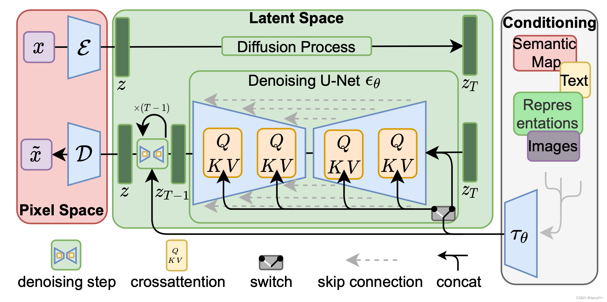

# Stable Diffusion 模型详解(Gemini2.5Pro生成)

参考资料：[Stable Diffusion 超详细讲解-CSDN博客](https://jarod.blog.csdn.net/article/details/131018599)

[Stable Diffusion原理详解_stable diffusion csdn-CSDN博客](https://jarod.blog.csdn.net/article/details/129280836)

Diffusion模型笔记（偏理论）[Diffusion notes.md](../Diffusion notes.md)

U-Net模型笔记 [U-net notes.md](../../U-net/U-net notes.md)

---

## 1. 核心思想：潜在扩散 

Stable Diffusion 是一种**潜在扩散模型 (Latent Diffusion Model, LDM)**，它能够根据文本提示（text prompt）生成高质量、高分辨率的图像。它的出现极大地推动了AI图像生成技术的发展，并因其开源特性而拥有庞大的社区和丰富的应用。

与早期直接在像素空间操作的扩散模型（如DDPM）不同，Stable Diffusion 的核心创新在于它在**计算成本更低的潜在空间（latent space）中执行扩散过程**，从而能够更高效地生成高分辨率图像。

### 为什么要进入潜在空间？

直接在像素空间（例如一张 512x512x3 的图像包含超过78万个数值）上运行扩散模型的去噪U-Net计算量非常巨大。图像中包含大量冗余信息和高频细节，这些细节对于语义理解可能不是最重要的。

LDM 的思想是：
1.  先用一个**编码器 (Encoder)** 将图像从高维像素空间压缩到一个维度低得多、但包含关键语义信息的**潜在空间**。这个潜在表示我们通常称为 $z$。
2.  在这个低维的潜在空间中执行计算密集型的**扩散和去噪过程**。
3.  最后，用一个**解码器 (Decoder)** 将去噪后的潜在表示还原回高维像素空间，生成最终图像。

这样做的好处是显著降低了训练和采样的计算成本，使得在消费级硬件上生成高分辨率图像成为可能。

## 2. Stable Diffusion 的主要组件

Stable Diffusion 主要由以下几个关键部分构成：

*   **变分自编码器 (Variational Autoencoder, VAE)**：负责图像与潜在空间之间的转换。
*   **U-Net (噪声预测器)**：在潜在空间中执行核心的去噪步骤。
*   **文本编码器 (Text Encoder)**：将输入的文本提示转换为U-Net能够理解的数字表示（条件嵌入）。
*   **条件机制 (Conditioning Mechanism)**：主要是通过交叉注意力（Cross-Attention）将文本信息注入到U-Net中。

我们来详细看看每一个组件：

### 2.1 变分自编码器 (Variational Autoencoder - VAE)

*   **目的**：
    
    1.  **编码器 $E$**：将输入的图像 $x$（像素空间）映射到一个低维的潜在表示 $z_0 = E(x)$。这个 $z_0$ 就是扩散过程的起点。
    2.  **解码器 $D$**：在扩散过程结束后，将去噪得到的潜在表示 $z'_0$ 映射回像素空间，生成最终图像 $\tilde{x} = D(z'_0)$。
    
*   **工作方式**：
    *   VAE 通常是**预训练**好的，并且在训练U-Net时其权重是固定的。
    *   编码器学习将图像压缩成包含其主要内容和结构信息的紧凑向量。解码器则学习如何从这些紧凑向量中重建出逼真的图像。
    *   例如，Stable Diffusion 常用的 VAE 可以将一个 512x512x3 的图像压缩成一个 64x64x4 的潜在表示。通道数从3（RGB）变为4，但空间维度大大降低。

*   **数学相关 (VAE训练，概念性)**：
    VAE的训练通常涉及两个损失项：
    
    1.  **重建损失 (Reconstruction Loss)**：确保解码器能够从潜在表示中恢复出与原图相似的图像。例如，使用均方误差 (MSE)：
        $$
        \begin{equation} \mathcal{L}_{recon} = ||x - D(E(x))||^2 \end{equation}
        $$
        
    2.  **KL散度损失 (KL Divergence Loss)**：促使编码器产生的潜在表示 $z$ 的分布接近一个标准正态分布 $N(0,I)$。这有助于潜在空间的规整性。
        $$
        \begin{equation} \mathcal{L}_{KL} = D_{KL}(q(z|x) || p(z)) \end{equation}
        $$
        
        其中 $q(z|x)$ 是编码器输出的分布，$p(z)$ 是先验分布（如标准正态分布）。
    
    在LDM中，VAE的主要作用是提供一个高效的感知压缩（perceptual compression）机制，而不是严格的概率建模。因此，KL散度项的权重可能较小，或者通过其他方式正则化，重点在于高质量的重建。

### 2.2 U-Net (在潜在空间中进行去噪)

* **目的**：这是扩散模型的核心。它是一个神经网络，负责在**潜在空间**中逐步去除噪声。它的任务是预测在给定的带噪声的潜在表示 $z_t$ 和时间步 $t$ (以及条件信息 $c$) 下，所包含的噪声 $\epsilon$。

*   **输入**：
    
    1.  带噪声的潜在表示 $z_t$。
    2.  当前的时间步 $t$ (通常会转换为时间嵌入)。
    3.  条件信息 $c$ (例如，从文本编码器得到的文本嵌入)。
    
* **输出**：预测的噪声 $\epsilon_{\theta}(z_t, t, c)$，其形状与 $z_t$ 相同。这里的 $\theta$ 代表U-Net的参数。

*   **架构**：
    *   标准的U-Net架构，包含一个对称的编码器（下采样路径）和解码器（上采样路径），以及连接对应层级的“跳跃连接 (skip connections)”。
    *   编码器部分逐步减小空间维度并增加通道数，以提取更抽象的特征。
    *   解码器部分逐步恢复空间维度并减少通道数，以重建去噪后的表示。
    *   跳跃连接帮助保留高分辨率的细节信息，对于图像生成任务非常重要。
    *   **关键创新**：在Stable Diffusion的U-Net中，大量使用了**交叉注意力层 (Cross-Attention Layers)**，用于有效地将文本条件信息 $c$ 融入到去噪过程中。
    
* **为什么要使用U-Net？**

  **U-Net 的结构特性非常适合于 Stable Diffusion 中“预测噪声”这个子任务**，即使它最初是为分割设计的。我们可以这样理解：

  1.  **输入和输出的相似性：**
      *   在图像分割中，U-Net 的输入是一张图像，输出是一张与输入图像同样大小的分割图，其中每个像素都有一个类别标签。
      *   在 Stable Diffusion 的去噪过程中，U-Net (或者说类 U-Net 结构) 的输入是当前时间步的**带噪声的隐空间表示 (latent representation)**，这个隐空间表示可以看作是一种“图像”或特征图。它的任务是预测添加到这个隐空间表示上的**噪声本身**。这个预测出的噪声也应该和输入的带噪声的隐空间表示具有相同的维度和结构。
      *   所以，两者都是接收一个“图像式”的输入，并产生一个同样大小的“图像式”的输出，只不过输出的内容从“类别标签”变成了“噪声模式”。

  2.  **保留空间信息和细节：**
      *   噪声的分布在图像的每个位置上可能是不同的，而且可能非常精细。为了准确地预测这种空间上变化的噪声，网络需要能够很好地捕捉和重建空间细节。
      *   U-Net 的**编码器-解码器结构**加上其标志性的**跳跃连接 (skip connections)** 非常擅长这一点：
          *   **编码器 (收缩路径):** 逐步提取图像的上下文信息和多尺度特征，理解图像的整体结构和局部细节。
          *   **解码器 (扩张路径):** 逐步恢复空间分辨率。
          *   **跳跃连接:** 将编码器中不同层级的特征（尤其是包含高频细节的浅层特征）直接传递给解码器中对应层级的特征。这对于重建精细的噪声模式至关重要。如果没有跳跃连接，在下采样和上采样的过程中，很多细节信息可能会丢失。

  3.  **像素级别的预测：**
      *   图像分割需要对每个像素进行分类。
      *   同样，Stable Diffusion 中的噪声预测也需要对隐空间表示中的“每个点”（可以类比为像素）上的噪声进行预测。U-Net 这种为像素级任务设计的结构天然适合这种需求。

  4.  **“分割”噪声：**
      *   您可以将 U-Net 在 Stable Diffusion 中的任务不严谨地理解为一种特殊的“分割”：它不是在分割图像中的物体，而是在“分割”出当前隐空间表示中的**噪声成分**和**信号成分**（即潜在的干净图像信息）。它学习识别并输出噪声模式。

  **总结一下：**

  Stable Diffusion 并不是直接用 U-Net 来做图像分割。而是**借鉴了 U-Net 这种强大的网络架构**，并将其应用于**预测和移除噪声**这一核心环节。在 Stable Diffusion 的结构图中，中间绿色区域的“Denoising U-Net $\epsilon_{\theta}$”就是指这个核心的去噪网络采用了类 U-Net 的结构。

### 2.3 文本编码器 (Text Encoder)

*   **目的**：将用户输入的文本提示（例如：“一只宇航员猫在月球上骑马”）转换成U-Net能够理解和使用的数字向量（文本嵌入 $c$）。

*   **工作方式**：
    1.  **分词 (Tokenization)**：将文本字符串分解成一系列的词元 (tokens)。
    2.  **嵌入 (Embedding)**：将每个词元映射到一个高维向量。
    3.  **Transformer 处理**：将词元嵌入序列输入到一个基于 Transformer 的模型中进行处理。Stable Diffusion 通常使用**预训练好的 CLIP (Contrastive Language-Image Pre-Training) 模型的文本编码器**。
        *   CLIP 模型通过在大量的（图像，文本）对上进行对比学习，使其文本编码器能够产生与对应图像在语义上高度相关的文本嵌入。这意味着CLIP的文本嵌入包含了丰富的视觉语义信息。
    4.  **输出**：一系列向量，代表了输入文本的语义内容。这个输出 $c$ 将作为条件输入到U-Net中。

*   **重要性**：文本编码器的质量直接影响到生成图像与文本提示的符合程度。使用强大的预训练模型（如CLIP）是Stable Diffusion成功的关键之一。

### 2.4 条件机制：交叉注意力 (Conditioning Mechanism: Cross-Attention)

*   **目的**：将文本编码器产生的文本嵌入 $c$ 的信息有效地注入到U-Net的去噪过程中，使得U-Net在去除噪声时能够“感知”到文本提示的内容。

*   **工作方式**：
    * 交叉注意力机制允许U-Net中的不同部分“关注”文本嵌入的不同部分。
    
    * 在标准的自注意力 (Self-Attention) 中，一个序列中的元素会相互关注。在交叉注意力中，一个序列（例如U-Net中间层的空间特征图）会关注另一个序列（例如文本嵌入 $c$）。
    
    *   具体来说，U-Net中的特征图会作为注意力机制的**查询 (Query, Q)**，而文本嵌入 $c$ 会作为**键 (Key, K)** 和 **值 (Value, V)**。
        $$
        \begin{equation} \text{Attention}(Q, K, V) = \text{softmax}\left(\frac{QK^T}{\sqrt{d_k}}\right)V \end{equation}
        $$
        其中 $d_k$ 是键向量的维度。
        
    * 通过这种方式，U-Net的每个空间位置可以根据文本提示的不同方面来调整其特征表示，从而引导生成过程。
    
    *   这些交叉注意力层通常被集成在U-Net的多个ResNet块或Transformer块中，使得条件信息能够在不同尺度和抽象层次上影响去噪。

## 3. Stable Diffusion 的工作流程

现在我们将这些组件串联起来，看看Stable Diffusion是如何工作的：

### 3.1 训练阶段 (Training) - 概念性

1.  **数据准备**：
    *   获取一张真实的训练图像 $x_0$。
    *   使用VAE编码器将其转换为潜在表示 $z_0 = E(x_0)$。
    *   获取与图像配对的文本描述（或随机抽取一个文本描述，对于无条件训练部分）。

2.  **前向扩散 (在潜在空间)**：
    
    *   随机选择一个时间步 $t$。
    *   生成一个与 $z_0$ 形状相同的标准高斯噪声 $\epsilon \sim N(0,I)$。
    *   根据前向扩散公式计算出在时间步 $t$ 的带噪声的潜在表示 $z_t$：
        $$
        \begin{equation}
        z_t = \sqrt{\bar{\alpha}_t}z_0 + \sqrt{1-\bar{\alpha}_t}\epsilon \label{eq:latent_forward_diffusion}
        \end{equation}
        $$
        这里的 $\bar{\alpha}_t$ 是预定义的噪声调度参数的累积乘积，与像素空间扩散模型中的定义类似。
    
3.  **噪声预测与损失计算**：
    
    *   将文本描述输入到文本编码器（如CLIP Text Encoder）得到文本嵌入 $c$。
    *   将带噪声的潜在表示 $z_t$、时间步 $t$（转换为时间嵌入）和文本嵌入 $c$ 输入到U-Net中。
    *   U-Net输出预测的噪声 $\epsilon_{\theta}(z_t, t, c)$。
    *   计算损失：通常是预测噪声与真实添加的噪声之间的均方误差 (MSE)：
        $$
        \begin{equation}
        \mathcal{L}_{LDM} = \mathbb{E}_{z_0, \epsilon, t, c} \left[ ||\epsilon - \epsilon_{\theta}(z_t, t, c)||^2 \right] \label{eq:ldm_loss}
        \end{equation}
        $$
        通过反向传播和梯度下降来优化U-Net的参数 $\theta$，使其能够更准确地预测噪声。

### 3.2 推理/采样阶段 (Inference/Sampling) - 生成图像

1.  **准备输入**：
    
    *   获取用户输入的文本提示。
    *   将文本提示输入到文本编码器，得到文本嵌入 $c$。
    *   生成一个与目标潜在表示形状相同的随机高斯噪声 $z_T \sim N(0,I)$ 作为起点。$T$ 是总的去噪步数。
    
2.  **迭代去噪 (在潜在空间)**：
    
    *   对于时间步 $t$ 从 $T$ 递减到 $1$ ($t = T, T-1, \dots, 1$)：
        *   将当前的带噪声潜在表示 $z_t$、时间步 $t$（转换为时间嵌入）和文本嵌入 $c$ 输入到训练好的U-Net。
        *   U-Net预测噪声 $\epsilon_{\theta}(z_t, t, c)$。
        *   （可选但常用）应用**无分类器引导 (Classifier-Free Guidance, CFG)** 来增强文本条件的引导效果（详见下一节）。
        *   使用预测的噪声和当前的 $z_t$ 来计算（或采样）上一步更清晰的潜在表示 $z_{t-1}$。这通常基于DDPM或DDIM的采样公式，例如（DDPM形式）：
            $$
            \begin{equation}
            z_{t-1} = \frac{1}{\sqrt{\alpha_t}}\left(z_t - \frac{1-\alpha_t}{\sqrt{1-\bar{\alpha}_t}}\epsilon_{\theta}(z_t, t, c)\right) + \sigma_t \mathbf{w} \label{eq:latent_reverse_step_ddpm}
            \end{equation}
            $$
            其中 $\mathbf{w}$ 是标准高斯噪声（如果 $t>1$），$\sigma_t$ 是该步骤的噪声标准差。DDIM采样器会有不同的形式，允许更大的步长。
    
3.  **解码到像素空间**：
    
    *   当迭代完成，得到去噪后的潜在表示 $z_0$（或接近 $z_0$ 的 $z'_0$）后，将其输入到预训练好的VAE解码器 $D$。
    *   解码器输出最终的图像 $\tilde{x} = D(z'_0)$。

## 4. 无分类器引导 (Classifier-Free Guidance - CFG)

CFG 是Stable Diffusion（以及许多其他现代扩散模型）取得高质量和强文本符合度的关键技术之一。

*   **目的**：在不依赖额外训练一个分类器模型的情况下，增强生成图像与文本提示的一致性，并提高图像质量。它允许用户通过一个**引导尺度 (guidance scale, $s$)** 参数来控制文本提示对生成结果的影响强度。

*   **工作原理**：
    
    1.  **训练时**：在训练U-Net时，以一定的概率（例如10-20%）将条件信息 $c$（文本嵌入）替换为一个特殊的“空”或“无条件”嵌入 $\emptyset$。这样，U-Net也学会了在没有文本提示的情况下进行去噪（即生成随机图像）。
    2.  **采样时**：在每个去噪步骤 $t$，U-Net实际上会进行**两次**噪声预测：
        *   一次是**有条件的预测**：$\epsilon_{\theta}(z_t, t, c)$，使用真实的文本嵌入 $c$。
        *   一次是**无条件的预测**：$\epsilon_{\theta}(z_t, t, \emptyset)$，使用“空”嵌入 $\emptyset$。
    3.  **最终的噪声预测** $\tilde{\epsilon}_{\theta}$ 通过将有条件预测“推离”无条件预测来得到：
        $$
        \begin{equation}
        \tilde{\epsilon}_{\theta}(z_t, t, c) = \epsilon_{\theta}(z_t, t, \emptyset) + s \cdot (\epsilon_{\theta}(z_t, t, c) - \epsilon_{\theta}(z_t, t, \emptyset)) \label{eq:cfg_formula}
        \end{equation}
        $$
        *   $s$ 是**引导尺度 (guidance scale)**。
            *   如果 $s=0$，则 $\tilde{\epsilon}_{\theta} = \epsilon_{\theta}(z_t, t, \emptyset)$，完全忽略文本提示（无条件生成）。
            *   如果 $s=1$，则 $\tilde{\epsilon}_{\theta} = \epsilon_{\theta}(z_t, t, c)$，等同于标准的有条件生成。
            *   如果 $s > 1$（例如常用的值在7-15之间），模型会更加强调与文本提示相关的特征，生成的图像会更贴合文本，通常质量也更高，但过高的 $s$ 值可能导致图像过于“夸张”或失真。
    4.  这个经过CFG调整后的 $\tilde{\epsilon}_{\theta}$ 被用于公式 \eqref{eq:latent_reverse_step_ddpm}（或其他采样器公式）中进行实际的去噪。
    
*   **优点**：CFG非常有效，因为它允许在采样时灵活控制条件强度，而不需要额外的模型或复杂的训练过程。

---

## 5. Stable Diffusion整体结构

这张图展示了 Stable Diffusion 所基于的**隐空间扩散模型 (Latent Diffusion Model)** 的架构。我们把它分解成几个主要部分来看：

- **红色部分 (Pixel Space):** 负责图像与隐空间的转换（编码和解码）。
- **绿色部分 (Latent Space):** 核心的扩散和去噪生成过程发生在这里。它包括了前向加噪（概念上）和关键的反向去噪（由 U-Net 完成）。
- **灰色部分 (Conditioning):** 提供外部指导信息（如文本、语义图等），控制生成图像的内容和风格。

下面是详细地解释：

1.  **像素空间 (Pixel Space - 左侧红色区域):**
    *   **输入图像 ($x$):** 这是原始的像素图像 (例如一张照片)。
    *   **编码器 ($\epsilon$):** 输入图像 $x$ 首先通过一个编码器 ($\epsilon$)。这个编码器将图像从高维的像素空间压缩到一个低维的**隐空间表示 ($z$)**。这样做是为了让后续的扩散过程计算效率更高，并且能捕捉图像的关键语义信息。
    *   **解码器 ($D$):** 在隐空间中完成扩散和去噪过程 (后面会讲到) 之后，一个解码器 ($D$) 会将处理后的隐空间表示转换回像素空间，生成最终的图像 ($\tilde{x}$)。

2.  **隐空间和扩散过程 (Latent Space and Diffusion Process - 中间绿色区域):**
    *   **隐空间表示 ($z$):** 这是输入图像的压缩版本。
    *   **前向扩散过程 (Forward Diffusion Process):** 隐空间表示 $z$ 会经历一个**扩散过程 (Diffusion Process)**。在这个过程中，噪声会通过一系列时间步 (T 步)逐渐添加到 $z$ 上。当这个过程结束时 (在时间 T)，隐空间表示 $z_T$ 几乎变成了纯粹的噪声，丢失了大部分原始结构。图中显示 $z$ 进入 "Diffusion Process"，输出 $z_T$。

3.  **去噪 U-Net ($\epsilon_{\theta}$) (Denoising U-Net - 绿色区域的中央部分):**
    *   这是图像生成过程的核心。它是一个神经网络 (具体来说是 U-Net 架构，其带有跳跃连接的形状表明了这一点)，其目标是逆转扩散过程。
    *   **迭代去噪 (Iterative Denoising):** 从充满噪声的隐变量 $z_T$ 开始，去噪 U-Net 逐步地去除噪声 (从 $z_T$ 到 $z_{T-1}$，依此类推，如图中 $\times(T-1)$ 所示，共进行 $T-1$ 步)。每一步都旨在预测并移除在前向扩散过程中相应步骤中添加的噪声。
    *   **条件输入 (Conditioning Input):** 非常关键的一点是，去噪过程是由**条件信息 (conditioning information)**引导的。模型通过这里获取生成何种图像的指令。
    *   **交叉注意力机制 (Cross-Attention - $QKV$ 模块):** U-Net 通过**交叉注意力机制 (cross-attention mechanisms)**来整合条件信息 (在下一节解释)。这些机制允许模型在去噪过程的不同阶段以及 U-Net 内部的不同空间位置关注条件输入 (如文本提示) 的相关部分。$QKV$ (Query, Key, Value) 模块是注意力机制的标准组成部分。
    *   **跳跃连接 (Skip Connections - 灰色虚线箭头):** 这些连接是 U-Net 架构中的典型特征，它们允许来自 U-Net 降采样路径中较早 (较高分辨率) 层的信息直接传递到升采样路径中较晚 (较低分辨率) 的层。这有助于保留细节并改善梯度流。
    *   **拼接 (Concat):** 这可能指的是网络中不同特征图或输入是如何组合的。

4.  **条件控制 (Conditioning - 右侧灰色区域):**
    *   这部分展示了如何使用外部信息来控制图像生成过程。这就是 Stable Diffusion 能够根据文本提示、其他图像、语义图等生成图像的原因。
    *   **输入类型 (Input Types):** 图中显示了多种类型的条件输入：
        *   **语义图 (Semantic Map):** 可能是一个定义图像区域的分割图。
        *   **文本 (Text):** 这是像 Stable Diffusion 这样的模型最常用的条件，用户提供文本提示。
        *   **表示 (Representations):** 其他形式的学习到的表示。
        *   **图像 (Images):** 可用于图像到图像的转换任务。
    *   **条件编码器 ($\tau_{\theta}$):** 这些不同的条件输入会由一个特定领域的编码器 ($\tau_{\theta}$) 处理，将它们转换成一种中间表示。然后，这种表示被送入去噪 U-Net，通常是通过交叉注意力层，以指导去噪 (从而指导生成) 过程。

**整体流程 (以文生图为例):**

1.  **文本提示:** 用户提供一个文本提示 (例如，“一个宇航员骑着马”)。
2.  **条件化:** 这个文本提示被条件编码器 ($\tau_{\theta}$) 处理，生成一个条件表示。
3.  **初始噪声:** 在隐空间中生成一个随机的噪声张量 $z_T$。
4.  **迭代去噪:** 去噪 U-Net ($\epsilon_{\theta}$) 将 $z_T$ 和条件表示作为输入。它在 $T$ 个步骤中迭代地对 $z_T$ 进行去噪。在每一步中，它使用交叉注意力机制来整合条件信息，预测并去除噪声，逐渐形成一个连贯的隐空间图像 $z$。
5.  **解码:** 一旦获得去噪后的隐空间表示 $z$，解码器 ($D$) 将其转换回像素空间，生成最终的输出图像 $\tilde{x}$。

**图例中的关键组件:**

*   **denoising step (去噪步骤):** U-Net 执行的迭代过程。
*   **crossattention (交叉注意力):** U-Net 如何整合条件信息。
*   **switch (切换):** 这可能表示一种在不同条件输入或控制流之间切换的机制，但仅凭这个高层框图无法完全确定其具体功能。
*   **skip connection (跳跃连接):** 有助于在 U-Net 中保留细节并辅助训练。
*   **concat (拼接):** 一种组合特征图或输入的方式。

------

## 6. Stable Diffusion 的关键优势总结

*   **高效性**：通过在低维潜在空间进行扩散，大大降低了计算需求，使得高分辨率图像生成更为可行。
*   **高质量**：结合了强大的预训练组件（VAE、CLIP文本编码器）和鲁棒的扩散模型框架，能够生成细节丰富、语义连贯的图像。
*   **可控性**：通过文本提示和CFG引导尺度，用户可以较好地控制生成图像的内容和风格。
*   **开源性**：Stable Diffusion的开源促进了其快速发展、广泛应用和大量的社区创新。
