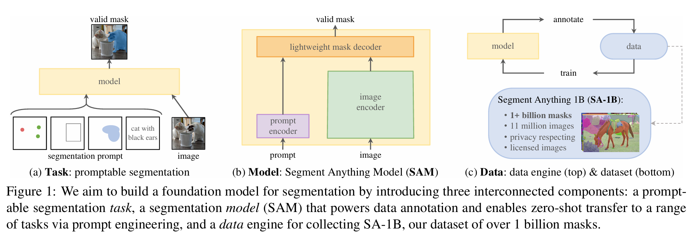
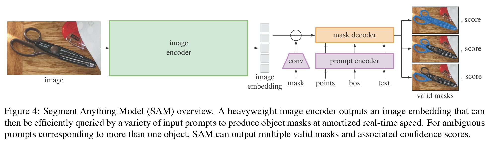

#  SAM笔记（Gemini2.5Pro生成）

学习资料：[SAM(分割一切)：从SAM、FastSAM、Grounded SAM到SAM2、SAMURAI——从分割图像到分割视频_sam分割-CSDN博客](https://blog.csdn.net/v_JULY_v/article/details/131503971?ops_request_misc=%7B%22request%5Fid%22%3A%229d912ac5bac2b0c2e1b948d5943433ad%22%2C%22scm%22%3A%2220140713.130102334..%22%7D&request_id=9d912ac5bac2b0c2e1b948d5943433ad&biz_id=0&utm_medium=distribute.pc_search_result.none-task-blog-2~all~ElasticSearch~search_v2-2-131503971-null-null.142^v102^pc_search_result_base3&utm_term=SAM&spm=1018.2226.3001.4187)

[【持续更新】Segment Anything Model （SAM）分割一切大模型相关论文和项目介绍_分割一切模型 在线-CSDN博客](https://blog.csdn.net/qq_36104364/article/details/133101952)

[(9 封私信 / 32 条消息) 一篇文章搞懂Segment Anything(SAM) - 知乎](https://zhuanlan.zhihu.com/p/637971092)

[LLM大模型: Segment Anything Model原理详解 - 第七子007 - 博客园](https://www.cnblogs.com/theseventhson/p/18523739)

[Segment Anything Model (SAM)：论文解读（导读）_sam论文-CSDN博客](https://blog.csdn.net/qq_42114376/article/details/130450134)

论文原文：[[2304.02643\] Segment Anything](https://arxiv.org/abs/2304.02643)

[SAM 论文翻译+笔记 - Beaug的自high专区](https://jinluzhang.github.io/技术/2023/07/04/SAM.html)

------

Segment Anything Model (SAM) 的目标是构建一个像大语言模型（LLM）一样的**视觉基础模型**。它不为特定任务训练，而是通过一个通用的、可提示的（Promptable）方式，来分割图像中的“任何”物体，实现了在分割领域的“zero-shot”泛化能力。

---

### SAM 的核心架构

SAM 的架构设计是其成功的关键，巧妙地平衡了性能和实时性。它由三个主要部分组成：

1.  **图像编码器 (Image Encoder)**
2.  **提示编码器 (Prompt Encoder)**
3.  **快速掩码解码器 (Fast Mask Decoder)**

下面我们将深入探讨每个组件的工程细节。

#### 1. 图像编码器 (Image Encoder)

这是模型中计算量最大、但也是“一劳永逸”的部分。

*   **作用**：将输入的原始高分辨率图像转换成一个低分辨率但高维度的特征图，我们称之为**图像嵌入 (Image Embedding)**。
*   **模型选择**：SAM 采用了一个非常强大的**视觉 Transformer (ViT)**，具体是一个 **ViT-H (Huge)** 模型。它经过了**掩码自编码器 (Masked Autoencoder, MAE)** 的预训练。选择 ViT 是因为它具有强大的全局特征提取能力，能够捕捉图像中物体之间远距离的依赖关系，这对于理解复杂的场景至关重要。
*   **工程细节**：
    *   **输入与输出**：它接收一个 $1024 \times 1024$ 像素的图像。经过处理后，输出一个 $64 \times 64$ 的特征图，每个网格点（patch）对应一个 256 维的特征向量。这个图像嵌入只需要计算一次，后续所有的交互都将复用它。
    *   **计算优化**：为了处理 $1024 \times 1024$ 的高分辨率输入，标准的 ViT 计算量巨大。SAM 对其进行了优化，使用了**窗口化的注意力机制 (Windowed Attention)**，将注意力计算限制在局部窗口内，并辅以全局注意力连接，从而在保持性能的同时显著降低了计算成本。

#### 2. 提示编码器 (Prompt Encoder)

这个组件负责将用户的各种输入提示（Prompt）转换成模型可以理解的嵌入向量。

*   **稀疏提示 (Sparse Prompts)**:
    *   **点 (Points)**：对于每个点，它会生成两种嵌入的加和：
        1.  **位置编码 (Positional Encoding)**：使用傅里叶特征来精确表示点在 $1024 \times 1024$ 图像上的坐标。
        2.  **类型嵌入 (Type Embedding)**：一个可学习的嵌入，用于区分这是**前景点**还是**背景点**。
    *   **框 (Boxes)**：一个矩形框由其左上角和右下角两个点来表示。这两个点分别进行位置编码，然后将它们的编码组合起来，再加上一个代表“框”类型的可学习嵌入，形成最终的框嵌入。
    *   **文本 (Text)**：SAM 使用了预训练的 **CLIP** 模型的文本编码器。这使得 SAM 能够理解开放词汇的文本描述，极大地增强了其通用性。

*   **稠密提示 (Dense Prompts)**:
    *   **掩码 (Masks)**：当用户提供一个低分辨率的掩码作为提示时，这个掩码会先经过几层**卷积网络 (CNN)** 进行下采样，使其尺寸与图像嵌入（$64 \times 64$）匹配。然后，将处理后的掩码嵌入与图像嵌入进行**逐元素相加**，直接将提示信息融入到图像特征中。

#### 3. 快速掩码解码器 (Fast Mask Decoder)

这是模型实现实时交互的“魔法”所在，它非常轻量且高效。

*   **作用**：接收**图像嵌入**和编码后的**提示嵌入**，然后高效地预测出高质量的分割掩码。
*   **模型设计**：它采用了一个经过修改的 **Transformer 解码器**。这个解码器只有两层，非常轻量。
*   **工程细节**：
    *   **双向注意力**：它包含一个**双向的交叉注意力机制**。这意味着信息不仅从提示流向图像（提示查询图像特征），也从图像流回提示（图像特征更新提示嵌入）。这个过程迭代进行，让提示嵌入（最初只包含位置或类别信息）逐渐吸收来自图像的几何与语义信息，变得更加“智能”。
    *   **输出头 (Output Heads)**：解码器最终会输出：
        1.  **多个掩码**：通常是 3 个，以应对一个提示可能对应多个物体（例如，一个点在轮胎上，可能指“轮胎”，也可能指“整辆车”）的歧义性。
        2.  **IoU 分数**：为每个预测的掩码估算一个置信度分数（Intersection over Union），告诉用户哪个掩码可能是最准确的。
    *   **实时性能**：整个解码过程在现代 CPU 上只需要大约 50 毫秒，这使得流畅的实时交互成为可能。

### 核心数学公式：注意力机制

SAM 的核心是注意力机制，它让模型能够根据提示聚焦于图像的关键区域。

行内公式示例：变量 $Q$ 代表查询。

行间公式（公式块）：
$$
Attention(Q, K, V) = \text{softmax}(\frac{QK^T}{\sqrt{d_k}})V
$$

*   $Q$ **(Query)**: 查询向量，在解码器中代表**提示嵌入**。
*   $K$ **(Key)**: 键向量，代表**图像嵌入**的各个部分。
*   $V$ **(Value)**: 值向量，同样来自**图像嵌入**，包含了实际的图像内容。
*   **核心思想**：通过计算 $Q$ 和 $K$ 的相似度，得到一个权重分布，然后用这个权重去加权求和 $V$，从而提取出与提示最相关的信息。

---

### SAM 的工程奇迹：数据引擎与训练

SAM 的强大不仅源于模型设计，更在于其背后无与伦比的数据集 **SA-1B** 和独特的训练流程。

*   **数据引擎 (Data Engine)**：这是一个三阶段的、人机协作的标注系统，是整个项目的工程核心。
    1.  **第一阶段：辅助手动标注**：标注员在专业标注软件的帮助下，通过点击前景/背景点来交互式地标注物体。模型会实时预测掩码，标注员进行修正。模型在标注员标注的同时也在后台进行学习和更新。
    2.  **第二阶段：半自动标注**：此时的模型已经足够强大。标注员不再标注所有物体，而是先标注置信度高的物体，然后模型会自动检测并标注剩余的物体，标注员只需对模型的标注进行修正。
    3.  **第三阶段：全自动标注**：模型已经非常强大。研究人员在图像上生成一个 $32 \times 32$ 的网格点阵，将每个点作为提示输入给模型，模型会自动生成海量的、高质量的掩码。这一阶段产生了 SA-1B 数据集中的绝大部分数据。

*   **损失函数 (Loss Function)**：训练时，模型预测的掩码和真实的标注掩码之间会计算一个复合损失，它是 **Focal Loss** 和 **Dice Loss** 的线性组合。
$$
L = \lambda_{\text{focal}} L_{\text{focal}} + \lambda_{\text{dice}} L_{\text{dice}}
$$
*   **Focal Loss**: 解决了前景像素和背景像素数量极度不平衡的问题。
*   **Dice Loss**: 直接优化分割任务中最重要的指标——交并比 (IoU)。

### 总结

SAM 之所以被称为一个里程碑，不仅因为它是一个强大的模型，更因为它在工程上的卓越实现：

1.  **巧妙的架构解耦**：将重量级的图像编码与轻量级的提示解码分离，实现了前所未有的实时交互性能，这是其能够作为交互式工具的工程基础。
2.  **创新的数据飞轮**：通过“模型辅助标注，数据反哺模型”的数据引擎，以极高的效率解决了通用分割模型所面临的数据瓶颈。
3.  **对歧义性的处理**：默认输出多个层次的掩码，并给出 IoU 预测，这是一种非常务实和用户友好的工程设计，解决了现实世界中分割任务固有的模糊性。

SAM 的成功为计算机视觉领域展示了构建“基础模型”的有效路径，其在模型设计、数据策略和工程实现上的巧思，都值得我们深入学习。
