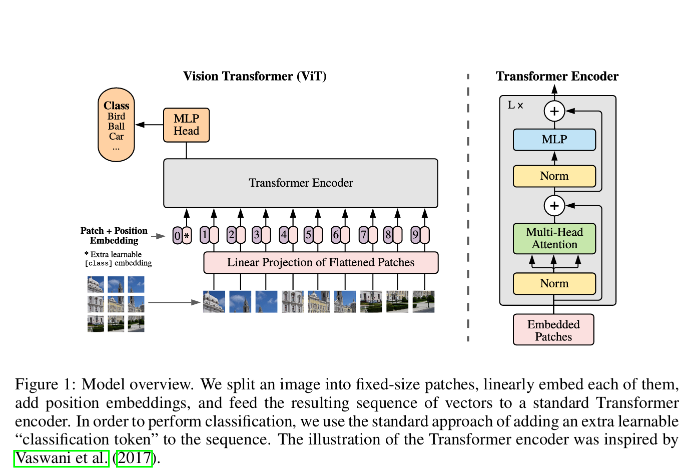
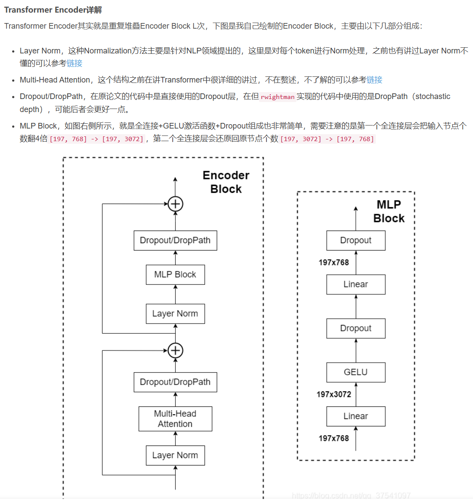
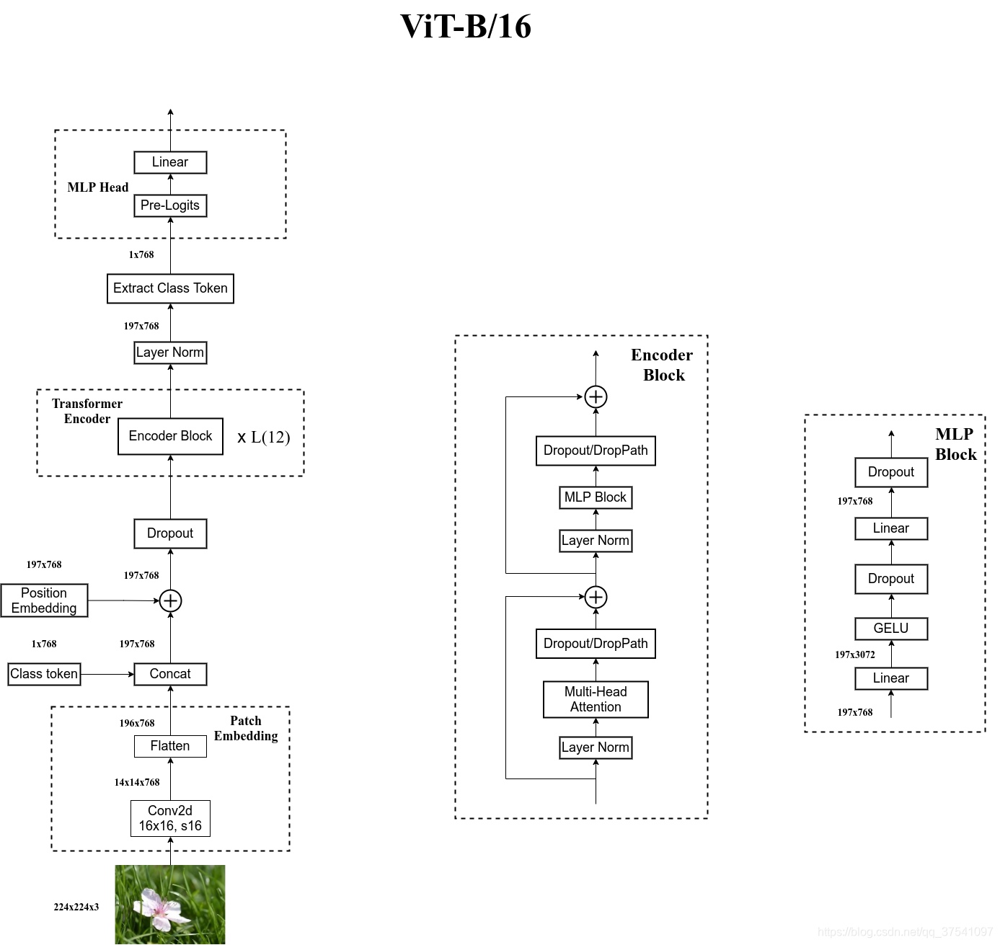

#  Vision Transformer notes笔记（Gemini2.5Pro生成）

学习资料：[Vision Transformer详解-CSDN博客](https://blog.csdn.net/qq_37541097/article/details/118242600)

[ViT（Vision Transformer）解析 - 知乎](https://zhuanlan.zhihu.com/p/445122996)

论文原文：[[2010.11929\] An Image is Worth 16x16 Words: Transformers for Image Recognition at Scale](https://arxiv.org/abs/2010.11929)

Transformer笔记  [Transformer notes](../../Natural Language Process/Transformer Model/Transformer notes.md)

GELU激活函数 [激活函数](../../Basic Concepts/激活函数.md)

------

图1：模型概览。我们将图像分割为固定尺寸的图块，对每个图块进行线性嵌入处理，添加位置编码后，将生成的向量序列输入标准Transformer编码器。为执行分类任务，我们采用常规方法——在序列中添加一个可学习的"分类标记"。本示意图中的Transformer编码器结构参考了Vaswani等人（2017）的设计。

------

好的，这是根据你的要求，在之前提供的 ViT 模型详解 Markdown 文本中，明确补充了 GELU 激活函数使用的更新版本：

## Vision Transformer (ViT) 模型详解

### 核心思想

ViT 的核心思想是将 NLP 领域大获成功的 Transformer 架构直接应用于图像识别任务，并且尽可能少地修改 Transformer 结构。为了实现这一点，ViT 将图像视为一系列的 图像块 (Patches)，类似于 NLP 中将句子视为一系列的单词 (Tokens)。通过这种方式，标准的 Transformer 编码器可以直接处理这些图像块序列。

### 模型架构详解

ViT 模型主要由以下几个部分组成：

1.  **图像分块 (Image Patching)**
    *   **目的**: 将 2D 图像转换为 1D 的序列数据，以适配 Transformer 的输入要求。
    *   **过程**:
        *   输入一张图像 $x$，其维度通常为 $H \times W \times C$ (高 × 宽 × 通道数)。
        *   将图像分割成 $N$ 个固定大小的正方形小块 (Patches)，每个块的大小为 $P \times P$。
        *   $N$ 的数量由图像尺寸和块大小决定：$N = (H / P) \times (W / P)$。例如，一张 224x224 的图像，如果块大小 P=16，那么 $N = (224/16) \times (224/16) = 14 \times 14 = 196$ 个块。
        *   **数学表示**: $x \in R^{H \times W \times C} \rightarrow x_p \in R^{N \times (P^2 \times C)}$
            *   $x$: 原始图像。
            *   $x_p$: 分割后得到的图像块序列。这里有 $N$ 个块，每个块被展平 (Flatten) 成一个向量，向量的维度是 $P \times P \times C$ (每个块的像素数乘以通道数)。

2.  **块嵌入 (Patch Embedding) / 线性投射 (Linear Projection)**
    *   **目的**: 将每个展平的图像块向量映射到一个固定维度的嵌入空间 (Embedding Space)，通常称为 $D$ 维。这类似于 NLP 中的词嵌入。
    *   **过程**:
        *   使用一个可学习的线性投射层（本质上是一个全连接层，权重矩阵为 $E$）将每个 $P^2 \times C$ 维的块向量映射到 $D$ 维。
        *   **数学表示**: $z_{patch} = x_p \times E$，其中 $E \in R^{(P^2 \times C) \times D}$
            *   $x_p$: 展平后的块序列 $(N, P^2C)$。
            *   $E$: 线性投射矩阵。
            *   $z_{patch}$: 经过线性投射后的块嵌入序列 $(N, D)$。

3.  **[CLS] Token 嵌入**
    *   **目的**: 借鉴 BERT 模型的设计，在序列的开头添加一个特殊的可学习的嵌入向量 $x_{class}$，称为 [CLS] Token (Classification Token)。这个 Token 的最终输出状态将被用作整个图像的聚合表示，用于最终的分类任务。
    *   **过程**: 生成一个 $D$ 维的可学习向量 $x_{class}$，并将其拼接到块嵌入序列 $z_{patch}$ 的最前面。

4.  **位置嵌入 (Positional Embedding)**
    *   **目的**: Transformer 本身不包含任何关于序列顺序或空间位置的信息（它是排列不变的）。但对于图像来说，块与块之间的相对位置至关重要。位置嵌入就是为了给模型提供这种空间位置信息。
    *   **过程**:
        *   创建一个可学习的位置嵌入矩阵 $E_{pos}$，其维度通常是 $(N+1) \times D$ (N 个块 + 1 个 [CLS] Token)。
        *   将位置嵌入 $E_{pos}$ 直接加到 [CLS] Token 和块嵌入组成的序列上。
        *   **数学表示**: $z_0 = [x_{class}; z_{patch}] + E_{pos}$
            *   $z_0$: Transformer 编码器的最终输入序列，维度为 $(N+1) \times D$。
            *   $[x_{class}; z_{patch}]$: 将 [CLS] Token 和块嵌入拼接起来。
            *   $E_{pos}$: 位置嵌入矩阵。

5. **Transformer 编码器 (Transformer Encoder)**

   

   *   **目的**: 处理输入的嵌入序列 $z_0$，捕捉图像块之间的全局依赖关系。
   *   **过程**:
       *   这是 ViT 的核心计算单元，由 $L$ 层相同的 Transformer Block 堆叠而成。
       *   每一层 Transformer Block 主要包含两个子层：
           *   **多头自注意力 (Multi-Head Self-Attention, MHSA)**: 允许序列中的每个元素（每个图像块和 [CLS] Token）关注序列中的所有其他元素，并根据相关性计算加权表示。这使得模型能够捕捉长距离依赖关系。
               *   **核心公式 (单头简化)**: $Attention(Q, K, V) = softmax(\frac{QK^T}{\sqrt{d_k}}) V$
                   *   $Q$ (Query), $K$ (Key), $V$ (Value) 是输入序列经过不同线性变换得到的矩阵。
                   *   $QK^T$ 计算了 Query 和 Key 之间的相似度（点积）。
                   *   $\sqrt{d_k}$ 是缩放因子，$d_k$ 是 Key 向量的维度，用于稳定梯度。
                   *   $softmax$ 将相似度分数转换为概率分布。
                   *   最后用这个概率分布对 $V$ (Value) 进行加权求和，得到该位置的输出表示。
               *   多头 指的是将 $D$ 维空间划分成多个 头 (Head)，每个头独立进行上述 Attention 计算，最后将所有头的结果拼接起来再进行一次线性变换。这允许模型在不同的表示子空间中共同关注来自不同位置的信息。
           *   **多层感知机 (MLP) / 前馈网络 (Feed Forward Network, FFN)**: **此子层在 ViT 中通常由两个线性层组成，并在第一个线性层之后使用 GELU (Gaussian Error Linear Unit) 作为激活函数**。它对 MHSA 的输出进行进一步的非线性变换，增强模型的表示能力。其典型结构为 `Linear -> GELU -> Dropout -> Linear -> Dropout`。
           *   可以参考 [激活函数](../../Basic Concepts/激活函数.md)
       *   每个子层（MHSA 和 MLP）前后都应用了**层归一化 (Layer Normalization, LN)**，并且使用了**残差连接 (Residual Connection)**。
           *   LN: 稳定训练过程，加速收敛。
           *   残差连接: 将子层的输入直接加到其输出上，有助于缓解梯度消失问题，使得训练更深层的网络成为可能。
       *   **数学表示 (第 $l$ 层)**:
           *   $z'_l = MHSA(LN(z_{l-1})) + z_{l-1}$ (MHSA 子层 + 残差连接)
           *   $z_l = MLP(LN(z'_l)) + z'_l$ (MLP 子层 + 残差连接，MLP内部使用GELU)
           *   $z_{l-1}$ 是第 $l-1$ 层的输出，$z_l$ 是第 $l$ 层的输出。

6.  **分类头 (Classification Head)**
    *   **目的**: 基于 Transformer 编码器的输出进行最终的分类预测。
    *   **过程**:
        *   取出 Transformer 编码器最后一层 ($L$ 层) 输出序列 $z_L$ 中对应于 [CLS] Token 的那个向量（即 $z_L^0$，序列的第一个元素）。
        *   将这个 $D$ 维的向量输入到一个简单的 MLP 头中（通常是一个带有 LayerNorm 的线性层）进行分类。
        *   **数学表示**: $y = Linear(LN(z_L^0))$
            *   $z_L^0$: 最后一层 Transformer 输出的 [CLS] Token 表示。
            *   $LN$: 层归一化。
            *   $Linear$: 最终的线性分类层，输出对应各个类别的 logits。
            *   $y$: 模型的最终预测输出。

### 关键特性与讨论

*   **缺乏归纳偏置 (Inductive Bias)**: 与 CNN 不同，ViT 在设计上几乎没有内置的图像特有的归纳偏置（如局部性、平移不变性）。CNN 的卷积核天然地关注局部区域，并且权重共享使得它能检测到图像中任何位置的相同模式。ViT 则必须从数据中从头学习这些空间关系。
*   **数据需求**: 正是因为缺乏归纳偏置，ViT 通常需要**非常大**的数据集进行预训练（例如 ImageNet-21k 或 JFT-300M）才能学习到强大的视觉表示，并超越同等规模的 CNN。在较小的数据集上，其性能可能不如 CNN。
*   **全局感受野**: MHSA 使得模型在早期层就能拥有全局感受野，每个块都能与其他所有块进行信息交互，这与 CNN 逐层扩大感受野的方式不同。这使得 ViT 非常擅长捕捉图像的全局上下文信息。
*   **可扩展性**: Transformer 架构已被证明在模型规模和数据量方面具有良好的可扩展性。增加模型深度 ($L$)、宽度 ($D$) 或头的数量，通常能带来性能提升（需要配合足够的数据）。
*   **激活函数的选择**: ViT 沿用了 NLP Transformer 的成功实践，在 MLP 层中使用了 **GELU** 激活函数，这被认为对其优异性能有所贡献。

### 总结

ViT 通过将图像巧妙地转换为序列数据，成功地将强大的 Transformer 模型引入了计算机视觉领域。它摒弃了 CNN 固有的归纳偏置，依赖大规模数据学习图像的内在结构和关系，并利用 GELU 等先进组件，展现了优异的性能和扩展性，是近年来计算机视觉领域最重要的突破之一。理解其分块、嵌入、位置编码和 Transformer 核心机制（包括 MHSA 和使用 GELU 的 MLP）是掌握 ViT 的关键。
