# Diffusion模型笔记

学习资料：[Diffusion Model 深入剖析_扩散模型如何通过x输入图片-CSDN博客](https://jarod.blog.csdn.net/article/details/130903760)

[【深度学习模型】扩散模型(Diffusion Model)基本原理及代码讲解-CSDN博客](https://blog.csdn.net/tobefans/article/details/129728036?ops_request_misc=%7B%22request%5Fid%22%3A%2241d2609bd8b057b0e6cf7b7eb3db13b2%22%2C%22scm%22%3A%2220140713.130102334..%22%7D&request_id=41d2609bd8b057b0e6cf7b7eb3db13b2&biz_id=0&utm_medium=distribute.pc_search_result.none-task-blog-2~blog~top_positive~default-1-129728036-null-null.nonecase&utm_term=diffusion&spm=1018.2226.3001.4450)

------

## 概率论知识补充

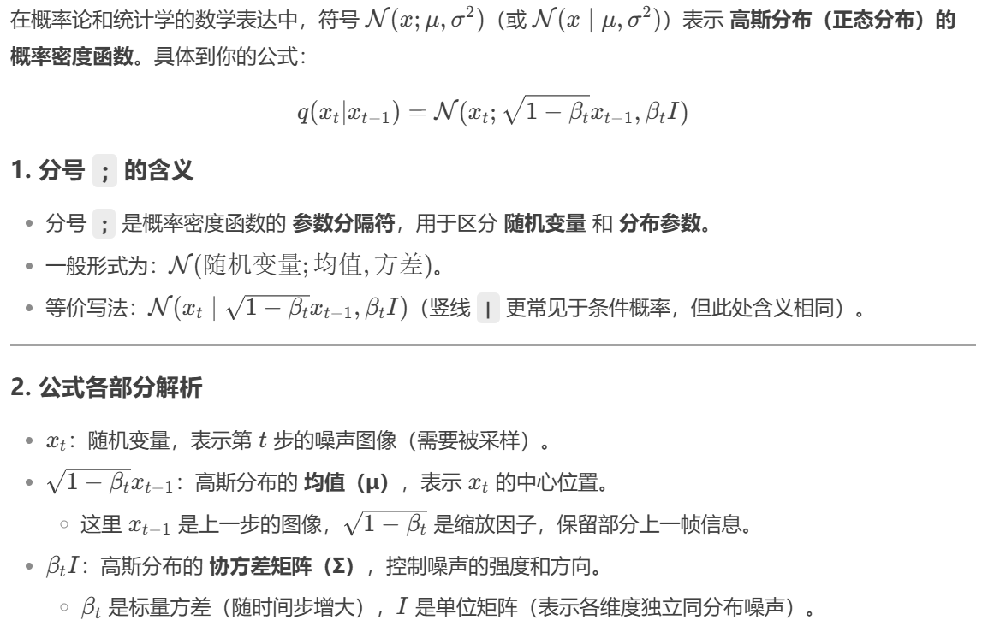

------

## 符号表

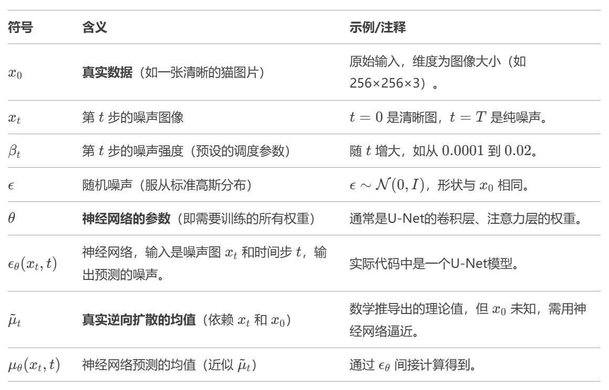

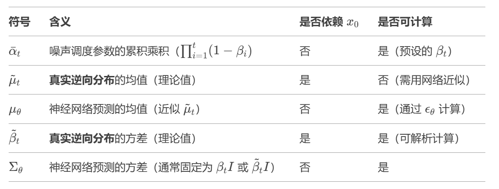

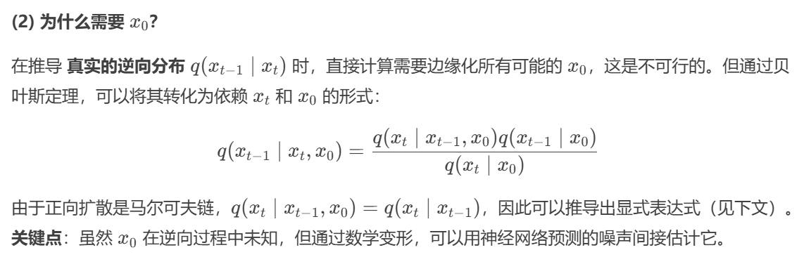

------

## 正向扩散过程

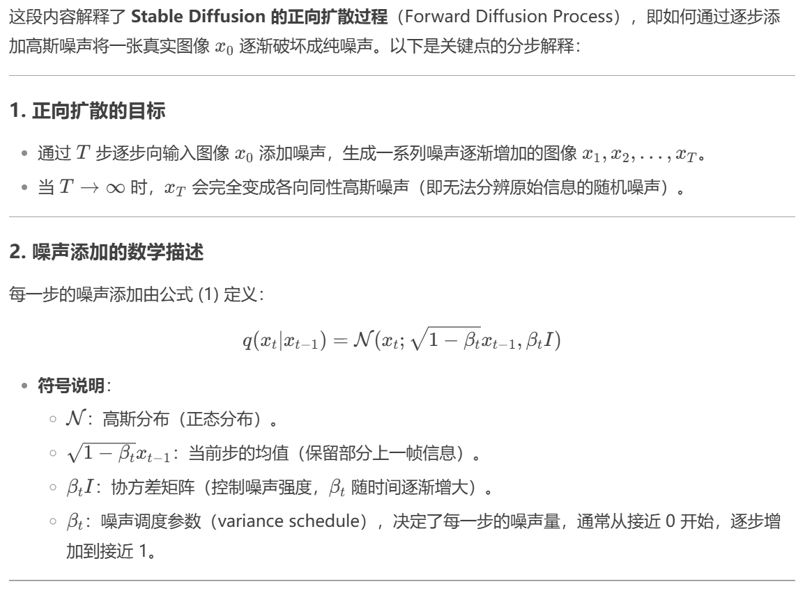

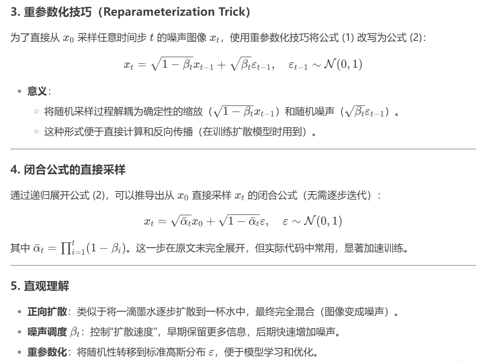

------

## 逆向扩散过程

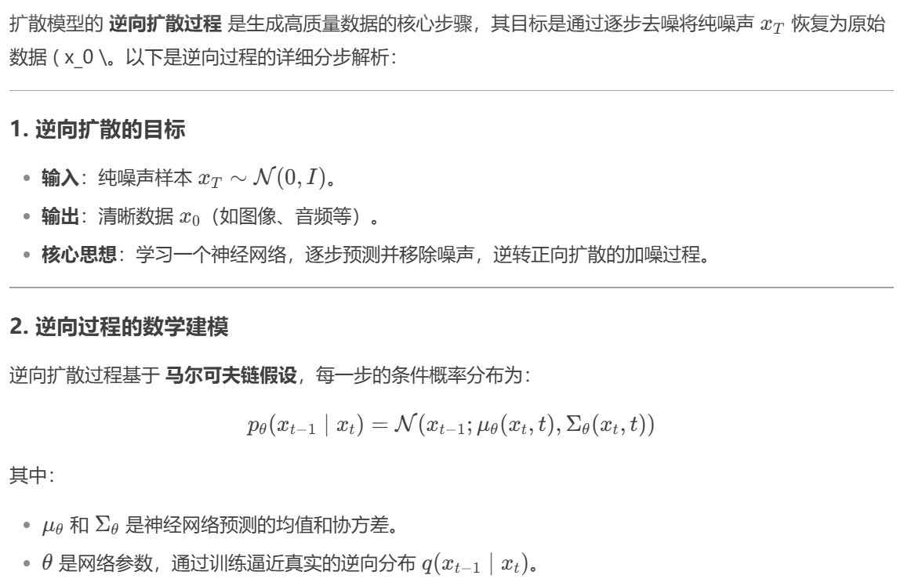

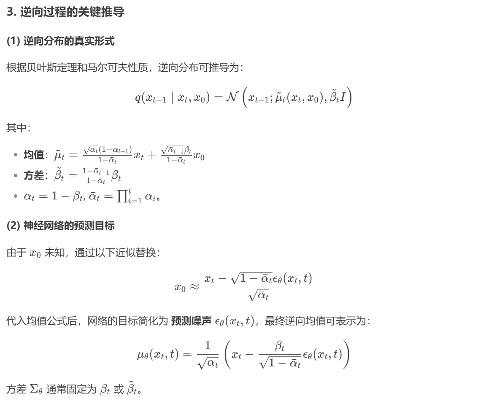

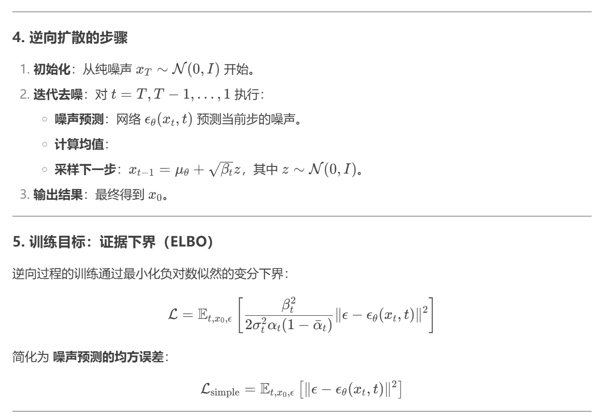

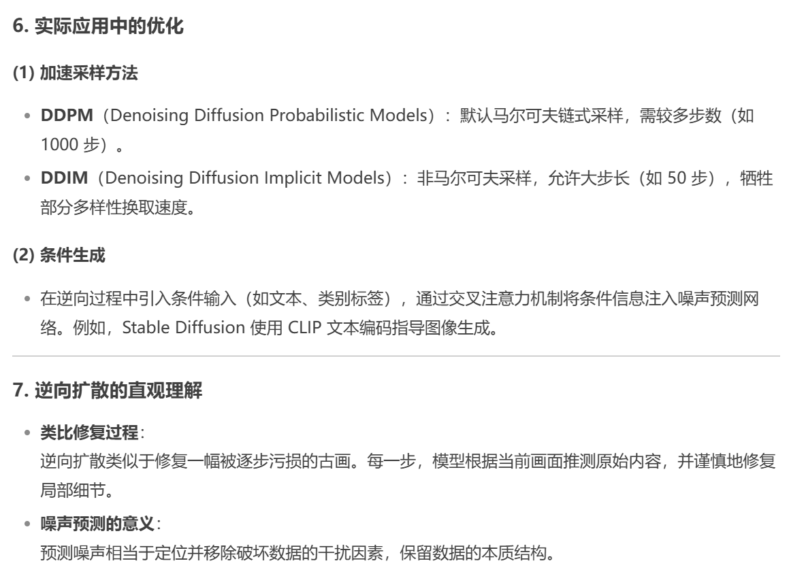

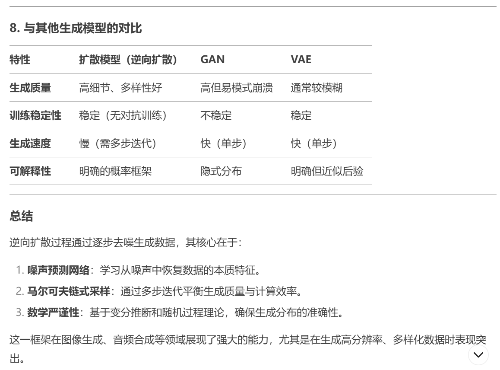

------

## 总结与混淆点澄清

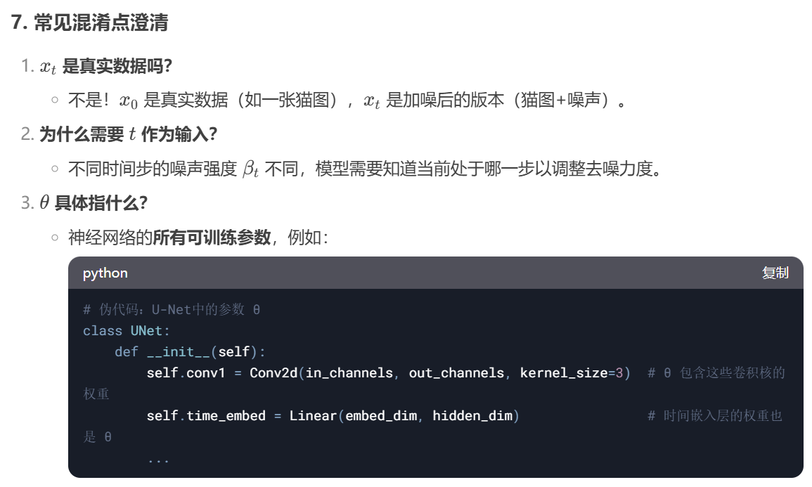

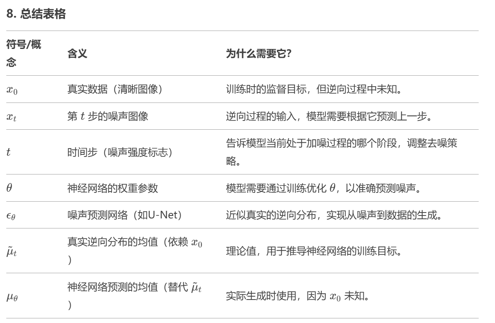
