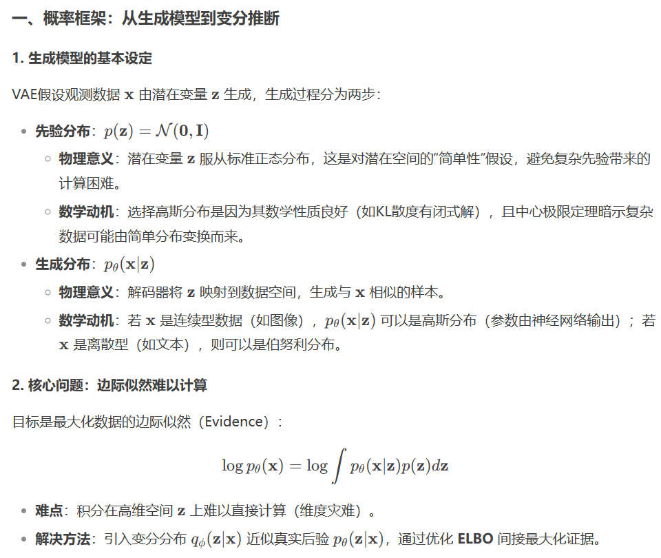
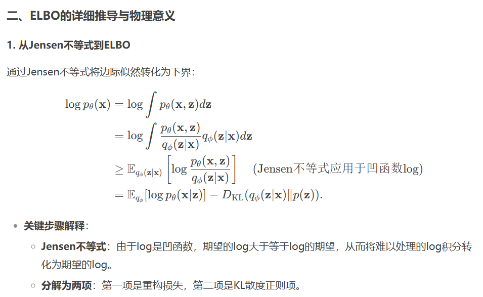
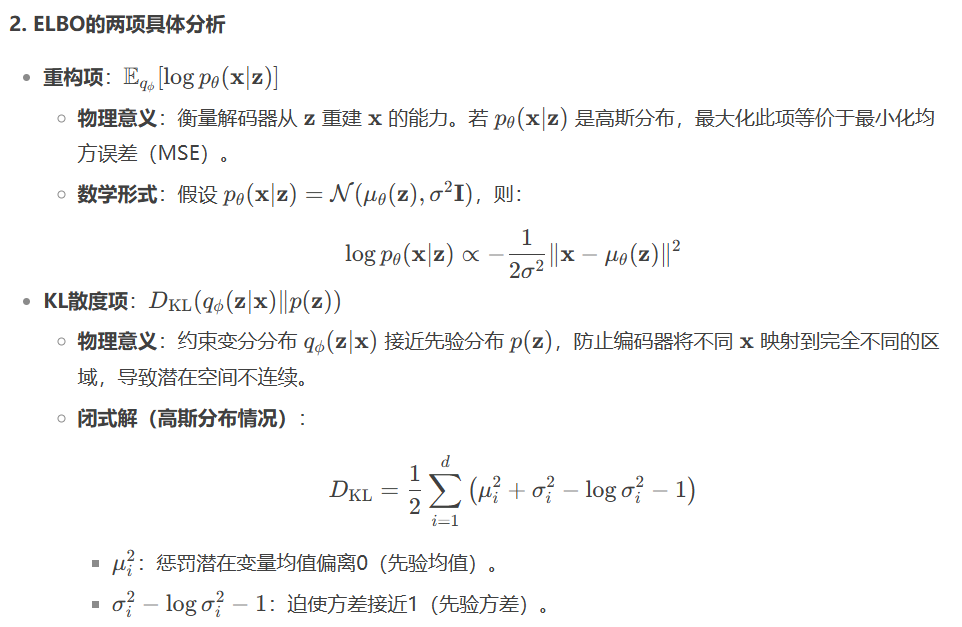
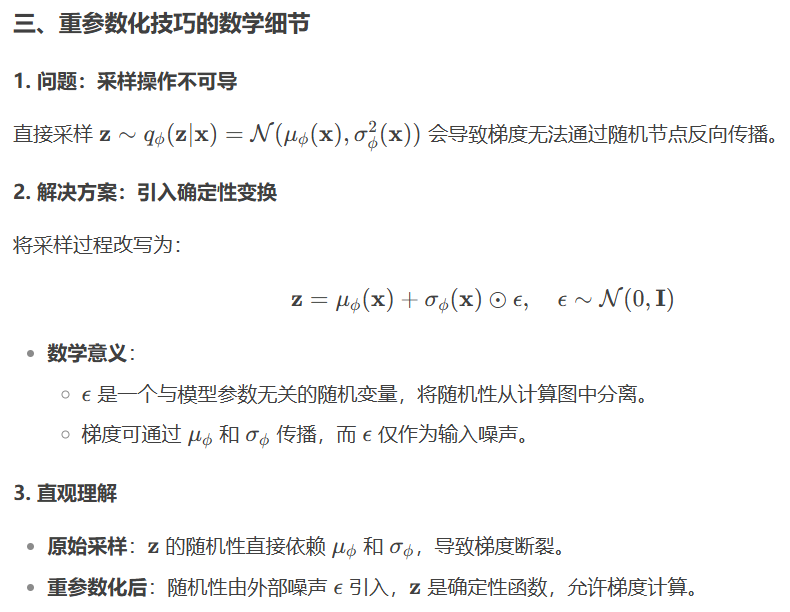
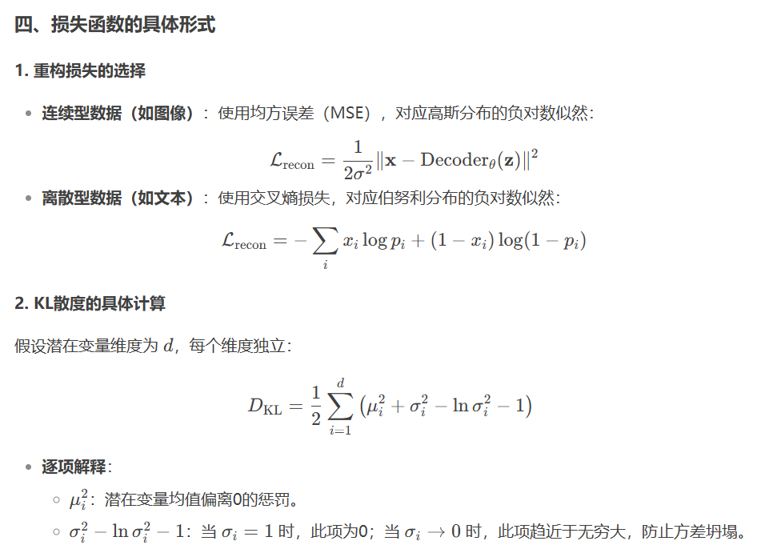
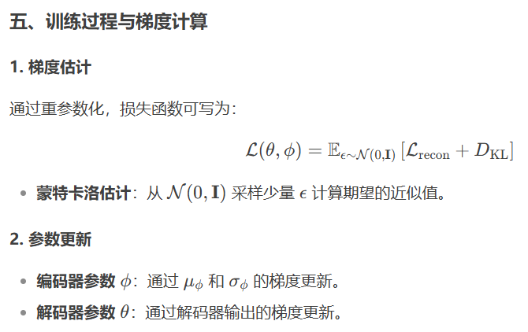
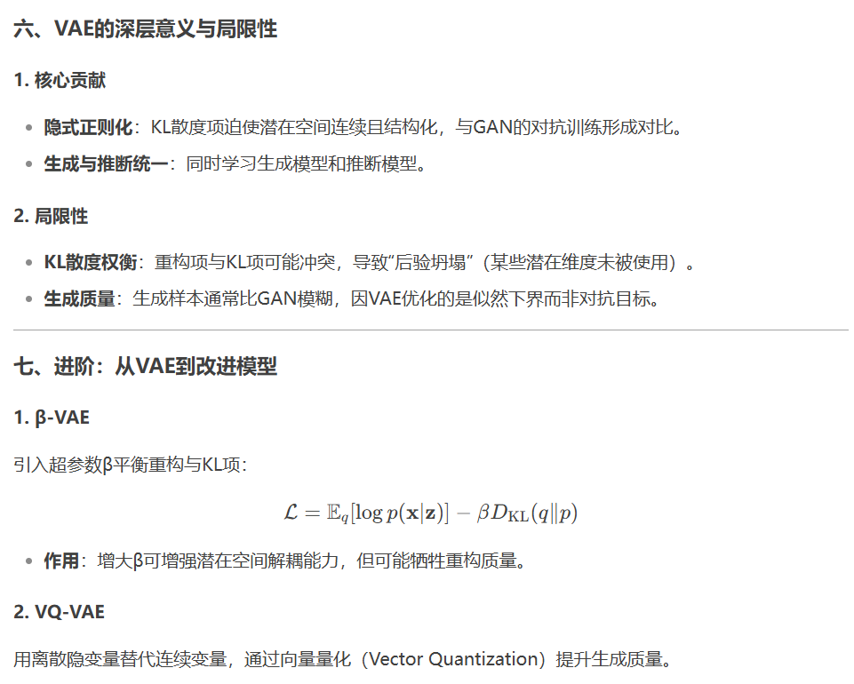

# VAE笔记（DeepSeek生成）

学习资料：[一文理解变分自编码器（VAE） - 知乎](https://zhuanlan.zhihu.com/p/64485020)

[VAE 模型基本原理简单介绍_vae模型-CSDN博客](https://blog.csdn.net/smileyan9/article/details/107362252?ops_request_misc=%7B%22request%5Fid%22%3A%225720b92ccb5458d8d586fc90dc3ce372%22%2C%22scm%22%3A%2220140713.130102334.pc%5Fall.%22%7D&request_id=5720b92ccb5458d8d586fc90dc3ce372&biz_id=0&utm_medium=distribute.pc_search_result.none-task-blog-2~all~first_rank_ecpm_v1~hot_rank-2-107362252-null-null.142^v102^pc_search_result_base3&utm_term=VAE&spm=1018.2226.3001.4187)

[【VAE学习笔记】全面通透地理解VAE(Variational Auto Encoder)_vae架构-CSDN博客](https://blog.csdn.net/a312863063/article/details/87953517)

------

### **VAE的核心目标**

VAE是一种生成模型，旨在学习观测数据 **x**（如图像、文本）的潜在结构，并实现：

- **数据生成**：从潜在空间采样生成新样本。
- **特征提取**：获得数据低维表示 **z**。
- **概率建模**：显式建模数据的生成过程 $p_\theta(x|z)$。

VAE通过最大化 **对数似然** $\log p_\theta(x|z)$ 来优化生成模型：

- **解码器输出** $p_\theta(x|z)$ 是一个分布（如高斯分布）。  
- $\log p_\theta(x|z)$ 衡量 $z$ 生成真实数据 $x$ 的可能性，越大说明重建越准确。

------------

## 一、概率论基础

### 1. 随机变量（Random Variable）
**定义**：将随机事件映射到数值的函数（如掷骰子的结果）。

在VAE中：
- $x$：观测随机变量（如图像像素）。
- $z$：潜在随机变量（隐藏特征）。

### 2. 概率分布（Probability Distribution）
**定义**：描述随机变量取不同值的概率规律。

**类型**：
- 离散型：概率质量函数（PMF），如伯努利分布。
- 连续型：概率密度函数（PDF），如高斯分布。

**VAE中的分布**：
- $p(z)$：先验分布（连续，如高斯）。
- $p_\theta(x|z)$：生成分布（连续或离散，由解码器定义）。

### 3. 条件概率（Conditional Probability）
**定义**：
$p(A|B)$ 表示在事件 $B$ 发生时 $A$ 的概率。

**VAE中**：
- $p_\theta(x|z)$：给定潜在变量 $z$ 时生成 $x$ 的概率。

### 4. 联合分布与边际分布
**联合分布 $p(x,z)$**：
$x$ 和 $z$ 共同出现的概率。

**分解**：
$p(x,z) = p_\theta(x|z)p(z)$。

**边际分布 $p(x)$**：忽略 $z$ 后 $x$ 的总概率。

**计算**：
$p(x) = \int p(x,z)dz$（连续）或 $\sum_z p(x,z)$（离散）。

### 5. 贝叶斯定理（Bayes' Theorem）
**公式**：
$$ p(z|x) = \frac{p(x|z)p(z)}{p(x)} $$

**意义**：通过观测数据 $x$ 反推潜在变量 $z$ 的分布（后验分布）。

## 二、微积分核心知识

### 1. 积分（Integration）
**定义**：求函数在区间内的"面积"，用于计算概率密度函数的累积值。

**在VAE中**：
边际似然是高维积分。

**难点**：
$z$ 通常是高维向量（如100维），直接计算不可行。

### 2. 期望（Expectation）
**定义**：随机变量的加权平均值，权重为其概率。

$$ E_{p(z)}[f(z)] = \int f(z)p(z)dz $$

**在VAE中**：
ELBO中的重构项 $E_q[\log p(x|z)]$ 是期望。

### 3. KL散度（Kullback-Leibler Divergence）
**定义**：衡量两个概率分布 $q$ 和 $p$ 的差异：

$$ D_{KL}(q\|p) = E_q\left[\log \frac{q(z)}{p(z)}\right] $$

**性质**：
- 非负性：$D_{KL} \geq 0$，当且仅当 $q=p$ 时取0。
- 不对称性：$D_{KL}(q\|p) \neq D_{KL}(p\|q)$。

**在VAE中**：
用于约束 $q_\phi(z|x)$ 接近先验 $p(z)$。

### 4. 重参数化技巧（Reparameterization Trick）
**问题**：直接采样 $z \sim q_\phi(z|x)$ 导致梯度无法反向传播。

**解决**：将随机性分离为外部噪声：

$$ z = \mu_\phi(x) + \sigma_\phi(x) \cdot \epsilon, \quad \epsilon \sim N(0,1) $$

**数学依据**：微积分中的变量替换（链式法则仍适用）。

## 三、VAE中的关键概率分布

### 1. 先验分布 $p(z)$
**定义**：标准正态分布 $N(0,I)$。

**作用**：约束潜在空间的结构，便于生成新样本。

### 2. 变分分布 $q_\phi(z|x)$
**定义**：由编码器输出的高斯分布 $N(\mu_\phi(x), \sigma_\phi^2(x))$。

**意义**：近似真实后验 $p(z|x)$。

### 3. 生成分布 $p_\theta(x|z)$
**定义**：由解码器参数化的分布（如高斯或伯努利）。

**输出**：

- 连续数据（图像）：高斯分布，均值 $\mu_\theta(z)$，方差可固定。
- 离散数据（文本）：伯努利分布（二值）或分类分布。

------

## 四、VAE模型详解

